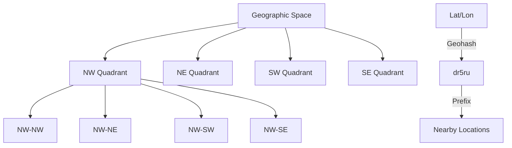

# Geohashing and Quadtrees

> Geographic data ko organize karo — location-based search fast karo.

> Geohashing geographic coordinates (lat, lon) ko encoded string mein convert karta hai — shorter string = smaller area. Quadtree space ko recursive quadrants mein divide karta hai. Location-based search (nearby restaurants, Uber nearby drivers) ke liye use hota hai. Geohash prefix = parent area, shorter prefix = larger area. Uber, Yelp geohash use karte hain nearby search ke liye.

Geohashing geographic coordinates ko compact strings mein encode karta hai:

**How geohashing works:**
1. Lat/lon coordinate alphanumeric string mein convert hota hai
2. Longer string = smaller area (more precise)
3. Shorter string = larger area (less precise)
4. Prefix matching = nearby locations share same prefix
5. **Example:** `dr5ru` = San Francisco area, `dr5r` = broader SF area

**Quadtree:**
- 2D space recursively 4 quadrants mein divide karta hai
- Each node 4 children (NW, NE, SW, SE)
- Leaf nodes represent geographic areas
- Efficient for spatial queries, collision detection

## Failure modes to mention

1. **Edge cases** — Locations near quadrant boundary → nearby query misses locations
2. **Precision vs performance** — Very precise geohash = narrow area, fewer results, more queries needed
3. **Grid skew** — Near poles, geohash cells distorted → uneven distribution
4. **Indexing overhead** — Geohash index maintenance for frequent updates

**🔴 Galti:** "Geohash exact distance" — Geohash approximate hai, nearby search prefix match se hota hai, exact distance not guaranteed.
**✅ Sahi:** "Geohash lat/lon to string, shorter = larger area. Nearby = prefix match. Quadtree recursively divides space. Not exact distance — edge cases near boundaries."

**Phrase:** Geohashing lat/lon ko encoded strings mein convert karta hai — prefix match se nearby search, quadtree recursively divides space, Uber/Yelp use karte hain.

**Yaad rakho (Revision):** Geohash lat/lon to string, longer=more precise, prefix match for nearby, quadtree recursive quadrants, edge cases near boundaries, used by Uber/Yelp.

**See also:** [Uber](/hld/uber), [Yelp](/hld/yelp), [Local Delivery Service](/hld/local-delivery).
