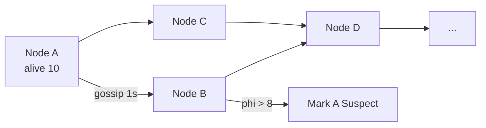

# Gossip Protocol

> Har node thodi der me random dost ko khabar de — khabar epidemic jaise faile.

> Gossip ek afwah jaisa — Ram ne Shyam ko bola, Shyam ne 2 ko, har round double. `O(log N)` me sabko pata, koi master nahi. Cassandra, Consul membership me yahi.

Failure detection, membership list, aur config spread me.

## How it works

Har `T=1 sec` pe har node random 1-3 nodes ko apna state bheje — `alive nodes list + version`.

- **Push:** main bheju
- **Pull:** tu kya janta hai le aun
- **Push-Pull:** dono

`N=1000` me 10 rounds me sabko pata (`2^10=1024`). Totally decentralized, koi leader nahi.

## When you pick it

- **Cassandra:** kaunsa node alive/dead — `phi` accrual failure detector (ping ka time dekhe).
- **Consul:** membership + health gossip.
- **Redis Cluster:** nodes ek dusre ko ping.

**SWIM:** ping → ack nahi to indirect ping via random node → phir bhi nahi to dead.

## Failure detection — phi accrual

Har node ka `phi` = kitna time se heartbeat nahi aaya. `phi > 8` to suspect, `>12` to dead. Adaptive — network slow to threshold badhe.

## Tradeoff

- **Pro:** no SPOF, `O(log N)` spread, partition me bhi chale.
- **Con:** thoda stale (1 sec), not strong consistent — isliye leader election ke liye Raft, membership ke liye gossip.

**🔴 Galti:** "Gossip se strong consistency" — Nahi, eventual.
**✅ Sahi:** "Membership + failure ke liye gossip, leader ke liye Raft/ZK."

**Phrase:** "Gossip afwah jaisa — har sec random ko push-pull, log N me spread, phi se fail detect."

**Yaad rakho:** Random push-pull, log N, phi accrual, no leader, eventual.

**See also:** [cassandra](/hld/cassandra), [replication](/hld/replication), [leader-election](/hld/leader-election).
