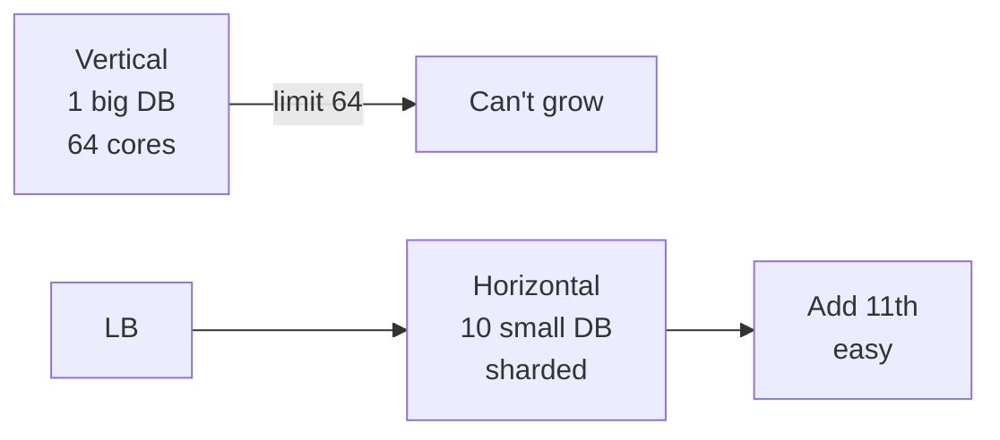

# Horizontal vs Vertical Scaling

> Ek box bada karo vs bahut boxes jodo — scale up vs scale out.

> **TL;DR Hinglish:** Vertical = ek hi computer me RAM/CPU badhao (16GB→64GB) — simple par ek limit ke baad mehenga aur SPOF. Horizontal = 1 se 10 servers jodo + load balancer — thoda complex par unlimited aur fault-tolerant. Interview me 90% horizontal bolo.

Har system design me puchenge — "scale kaise karoge?"

## Vertical (Scale Up)

- Ek hi server ko powerful banao — `t2.micro → r5.4xlarge`, disk SSD bada.
- Pros: code change nahi, join/transaction easy, debug simple.
- Cons: ek limit (max 64 cores), SPOF (box mara to sab gaya), downtime for upgrade, cost exponential.

**Example:** Postgres ko `r5.large → r5.12xlarge` — 2TB RAM tak theek, uske baad nahi.

## Horizontal (Scale Out)

- Chhote-chhote N boxes + [Load Balancer](/system-design/load-balancer) + sharding/partitioning.
- Pros: unlimited boxes, ek mara to baaki zinda, rolling deploy.
- Cons: app ko shard key sochna padega, cross-box join mushkil, network partition handle.

**Example:** 1 API server 1k RPS → 10 servers + consistent hashing + shard `userId % 10` → 10k RPS.

## How it works

- **Vertical:** early stage, 1k QPS, monolith — jaldi ship karo, Postgres ko bada box.
- **Horizontal:** 10k+ QPS, global users — Day 1 se stateless + hash sharding design rakho.

**Auto-scaling:** CPU 60% → add box (HPA in K8s), queue depth se Kafka consumers.

**Stateless must:** horizontal tabhi jab app me local state nahi — session Redis me, upload S3 me.

## Failure handling

- **Vertical SPOF:** 1 box down to sab down — HA ke liye bhi replica chahiye.
- **Horizontal hot shard:** `hash%N` pe ek box garam → consistent hashing + virtual nodes.

**🔴 Galti:** "Hamesha vertical" — Limit pe phas jaoge.
**✅ Sahi:** "Start vertical for speed, design stateless so horizontal later via sharding + LB."

**Phrase:** "Vertical ek box bada — simple par limit/SPOF, Horizontal N boxes + LB/shard — 90% interviews me horizontal."

**Yaad rakho:** Up = big box simple limit, Out = many boxes + shard key, stateless zaruri.

**See also:** [sharding](/system-design/sharding), [partitioning](/system-design/partitioning), [load-balancer](/system-design/load-balancer).
