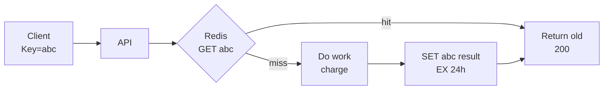

# Idempotency

> Same request 2 baar aaye to 2 baar kaam nahi — ek hi baar.

> Idempotency ek ticket counter jaisa — same ticket 2 baar dikhao to ek hi seat. `Idempotency-Key` header se server pehle dekhe "ye key pehle ki kya?", haan to purana jawab de do, nahi to kaam karke yaad rakho.

Network retry, user double-click, Kafka at-least-once — har jagah duplicate aayega.

## How it works

**1. Idempotency-Key:** client har request pe `UUID` bheje — `Idempotency-Key: 550e-...`. Server `SET key result NX EX 24h` — pehle hai to wahi return, nahi to kaam karke `SET`.

**2. Natural idempotent:** `PUT /users/123 {name:"A"}` 5 baar same. `DELETE /items/123` bhi. `POST` se bacho — `POST /pay` duplicate charge karega, isliye key chahiye.

**3. Dedup table:** `processed_keys(key PK, response, created_at)` — `INSERT ... IF NOT EXISTS` (Cassandra) ya `INSERT ON CONFLICT DO NOTHING`.

**Kafka/Queue:** consumer `msgId` yaad rakhe — Redis `SETNX msg:123 1` → pehle dekha to skip.

## Exactly-once

- **Dedup + Retry:** client retry same key se, server dedup → exactly-once lagta hai.
- **Outbox:** DB write + event ek transaction me outbox table, relay → no double publish.
- **Two-phase:** prepare + commit, par heavy.

## How to answer in interview

- **Payment:** `POST /charges` me `Idempotency-Key` must, `key = clientOrderId`.
- **WhatsApp send:** `clientMsgId` se dedup, retry safe.

**🔴 Galti:** "Retry bina key ke" — Double charge, double message.
**✅ Sahi:** "Har POST pe UUID key + SETNX + 24h TTL, Kafka consumer msgId dedup."

**Phrase:** "Idempotency-key + SETNX, pehle hai to purana jawab, nahi to kaam karke yaad rakho — exactly-once jaisa."

**Yaad rakho:** Key = UUID, SETNX, TTL 24h, PUT idempotent, POST nahi, Kafka msgId.

**See also:** [payment-system](/hld/payment-system), [whatsapp](/hld/whatsapp), [kafka](/hld/kafka).
