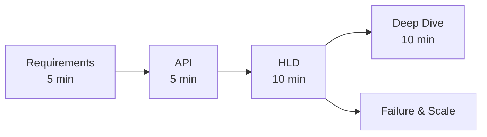

# Introduction

> System design interview me kaam ka design jaldi pick karo, fir jahan matter karta hai wahan deep jao. Style: [Hello Interview — System Design in a Hurry](https://www.hellointerview.com/learn/system-design/in-a-hurry/introduction) se inspired.

> **TL;DR Hinglish:** Pehle 5 min me requirements + API likho, 10 min me simple boxes se happy path chalao, fir 10 min ek-do deep dive me dikhao ki tum trade-off samajhte ho. Simple working system pehle, scale baad me.

Ye notes **product / infrastructure** interviews ke liye hain — "Design Bitly", "Design Uber", "Design Rate Limiter". Fuzzy problem ko API me, fir boxes me todna hai jo scale aur fail dono handle kare.

Single sahi diagram nahi hota. Interviewer dekhta hai tum **kaise navigate** karte ho, **trade-off** kaise sochte ho, aur **colleague jaisa communicate** karte ho.

## Kya test hota hai? (4 cheezein)

**1. Problem navigation.** Sahi requirements puche, faltu cheez skip ki, aur working system ship kiya? Galti: 20 min CDN design kar diya jab asli puzzle matching/consistency tha.

**2. Solution design.** Pieces naam le paaye (cache, queue, DB, CDN) aur data kaise move hoga clear hai? Bina request path ke boxes ka jhaar fail hai.

**3. Technical excellence.** Tools pata hain — Redis, Kafka, Postgres, S3 — aur kab galat tool hai? "Hamesha MySQL shard karo" 2015 wali advice ab yellow flag hai.

**4. Communication.** Zor se socho (think out loud). Interviewer push kare to adjust karo, bekar design defend mat karo.

Mid-level: complete simple design kaafi. Senior: basics jaldi khatam karke **1-2 deep dive** par time lagao.

## 2 tarah ke interviews

**Product design** — Bitly, WhatsApp, YouTube, Uber. Users, APIs, storage, scale.

**Infrastructure design** — rate limiter, distributed cache, job scheduler, web crawler. Yahan product khud ek platform hai.

Ye page **LLD class diagram** (parking lot, elevator) nahi hai. Agar classes + SOLID puche to wo alag interview hai.

## Delivery framework — har baar yehi follow karo

Working system pehle, fir harden karo. Interview me bolo: *"Pehle simple design jo APIs meet kare, fir scale aur failure ke liye harden karenge."*

1. **Requirements (~5 min).** Top 3 functional ("users can…") + 3-5 non-functional (latency, availability, consistency, scale). Likho. Pucho — 45 min me kya in-scope hai?
2. **Entities (~2 min).** Nouns: User, Ride, ShortUrl. Rough draft hi.
3. **API (~5 min).** Default REST. 4-5 endpoints ka sketch.
4. **High-level design (~10-15 min).** Har API ke liye boxes. **Happy path** end-to-end bolo. "Cache baad me" bolke skip kar sakte ho agar v1 me zaroorat nahi.
5. **Deep dives (~10 min).** Asli NFR: celebrity fan-out, bid consistency, transcoding, geo search. Senior khud lead kare.

**Capacity math:** naatak mat karo. Estimate tabhi jab number **design badle** ("Top-K ek machine me fit hoga kya?").

## Non-functional checklist — is product ke liye kya matter karta hai?

Har product ke liye relevant pick karo, CAP har app pe mat rato.

1. **Consistency vs availability** partition me
2. **Scale** — read-heavy vs write-heavy; bursty (tickets, auctions)
3. **Latency** — kaunsa path 200ms ke andar chahiye?
4. **Durability** — events lose kar sakte kya? Chat vs analytics alag
5. **Abuse** — rate limits, auth, bots
6. **Failure** — SPOF, retries, multi-AZ

## Kaise padhna hai — revision ke liye

Pehle **Introduction** padho, fir **Key Technologies** skim karo taaki tool ka naam reason ke saath le sako. Sabse zyada time **Question Breakdowns** par — wahi se yaad hota hai.

Har design page ka same shape: asli sawal kya hai, requirements, APIs, boxes, ek deep dive jo interviewer zarur puchega, aur ek line jo tum bol sakte ho.

**Yaad rakho (Revision Checklist):**
1. Har design me happy path pehle
2. NFR sirf jo is product me matter kare
3. Trade-off bolke jao — "Agar X to Y, warna Z"
4. Ek phrase ready rakho har page ka

**Related:** shipping aur Docker → [production notes](/notes/advanced-topics). SQL depth → [SQL & DBMS](/notes/sql).
