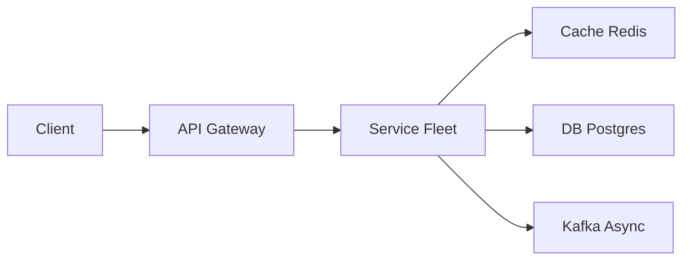

# Job Scheduler

> Cron for a whole company. The job is **run exactly once (or retry safely)** across many workers, not `crontab` on one VM.

> **TL;DR Hinglish:** Jobs Postgres me durable, workers poll/heartbeats, lease + ZK leader, retry with backoff, exactly-once via idempotent.

## Kya poochte hain? (What they ask) — Hinglish me samjho

Design a distributed job scheduler: users register jobs to run once at a timestamp, on a cron expression, or with a delay (e.g., "email in 30 minutes"). Thousands of jobs fire per second across many workers that can crash or scale. Don't run the billing cron twice.

**Scenario:** You have 200 app pods, 50k job definitions, and a requirement that a job like `charge_monthly` runs once per tick even if 5 dispatchers and 20 workers are alive. Workers can die mid-execution. The interviewer will push on "exactly-once" — the correct answer is at-least-once with idempotent handlers.

**What interviewer tests:**
- Distributed locking / leasing without single point of failure
- Durable schedule state vs. in-memory cron
- Retry, backoff, DLQ, and missed-tick policy
- Thundering herd at `:00` and timezone correctness

## Requirements — Kya chahiye? (Functional / Non-functional)

| Category | Requirement |
|---|---|
| **Functional** | Register job: `name`, `cron` or `run_at` / `delay`, `payload` (JSON), `timeout`, `retryPolicy`, `maxRetries`. Cancel / pause / resume job. List runs with status (`PENDING`, `RUNNING`, `SUCCESS`, `FAILED`, `DLQ`). Trigger ad-hoc run. DAG dependencies (v2). |
| **Non-functional** | Durable schedule (survives dispatcher crash). At-least-once execution with idempotent handlers. No double-enqueue when dispatchers scale. Scalable to 100k jobs with second granularity. Observable (metrics, logs, alerts). |
| **Clarify** | Cron semantics: standard 5-field? Timezone per job? Missed-tick policy: catch-up or skip? Max payload size? Who runs the job — your workers or a webhook to caller? Job duration range (ms to hours)? |
| **Out of scope v1** | Full DAG orchestrator (like Airflow), UI for visual DAG editor, per-job code deployment, distributed cron editor with RBAC. |

## Scale ka andaaza — Kitna load? (Math jo design badle)

| Metric | Math | Result |
|---|---|---|
| **Jobs stored** | 50k definitions × avg 500 bytes + indexes | ~25 MB metadata; runs history dominates |
| **Runs history** | 50k jobs × avg 10 runs/day × 365 days × 300 bytes | ~55 GB/year before TTL/archival |
| **QPS — dispatch** | 50k jobs, 30% hourly crons: ~15k ticks/hour ≈ 4/sec; + 1k delayed jobs/sec | ~1k–5k dispatches/sec peak |
| **QPS — workers** | Each dispatch → 1 enqueue + 1 callback | ~2k–10k internal rps |
| **Storage bandwidth** | Poll `SELECT ... WHERE next_run_at <= now() LIMIT 500` every second | ~500 rows/sec scan, index on `next_run_at` keeps it cheap |
| **Kafka/SQS** | 5k messages/sec × 1 KB | ~5 MB/s; trivial for [Kafka](/system-design/kafka) |

The bottleneck is **contention on the dispatch query**, not raw throughput.

## API Design — Endpoints kya honge?

| Method | Endpoint | Description |
|---|---|---|
| `POST` | `/api/v1/jobs` | Create job |
| `GET` | `/api/v1/jobs/{id}` | Get job + next run |
| `DELETE` | `/api/v1/jobs/{id}` | Cancel job |
| `POST` | `/api/v1/jobs/{id}/pause` | Pause scheduling |
| `POST` | `/api/v1/jobs/{id}/resume` | Resume |
| `GET` | `/api/v1/jobs/{id}/runs?cursor=` | List runs |
| `POST` | `/api/v1/jobs/{id}/trigger` | Ad-hoc run |
| `POST` | `/internal/workers/callback` | Worker reports success/fail + heartbeat |

**Create job — Request:**
```json
POST /api/v1/jobs
{
  "name": "billing-daily",
  "cron": "0 2 * * *",
  "timezone": "UTC",
  "payload": { "accountId": "acct_123" },
  "timeoutMs": 60000,
  "retryPolicy": { "maxRetries": 3, "backoff": "exponential", "baseMs": 1000 },
  "queue": "billing"
}
```

**Create — Response:**
```json
{ "jobId": "job_abc", "nextRunAt": "2026-08-26T02:00:00Z", "status": "ACTIVE" }
```

**Worker contract:** Workers `POST /internal/workers/callback { runId, status, result, error }` or use long-poll `GET /internal/workers/poll?queue=billing` to fetch work. Alternative: push via [Kafka](/system-design/kafka) / SQS.

Headers: `Idempotency-Key` on create; `X-Run-Id` on callbacks.

## High-Level Design (HLD) — Boxes kaise judenge? (Hinglish)

```
Client / Admin UI
   |
 API Gateway (auth, validation)
   |
 Job Service (CRUD, validation, computes next_run_at)
   |
 Postgres (jobs, runs)  <-- Dispatcher (polls next_run_at, enqueues)
   |                         |
   |                      [Kafka](/system-design/kafka) / SQS (run queue, per-queue partitions)
   |                         |
   +---- Workers (poll / consume, execute, heartbeat, callback)
   |
 [Redis](/system-design/redis) (optional lease / fencing token cache)
   |
 Observability: [metrics](/system-design/metrics-monitoring) + logs + DLQ dashboard
```



**Components:**
- **Job Service:** Validates cron (via cron parser), stores UTC `next_run_at`, computes following tick using library (e.g., `cron-utils`). Never trusts client clock.
- **Dispatcher:** Stateless replicas (3–5) that every 500ms–1s run: `SELECT ... WHERE next_run_at <= now() AND status='ACTIVE' ORDER BY next_run_at LIMIT 500 FOR UPDATE SKIP LOCKED` → for each row, generate `runId = uuid`, insert into `job_runs`, set `next_run_at` to next cron tick (or null for one-shot), enqueue to [Kafka](/system-design/kafka)/SQS. `SKIP LOCKED` ensures two dispatchers never grab the same job.
- **Queue:** [Kafka](/system-design/kafka) topic `job.runs` partitioned by `jobId` or `queue` name; or SQS per queue for simpler ops. Provides durability if workers are down.
- **Workers:** Autoscaled pool per queue (billing, email, etc.). Long-poll or Kafka consume; execute handler; send heartbeat every 10s; callback success/fail. On timeout, dispatcher resets `locked_by` via lease expiry.
- **DLQ:** After `maxRetries` exhausted, move to DLQ topic/table for manual retry.

**Write flow — Register job:**
1. `POST /jobs` → validate cron, compute `next_run_at` in UTC, insert into `jobs`.

**Read flow — Dispatch tick:**
1. Dispatcher lease-selects due jobs under transaction → enqueues → commits. If commit fails, message not sent (transactional outbox variant).

**Execution flow:**
1. Worker consumes `runId` + payload → executes idempotent handler keyed by `runId` → callback. If worker dies, heartbeat lease expires and another worker retries after visibility timeout.

## Low-Level Design (LLD) — DB + Classes (Hinglish notes)

**DB Schema (Postgres):**
```sql
CREATE TABLE jobs (
  id              BIGSERIAL PRIMARY KEY,
  name            VARCHAR(200) NOT NULL,
  cron            VARCHAR(100), -- null for one-shot/delayed
  run_at          TIMESTAMPTZ, -- for one-shot
  timezone        VARCHAR(50) NOT NULL DEFAULT 'UTC',
  payload         JSONB NOT NULL DEFAULT '{}',
  queue           VARCHAR(100) NOT NULL DEFAULT 'default',
  status          VARCHAR(20) NOT NULL DEFAULT 'ACTIVE', -- ACTIVE, PAUSED, CANCELLED
  next_run_at     TIMESTAMPTZ,
  locked_by       VARCHAR(100),
  locked_at       TIMESTAMPTZ,
  timeout_ms      INT NOT NULL DEFAULT 60000,
  max_retries     INT NOT NULL DEFAULT 3,
  created_at      TIMESTAMPTZ DEFAULT now(),
  updated_at      TIMESTAMPTZ DEFAULT now()
);
CREATE INDEX idx_jobs_next_run ON jobs(next_run_at) WHERE status='ACTIVE';
CREATE INDEX idx_jobs_queue_next ON jobs(queue, next_run_at);

CREATE TABLE job_runs (
  id              BIGSERIAL PRIMARY KEY,
  job_id          BIGINT NOT NULL REFERENCES jobs(id),
  run_id          VARCHAR(64) UNIQUE NOT NULL, -- idempotency key for handlers
  status          VARCHAR(20) NOT NULL, -- PENDING, RUNNING, SUCCESS, FAILED, DLQ
  attempt         INT NOT NULL DEFAULT 0,
  payload         JSONB,
  result          JSONB,
  error           TEXT,
  scheduled_at    TIMESTAMPTZ NOT NULL,
  started_at      TIMESTAMPTZ,
  finished_at     TIMESTAMPTZ,
  lease_expires_at TIMESTAMPTZ
);
CREATE INDEX idx_runs_job_time ON job_runs(job_id, scheduled_at DESC);
CREATE INDEX idx_runs_status ON job_runs(status, lease_expires_at);

-- For exactly-once handler dedup, handlers store:
-- CREATE UNIQUE INDEX ON billing_ledger(run_id) -- or separate dedup table
```

**Key classes / responsibilities:**
```python
class JobService:
  def create_job(payload): # validate cron, compute next_run_at UTC
  def cancel_job(id): ...
  def compute_next_run(cron, timezone, after): ...

class Dispatcher:
  def tick():
    with db.transaction():
      rows = db.query("SELECT * FROM jobs WHERE next_run_at <= now() AND status='ACTIVE' ORDER BY next_run_at LIMIT 500 FOR UPDATE SKIP LOCKED")
      for job in rows:
        run_id = uuid()
        db.insert_run(job.id, run_id, status='PENDING')
        job.next_run_at = compute_next_run(job.cron, job.timezone, after=now())
        job.locked_by, job.locked_at = self.id, now()
        queue.enqueue({job_id: job.id, run_id, payload: job.payload})

class Worker:
  def poll(): # long-poll or Kafka consume
  def execute(run): # idempotent: check dedup table by run_id before side effects
  def heartbeat(run_id): # UPDATE job_runs SET lease_expires_at = now()+30s

class RetryPolicy:
  def next_delay(attempt): return base * 2**attempt + jitter
```

**Concurrency & algorithms:**
- **SKIP LOCKED:** The core primitive. Two dispatchers run the same `SELECT FOR UPDATE SKIP LOCKED` — the first locks rows, the second skips them. No [ZooKeeper](/system-design/zookeeper) needed for correctness, though leader election can reduce duplicate wakeups.
- **Lease + fencing token:** Alternative with [Redis](/system-design/redis): `SET job:lock:{id} <token> NX EX 30` — only holder with current token may enqueue. Fencing token (monotonic `runId`) ensures stale holder can't commit.
- **Jitter for thundering herd:** Instead of `0 * * * *` for 10k jobs, spread `next_run_at` by adding `random(0, 300s)` on creation or using `0-5 * * * *` equivalent. Prevents midnight spike.
- **Missed ticks:** Policy per job: `SKIP` (email digest — don't send 10 old digests) vs `CATCH_UP_ONCE` (billing — run once with latest payload, not N times). Dispatcher checks `now() - next_run_at > threshold` and applies policy.

**Patterns used:** Lease / Distributed lock, Transactional outbox (run insert + enqueue), Idempotency key (`run_id`), Retry with exponential backoff + jitter, DLQ, Heartbeat / lease expiry, Leader election (optional via [ZooKeeper](/system-design/zookeeper)/etcd).

## Deep Dive — Gehrai se (Interview yahi puchega) — exactly-once is a lie (and what to do)

You will **not** get exactly-once in a distributed system with failures — you get **at-least-once execution + idempotent handlers + dedup**. Concretely:
1. **Dispatcher dedup:** `SKIP LOCKED` prevents double-enqueue; `run_id` UNIQUE prevents double-insert even if dispatcher retries.
2. **Worker dedup:** Handler checks `SELECT * FROM billing_ledger WHERE run_id=?` before charging. If present, return success without side effect. This is the real guarantee.
3. **Heartbeat / lease:** Worker updates `lease_expires_at` every 10s. If worker dies, dispatcher (or reaper) resets `status=PENDING` after `lease_expires_at < now()` and re-enqueues with `attempt+1`. Use visibility timeout in SQS / Kafka consumer timeout equivalently.
4. **Do not** have 200 pods each running `if (minute===0) bill()` — that's the classic double-charge bug the interviewer wants you to name.

## Deep Dive — Gehrai se (Interview yahi puchega) — missed ticks and hot midnight

If the dispatcher was down 10 minutes, 500 jobs are overdue. Naively enqueueing all 500 at once + computing each next tick as `now()` causes drift. Correct behavior: for `SKIP` jobs, set `next_run_at = next tick after now()` and enqueue only one run; for `CATCH_UP` jobs, enqueue one run with a flag `wasMissed=true` and document it. For **hot `:00`**, pre-jitter on write: `next_run_at = cron_next + random(0, 5m)` or bucket jobs into 60 shards and stagger dispatcher ticks per shard. Mention timezones: store UTC, convert at scheduling edge, and warn about DST gaps (2am doesn't exist in some zones).

## Deep Dive — Gehrai se (Interview yahi puchega) — delayed jobs and DAGs

Delayed jobs ("send reminder in 30 min") are cron with `run_at = now()+delay`. Implementation options: SQS delay queue, [Redis](/system-design/redis) sorted set `ZADD jobs:delayed <run_at> <jobId>` with a poller `ZRANGEBYSCORE ... LIMIT 100`, or [Kafka](/system-design/kafka) with delayed topic + scheduler. For DAGs (Airflow-style), add `job_dependencies(job_id, depends_on_job_id, depends_on_run_status)` and only enqueue when parents succeeded; a DAG scheduler topologically checks readiness after each parent callback.

## Hinglish Tip — Galti vs Sahi

**🔴 Galti:** Hot path pe DB direct without cache/queue.
**✅ Sahi:** Cache/queue beech me, DB source of truth.

## Failures & Scale — Kya tootega aur kaise bachenge? (Hinglish)

| Failure | Handling |
|---|---|
| **Dispatcher crash** | Other dispatchers continue via `SKIP LOCKED`; overdue jobs picked up on next tick. No SPOF. |
| **Worker crash mid-job** | Lease expires → reaper re-enqueues; handler idempotency prevents double charge. |
| **Queue down ([Kafka](/system-design/kafka)/SQS)** | Dispatcher keeps `PENDING` runs in DB; retries enqueue with backoff; circuit breaker to avoid DB bloat. |
| **DB overload** | Index on `next_run_at` keeps poll cheap; shard by `queue` or `jobId` hash; move hot queues to dedicated dispatcher. |
| **Clock skew** | NTP on all hosts; dispatcher uses DB `now()` as source of truth; never use client-supplied time. |
| **Poison pill (always fails)** | After `maxRetries`, route to DLQ; alert on DLQ depth; manual replay endpoint. |
| **Scale** | Add dispatcher replicas (SKIP LOCKED scales linearly to ~10). Partition queues; autoscale workers per queue depth. Archive old `job_runs` to S3/cold store. |

## Aur kya puch sakte hain? (Extra probes — Hinglish)

1. DAG of jobs (Airflow) — `dependencies` table; don't start B until A succeeded; support fan-in/fan-out.
2. Delayed messages — SQS delay / Redis sorted set / Kafka delayed publish.
3. Timezones — store UTC, convert at edge; handle DST non-existent times.
4. Observability — per-queue lag, run latency histogram, DLQ alerts, distributed tracing with `run_id`.
5. Calendar vs interval scheduling — "every 24h" vs "daily at 2am" behave differently on DST days.

**Yaad rakho (Revision):** Write durable, read cache, async Kafka/Flink, failure me degrade gracefully.

**Phrase:** "Schedules live in the DB. Dispatch uses SKIP LOCKED and a run id. Workers are at-least-once; the job itself is idempotent. No crontab on random pods."
