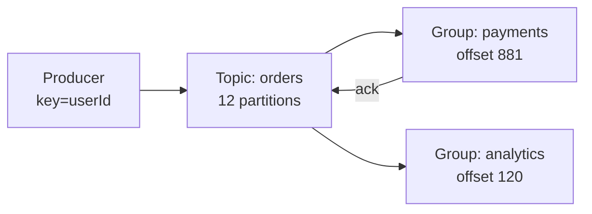

# Kafka

> Durable ordered event log. Fan out to many consumers, replay history, buffer spikes.

> Kafka is a train with durable cars: every partition holds messages in order on disk, safe and replayable. One producer serves many consumer groups reading at their own speeds. It is a log, not a queue — nothing deletes on read.

## When to pick it

1. Event streaming between services (order created → five reactions)
2. High-throughput ingest (clicks, logs, metrics at 100k+ msgs/s)
3. Replay needs (new consumer reads history, bug reprocessing)
4. Spike buffering in front of slow processors

**Don't use for:** simple task queues with routing (RabbitMQ fits better), request-reply RPC, or tiny throughput (SQS suffices).

## How it works

Topics split into partitions (parallelism unit); producers key messages to partitions (same key, same order); consumer groups each read the full log independently with committed offsets. Retention (days to forever) decides replay window. Replication factor 3 with `acks=all` and min in-sync replicas gives durability without single points of failure.

## Delivery semantics

- **At-most-once:** commit before processing — may lose, never duplicates.
- **At-least-once:** commit after processing — redelivers on crash; pair with idempotent consumers (the default).
- **Exactly-once:** transactions plus idempotent producer — narrow scope, real cost.

## Failure modes to mention

1. **Consumer lag** — slow group falls behind; monitor lag, autoscale consumers.
2. **Rebalance storms** — scaling pauses consumption; size partitions for peak parallelism.
3. **Unclean leader election** — misconfiguration loses acknowledged writes; set min ISR properly.
4. **Hot partitions** — bad keys pile on one partition; key design matters.

**Mistake:** "Treat Kafka like a queue with deletes."
**Correct:** "Durable log with offsets — consumers track position, history replays, retention bounds it."

**Phrase:** "Kafka is the durable train — partitions for order and scale, groups read independently, offsets track progress."

**Remember (Revision):** Topics split into partitions, keys preserve order, groups read independently, offsets committed, retention bounds replay, acks=all plus min ISR for durability.

**See also:** [message queues](/hld/message-queues), [ad click aggregator](/hld/ad-click-aggregator), [notification system](/hld/notification-system).
