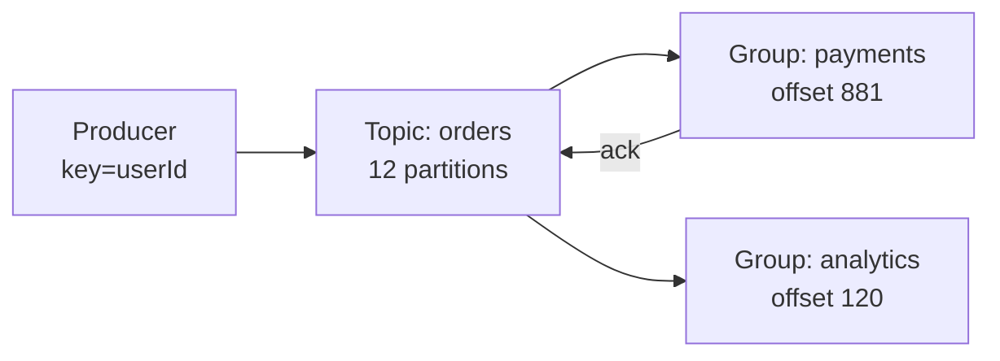

# Kafka

> Durable ordered event log. Fan out to many consumers, replay history, buffer spikes.

> Kafka is a train with durable cars: every partition holds messages in order on disk, safe and replayable. One producer serves many consumer groups reading at their own speeds. It is a log, not a queue — nothing deletes on read.

## When to pick it

1. Event streaming between services (order created → five reactions)
2. High-throughput ingest (clicks, logs, metrics at 100k+ msgs/s)
3. Replay needs (new consumer reads history, bug reprocessing)
4. Spike buffering in front of slow processors

**Don't use for:** simple task queues with routing ([RabbitMQ](/hld/rabbitmq) fits better), request-reply RPC, or tiny throughput (SQS suffices).

## How it works

Topics split into **partitions** (the parallelism unit). Producers key messages to partitions — **same key → same partition → order preserved**. Each **consumer group** reads the full topic independently and commits **offsets**. Retention (hours → forever) decides how far you can replay. Replication factor 3 with `acks=all` and `min.insync.replicas ≥ 2` gives durability without a single point of failure.

**Interview defaults:** partition count ≥ peak consumer parallelism; key by entity id (`orderId`, `userId`); never key everything to `null` if order matters.

## Delivery semantics

| Mode | Commit when | Risk | Use |
|------|-------------|------|-----|
| At-most-once | Before processing | May lose | Metrics you can drop |
| At-least-once | After processing | Duplicates | Default — make consumers **idempotent** |
| Exactly-once | Idempotent producer + transactions | Cost / complexity | Ledger-ish pipelines in one cluster |

**Say aloud:** *"At-least-once plus idempotent consumers is what I ship; exactly-once is a narrow tool, not a default."*

## Ordering and keys

- Order is **per partition**, not global.
- Hot key (`celebrityUserId`) → one partition melts — shard the key (`userId#0..N`) or accept fan-out elsewhere.
- Changing partition count breaks key→partition mapping for old data — plan capacity early.

## Failure modes to mention

1. **Consumer lag** — slow group falls behind; monitor lag, autoscale consumers up to partition count.
2. **Rebalance storms** — membership churn pauses consumption; sticky assignor + stable consumer count.
3. **Unclean leader election** — misconfig can lose acknowledged writes; keep `min.insync.replicas` honest.
4. **Hot partitions** — bad keys pile on one partition; fix key design, not "more brokers" alone.
5. **Poison messages** — bad payload loops forever — DLQ / skip after N retries with alert.

**Mistake:** "Treat Kafka like a queue with deletes."
**Correct:** "Durable log with offsets — consumers track position, history replays, retention bounds it."

**Phrase:** "Kafka is the durable train — partitions for order and scale, groups read independently, offsets track progress."

**Remember (Revision):** Topics → partitions; keys preserve order; groups independent; offsets + retention; `acks=all` + min ISR; at-least-once + idempotent consumers.

**See also:** [message queues](/hld/message-queue), [ad click aggregator](/hld/ad-click-aggregator), [notification system](/hld/notification-system).
