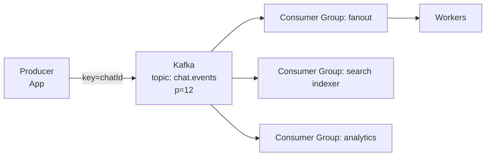

# Kafka

> Durable ordered event log. Boht saare consumers ko fan-out, history replay, aur spikes ko buffer karna ho to Kafka.

> **TL;DR Hinglish:** Kafka ek durable train ki tarah hai — har dabba (partition) me messages order me, disk pe safe. Ek producer, boht saare consumer groups alag-alag speed se read kar sakte hain, purana data replay bhi. Queue nahi, log hai.

Queue vs log vs pub/sub ka fark samjho. Queue me ek message ek consumer kha jata hai. Log me har consumer group pura log padh sakta hai, offset yaad rakhta hai. Isliye analytics + search + notifications sab ek hi event se chal sakte hain.

## Kab chunna hai?

- Ek event se 3-4 systems trigger hone hain (Bitly click → analytics, Twitter fan-out → timelines)
- Replay chahiye — naya consumer purana data fir se padh sake
- Spike buffer — 40k QPS aaye to DB seedha mar jaye, Kafka pehle absorb kare
- Ordering per key chahiye (chatId ya orderId se partition)

**Mat use karo:** simple request-response ya low-throughput job queue jahan SQS/RabbitMQ kaafi ho — Kafka heavy hai.

## Kaise kaam karta hai — Hinglish me

**Partition = dabba.** `key = chatId` → `hash(key) % partitions` → same chat hamesha same partition, order safe. Partition ek leader + replicas (ISR).

**Consumer group = team.** Ek group me har partition ek hi consumer ko milta hai (parallel). Dusra group pura wapas padh sakta hai. Offset = kitna padh liya.

**Delivery guarantees:**
- `at-most-once` — auto-commit pehle, process baad me → lose ho sakta hai
- `at-least-once` — process karke commit → duplicate ho sakta hai, idempotent consumer chahiye
- `exactly-once` — idempotent producer + transaction (Flink/Kafka Streams), bolna easy, karna mushkil

**Outbox pattern:** DB write + Kafka publish ek sath kaise? App DB me outbox table me event likhe, CDC/Debezium Kafka me daale. 2-phase commit se bacho.

## Patterns

- **Fan-out:** ek topic, N groups. Har group apna offset.
- **Backpressure:** consumer slow to lag badhe, alert.
- **Compaction:** key ka latest value hi rakho (config).

## Failure — kya bolna hai

- **Lag:** consumer slow → monitoring + autoscale, DLQ for poison pill
- **Ordering:** galat key se order toot jayega — hamesha bolna kaunsa key
- **Retention:** 7 din default, disk full se pehle delete
- **Rebalance:** consumer add/remove pe thoda pause — sticky assignor se kam

**🔴 Galti:** "Har request Kafka se" — Latency badh jayegi (~10ms).
**✅ Sahi:** "Hot path sync DB/Redis, side-effects async Kafka se."

**Phrase:** "Kafka durable log hai. Partition key se order, har consumer group apna offset, at-least-once + idempotent consumer."

**Yaad rakho:** Log ≠ Queue, partition = order, offset = cursor, outbox for atomic, lag monitor.

**See also:** [notification system](/system-design/notification-system), [ad click aggregator](/system-design/ad-click-aggregator), [Flink](/system-design/flink).
