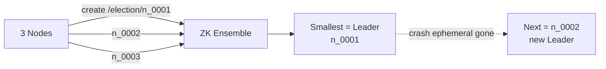

# Leader Election

> Kai servers me se ek ko leader chuno — wahi kaam kare, baaki standby.

> Leader ek class monitor jaisa — ek hi bolega, baaki sunenge. Monitor bimar to naya chun lo. ZooKeeper/Raft me `ephemeral` + `lease` se.

Scheduler, Kafka controller, shard primary — sab me leader.

## How to elect

**1. ZooKeeper:** `/election/n_0001` sequential ephemeral banao — sabse chhota leader. Dead to node auto delete, agla chhota leader.

**2. Raft (etcd, Consul, KRaft):** term badhao, vote maango — majority `F+1` de to leader. Log replicate.

**3. DB lease:** `UPDATE leaders SET owner='host1', expires=now()+10s WHERE owner IS NULL OR expires<now()` — simple, par clock skew se split-brain.

**Lease + Fencing:** leader ke paas 10 sec lease, har 3 sec renew. Kaam karne se pehle fencing token `epoch` check — purana leader ka token purana to storage reject.

## How to prevent split-brain

2 leaders ek saath → double write. Fix: **fencing token** (monotonic `epoch`) — storage har write pe `if epoch < current → reject`.

## How to answer in interview

- **Job Scheduler:** leader hi cron trigger kare, baaki watch.
- **Kafka:** controller leader — partition assign.

**🔴 Galti:** "Leader bina lease" — Network cut pe 2 leaders.
**✅ Sahi:** "Ephemeral + lease 10 sec + fencing epoch."

**Phrase:** "ZooKeeper sequential ephemeral ya Raft majority, lease renew, fencing se split-brain rokho."

**Yaad rakho:** Smallest = leader, ephemeral auto delete, lease 10s, fencing token.

**See also:** [zookeeper](/hld/zookeeper), [replication](/hld/replication), [gossip-protocol](/hld/gossip-protocol).
