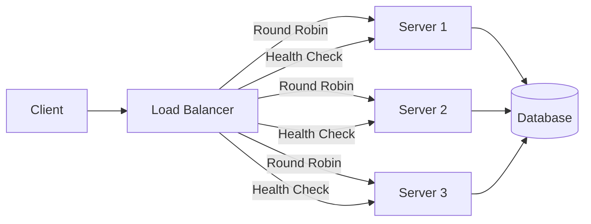

# Load Balancing

> Traffic ko distribute karte hain across servers — single server collapse nahi hoga, availability badhegi.

> Load balancer traffic distribute karta hai multiple servers pe. Algorithms: Round Robin (cyclic), Least Connections (kam load wale ko), Hash (same client same server). Layer 4 (TCP) vs Layer 7 (HTTP). Health checks se dead servers detect. Load balancer single point of failure ho sakta hai — isliye HA pairs use karte hain.

Jab ek server pe sab load nahi jata, load balancer traffic distribute karta hai:

**Algorithms:**
- **Round Robin** — cyclic order mein distribute
- **Least Connections** — jo server ka least active connections hai, usko do
- **Weighted** — powerful server ko zyada traffic
- **IP Hash** — same client IP same server pe jaaye (session affinity)

**Layer 4 vs Layer 7:**
- **L4 (Transport)** — TCP/UDP level, source/dest IP + port dekhta hai
- **L7 (Application)** — HTTP level, URL, headers, cookies dekhta hai

## How it works

1. Client request load balancer pe aata hai
2. LB algorithm select karta hai server
3. Request us server pe forwarded hota hai
4. Response client tak LB se jaati hai
5. **Health checks** — LB regularly ping karta servers pe, dead server remove

## Failure modes to mention

1. **LB as SPOF** — Single load balancer fail = entire system down — HA pairs (active-passive) se bachna
2. **Sticky sessions** — Session affinity fail = user logged out — session affinity important
3. **Health check too aggressive** — Server restart pe LB remove hota, slow to come back
4. **SSL termination** — LB SSL decrypt, server HTTP — LB pe overhead

**🔴 Galti:** "Load balancer single hai, sab theek" — LB SPOF hai — active-passive ya active-active pairs lagao.
**✅ Sahi:** "Load balancer distributes traffic with algorithms, health checks remove dead servers. Use HA pairs to avoid SPOF. Layer 7 for smart routing."

**Phrase:** Load balancer distributes traffic across servers using algorithms (round-robin, least-connections, hash). Layer 4 (IP+port) vs Layer 7 (HTTP). Health checks + HA pairs for availability.

**Yaad rakho (Revision):** LB algorithms (RR, Least Conn, IP Hash), L4 vs L7, health checks, HA pairs, session affinity sticky sessions, SSL termination.

**See also:** [Clustering](/hld/clustering), [IP](/hld/ip), [Availability](/hld/availability).
