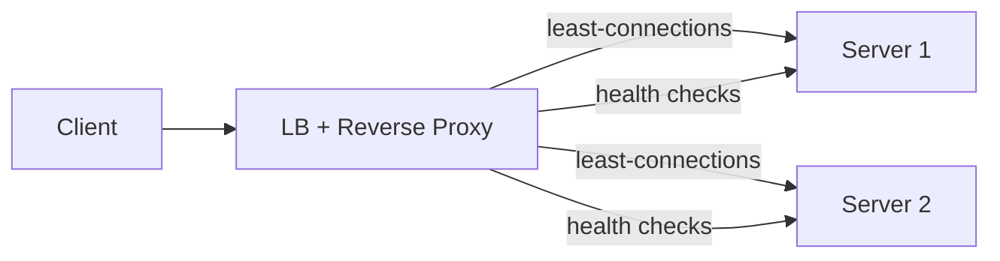

# Load Balancing

> Spread traffic so no single server melts — with health checks removing the dead.

> A load balancer sits in front of server pools and assigns each request by algorithm. Layer 4 balances on IP and port (TCP/UDP level, fast, dumb). Layer 7 understands HTTP — URL, headers, cookies — enabling smart routing, path rules, and session affinity.

## Algorithms

- **Round Robin** — cyclic order; simple, assumes equal servers.
- **Weighted Round Robin** — powerful servers get proportionally more traffic.
- **Least Connections** — send to the server with fewest active connections; best for uneven request costs.
- **IP Hash** — same client IP lands on the same server; gives session affinity without cookies.
- **Least Response Time** — combine connections with observed latency.

## Consistent Hashing

When servers cache, random distribution destroys hit rates on scaling. Consistent hashing maps servers and keys onto a ring — adding a server moves only `1/N` of keys. Virtual nodes (100+ per server) even out the load. This is how caches and shards scale without mass invalidation.

## Health Checks and Failover

The balancer pings servers (HTTP `/health`, TCP connect); failures leave the pool, recoveries rejoin after consecutive passes. Checks must be cheap and fast — aggressive timeouts flap servers in and out. Failover is automatic; clients never notice dead servers.

## Sticky Sessions

IP hash or cookies pin a user to one server — needed only for stateful servers. Prefer stateless servers plus a shared session store instead; stickiness complicates failover and scaling.

## Reverse Proxy

A reverse proxy (Nginx, HAProxy) is a load balancer plus extras: SSL termination, caching, compression, rate limiting, DDoS absorption. In practice the LB and reverse proxy are the same box. Forward proxies serve clients (VPNs, corporate filtering) — the mirror image.

## Keep in mind

- L4 sees IP and port; L7 sees HTTP — pick L7 for smart routing.
- Least connections for uneven costs; IP hash for affinity.
- Consistent hashing protects caches when servers change.
- Health checks must be cheap, with hysteresis before rejoining.
- The balancer itself is a single point of failure — run HA pairs.
- Prefer stateless servers over sticky sessions.
