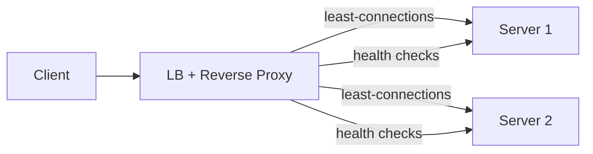

# Load Balancing

> Spread traffic so no single server melts — with health checks removing the dead.

> A load balancer sits in front of server pools and assigns each request by algorithm. Layer 4 balances on IP and port (TCP/UDP level, fast, dumb). Layer 7 understands HTTP — URL, headers, cookies — enabling smart routing, path rules, and session affinity.

## Algorithms

The algorithm decides **which healthy backend** gets the next request. Round robin is fair when requests cost the same; weighted round robin skews toward bigger instances (more CPU/RAM). **Least connections** tracks active in-flight work — better when some requests hold connections longer (uploads, slow queries). **Least response time** blends queue depth with observed latency — useful when backends are heterogeneous. **IP hash** maps client IP to server — cheap affinity without cookies, but uneven if NAT concentrates users.

- **Round Robin** — cyclic order; simple, assumes equal servers.
- **Weighted Round Robin** — powerful servers get proportionally more traffic.
- **Least Connections** — send to the server with fewest active connections; best for uneven request costs.
- **IP Hash** — same client IP lands on the same server; gives session affinity without cookies.
- **Least Response Time** — combine connections with observed latency.

- Default interview pick: **least connections** for API tiers with variable latency.
- **Weighted** when mixing instance types (c6g.large + c6g.4xlarge in one pool).
- **Random with two choices** — cheap approximation of least loaded at scale.
- Re-evaluate on **scale events** — adding a node changes round-robin interleaving.
- Algorithms assume **homogeneous health** — unhealthy nodes must be removed first.

## Consistent Hashing

Plain modulo hashing (`hash(key) % N`) reshuffles almost every key when N changes — cache hit rates collapse after one scale event. **Consistent hashing** places servers and keys on a ring; only keys between the old and new server move (~`1/N` of keys). **Virtual nodes** (100+ per physical server) spread load evenly so one hot machine does not own half the ring. Used for **memcached/redis clusters**, CDNs, and sharded gateways — say it when the prompt mentions cache or data partitioning.

- Ring key = **hash(user_id)** or **hash(cache key)** — same key → same shard until topology changes.
- **150+ vnodes per node** is a common rule of thumb for even distribution.
- On node failure, **replicate** keys to successor nodes — mention replication factor.
- **Jump consistent hash** — alternative with minimal movement; know the name.
- Distinct from **LB algorithms** — consistent hashing is about **data placement**, not HTTP routing.

## Health Checks and Failover

Load balancers only send traffic to **healthy** backends. **Active checks** probe `/health` or TCP connect on an interval; **passive checks** mark nodes bad after consecutive 5xx or timeouts from real traffic. Use lightweight endpoints that verify critical dependencies optionally (deep vs shallow health). **Hysteresis** — require N successes before re-admitting a flapping node — prevents thundering herds. Failover is automatic; clients never notice dead servers behind the VIP.

- **Liveness** = process up; **readiness** = can serve traffic (DB reachable).
- Keep health checks **cheap** (<10 ms) — no full dependency fan-out every second.
- Align check **interval/timeout** with **connection drain** on deploy (graceful shutdown).
- **Out-of-band management** — do not route admin traffic through the same pool blindly.
- Multi-AZ: LB spans zones; backends per zone for **zonal failure** isolation.

## Sticky Sessions

Session affinity pins a user to one backend — via **cookie insert**, **header**, or **IP hash**. Useful only when the server holds local session or websocket state you cannot externalize quickly. Stickiness hurts **even load** (power users skew one node) and **failover** (lost session on node death). Prefer **centralized session store** (Redis) or **JWT** so any node serves any user; if you must stick, set short TTL and plan drain on scale-in.

IP hash or cookies pin a user to one server — needed only for stateful servers. Prefer stateless servers plus a shared session store instead; stickiness complicates failover and scaling.

- **Cookie-based** stickiness survives client IP changes (mobile networks).
- **IP hash** breaks behind carrier NAT — many users, one IP.
- On node loss, **sticky users** lose sessions unless replicated — state the downside.
- WebSocket **often needs affinity** — pair with connection migration or regional shards.
- Kubernetes: **SessionAffinity Service** vs Ingress annotations — same concepts.

## Reverse Proxy

A **reverse proxy** terminates client connections and forwards to upstreams — Nginx, Envoy, HAProxy, cloud ALB/NLB. Beyond balancing, it handles **TLS termination**, **gzip/brotli**, **static caching**, **rate limiting**, and **DDoS absorption**. In practice the LB and reverse proxy are often the same box at the edge. A **forward proxy** sits near clients (corporate proxy, VPN) and filters outbound traffic — opposite direction, different threat model.

- **L4 LB (NLB)** — TCP pass-through, ultra-low latency, no HTTP routing.
- **L7 LB (ALB/Envoy)** — path/host routing, auth, WAF integration.
- **Sidecar proxy** (service mesh) — mTLS + LB **east-west** between pods.
- **Connection draining** on deploy — stop new connections, wait for in-flight to finish.
- **Anycast IP** at edge — one IP, many PoPs; health-based withdrawal.

## Keep in mind

- L4 sees IP and port; L7 sees HTTP — pick L7 for path routing, auth, and TLS at edge.
- Least connections for uneven costs; IP hash only when you accept affinity downsides.
- Consistent hashing protects caches and shards when server count changes.
- Health checks must be cheap, with hysteresis before rejoining flapping nodes.
- The balancer itself is a single point of failure — run HA pairs, anycast, or managed multi-AZ LBs.
- Prefer stateless servers plus shared session store over sticky sessions when you can.
