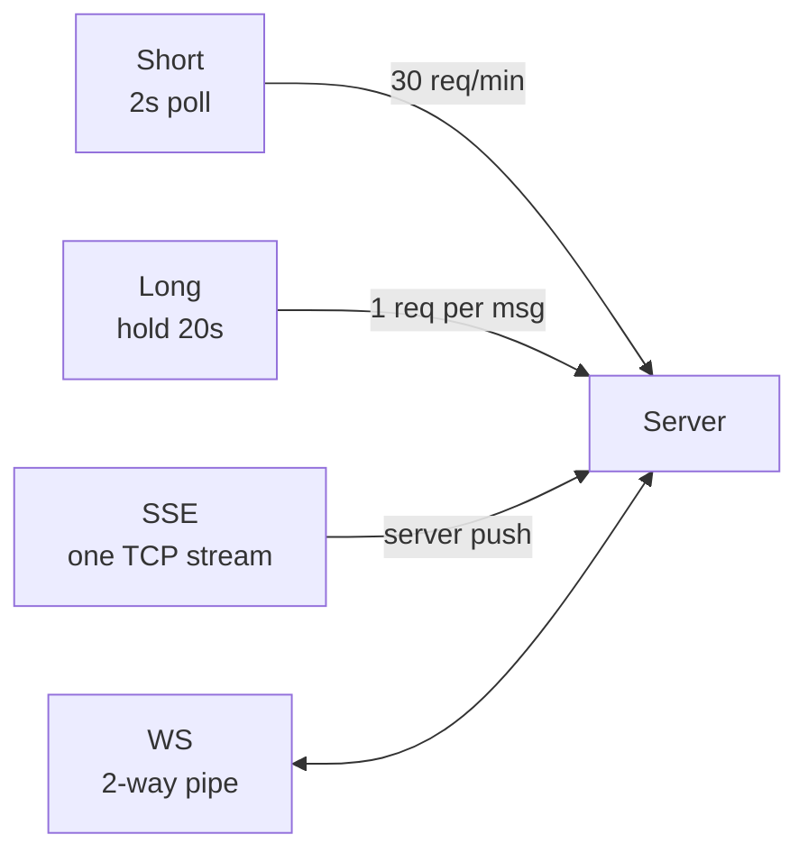

# Long Polling vs SSE vs WebSocket

> Server se push kaise? Polling waste, long-hold, SSE one-way, WS two-way.

> Short polling har 2 sec darwaza khatkhatana — thak gaye. Long polling darwaza pakad ke khade raho, khule to bolo. SSE ek speaker jisse server bolta rahe, WS phone call.

Har realtime design me yahi puchenge.

## How it works

**1. Short polling:** `setInterval(()=>GET /messages,2000)` — simple, par 30 req/min waste, latency 2 sec, battery gayi.

**2. Long polling:** `GET /poll?since=123` ko server 20 sec hold kare, naya aaya to turant jawab, nahi to `204` + client retry. Latency kam, par har message pe naya TCP + server hold.

**3. SSE (Server-Sent Events):** `GET /stream` + `Content-Type: text/event-stream` — ek HTTP pe server `data: {...}\n\n` bhejta rahe, auto reconnect `Last-Event-ID`. **One-way** (server→client), text only, simple. Feed/notifications ke liye kaafi.

**4. WebSocket:** `ws://` Upgrade 101 ke baad dono taraf bhej sakte, binary+text, 1 TCP. **Two-way** — chat, docs, game.

| Use | Best |
|---|---|
| Chat, Docs, Game | WebSocket |
| Feed, Notifications | SSE bhi ok |
| Old browser | Long polling fallback |

## Trade-offs

- **Polling:** waste + latency
- **Long:** hold se server threads bhare — async (Node/Netty) chahiye
- **SSE:** HTTP, LB friendly, par one-way
- **WS:** best par LB sticky + heartbeat + scale mushkil

**🔴 Galti:** "Har cheez WS" — Feed pe SSE kaafi, WS heavy.
**✅ Sahi:** "Chat/docs WS, feed SSE, fallback long polling."

**Phrase:** "Short waste, long hold, SSE one-way stream, WS two-way phone call — use case dekho."

**Yaad rakho:** Short 2s, long 20s hold, SSE `text/event-stream`, WS 101 + 2-way.

**See also:** [websocket](/hld/websocket), [whatsapp](/hld/whatsapp), [fb-live-comments](/hld/fb-live-comments).
