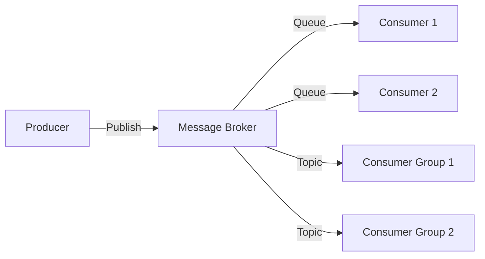

# Message Brokers

> Application components ko connect karte hain asynchronously — decoupling.

> **TL;DR Hinglish:** Message broker ek middleware hai jo producers aur consumers ko connect karta hai asynchronously. Decoupling hota hai — producer ko consumer ka existence nahi pata. Types: Point-to-point (queue), Publish-Subscribe (topic). Kafka, RabbitMQ, ActiveMQ popular hain. Benefits: reliability, scalability, async processing. Producer publish karta hai topic/queue pe, consumer subscribe karta hai.

Message broker decouples application components ke beech:

**How it works:**
1. Producer message publish karta hai broker pe
2. Broker message store/forward karta hai
3. Consumer message broker se consume karta hai
4. **Decoupling** — Producer/consumer dono jaante nahi ek doosre ke baare mein

**Types:**
- **Point-to-point** — Queue, message ek consumer tak jaata hai
- **Publish-Subscribe** — Topic, message sab subscribers ko jaati hai
- **Pub/Sub + Queue combo** — Kafka-like, topic + consumer groups

**Popular brokers:**
- **Kafka** — Distributed log, high throughput, durable
- **RabbitMQ** — Flexible routing, AMQP protocol
- **ActiveMQ** — Java-based, JMS support

## Failure modes to mention

1. **Broker SPOF** — Broker fail = entire system down — cluster mode, replication
2. **Message loss** — Broker crash before consumer ack — persistence, ack mechanisms
3. **Message duplication** — Consumer crash, message not acked, redelivered — idempotent consumers
4. **Backpressure** — Consumers slow, queue builds up — drop, throttle, or buffer

**🔴 Galti:** "Message broker = database" — Broker messages transfer karta hai, data store nahi. Different purpose.
**✅ Sahi:** "Message broker decouples producers/consumers asynchronously. Types: point-to-point (queue) and pub-sub (topic). Kafka/RabbitMQ popular. Not a database."

**Phrase:** Message broker producers aur consumers ko connect karta hai asynchronously — decoupling, reliability, scalability. Kafka, RabbitMQ. Queue vs Topic.

**Yaad rakho (Revision):** Producer → broker → consumer, decoupling, point-to-point vs pub-sub, Kafka/RabbitMQ, broker SPOF (cluster), message loss (ack), idempotent consumers.

**See also:** [Message Queue](/system-design/message-queue), [Publish-Subscribe](/system-design/publish-subscribe), [Kafka](/system-design/kafka).
