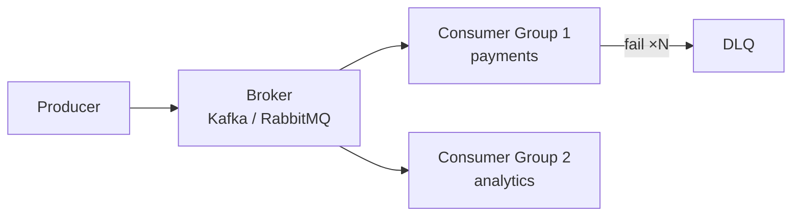

# Message Queues

> Decouple in time — producers move on while consumers catch up, with spikes absorbed in between.

> Queues sit between producers and consumers so neither waits for the other. Order placed → payment, inventory, and email each proceed independently. Spikes queue up instead of crashing services. Core trio: Kafka (durable log), RabbitMQ (smart routing), NATS JetStream (lightweight plus persistence).

## Message Queue Basics

A **broker** buffers messages between **producers** (publishers) and **consumers** (workers). **Point-to-point** queues deliver each message to exactly one consumer in a competing-consumer group — work queues, job processing. **Persistence** (disk append log vs memory) and **acknowledgments** define durability: after ack, message is gone; before ack, broker redelivers on consumer crash. Throughput scales with partitioning and consumer count until broker or downstream DB becomes the bottleneck.

- **Broker vs bus:** Queue = one consumer per message per group; log = retain for replay and multiple independent consumer groups.
- **Backlog depth:** Monitor queue lag — sustained growth means consumers slower than producers, not "free buffer forever."
- **Message size limits:** Large payloads belong in object storage with queue carrying pointer — Kafka default ~1MB per message.
- **Ordering contract:** Define per-partition or per-queue — global order is expensive and usually unnecessary.

## Producer and Consumer Roles

Producers serialize events and publish with optional **publisher confirms** (RabbitMQ) or **acks=all** (Kafka) before considering send successful. Consumers fetch or receive push, process **idempotently**, then **ack** — nack or fail without ack triggers redelivery. Slow consumers create lag; fast producers fill retention — both sides need SLAs. Never assume exactly-once processing without dedup keys and idempotent side effects.

- **Idempotent consumer:** Store processed message ID or business idempotency key before side effects commit.
- **Prefetch / max.poll:** Tune batch size so one poison message does not block entire partition worker unfairly.
- **Graceful shutdown:** Finish in-flight, commit offset/ack, then exit — hard kill causes duplicate work.
- **Poison messages:** After N failures route to DLQ — do not infinite retry on bad JSON.

## Pub/Sub Model

**Topics** (or exchanges + bindings) fan out one published event to many **subscriber groups** — each group receives every message independently (payments group + analytics group both see `OrderCreated`). Within a group, partitions divide work among members. Use for event-driven architectures: domain events trigger notifications, search indexing, and billing without orchestrating synchronous RPC chains.

- **Fan-out vs queue:** Pub/sub duplicates to groups; queue competes within one group — Kafka combines both via consumer groups.
- **Subject/topic naming:** Version or schema in name (`order.created.v2`) eases evolution alongside schema registry.
- **Filtering:** RabbitMQ routing keys, Kafka headers — reduce noise so consumers do not parse irrelevant events.
- **Choreography:** Many subscribers react to one event — document ordering assumptions and compensations.

## Asynchronous Processing

Move work off the critical HTTP path: return `202 Accepted` with job ID while encoding, PDF generation, or fraud scoring runs in workers. User-perceived latency drops; system absorbs downstream outages by growing backlog (within retention limits). Tradeoffs: harder tracing (correlate trace ID in message), delayed failure visibility, and need for status polling or webhooks on completion.

- **Outbox pattern:** Write DB + outbox row in one transaction; relay publishes to broker — avoids "DB committed, message lost."
- **Inbox pattern:** Dedup incoming events at consumer DB before processing — pairs with at-least-once delivery.
- **SLA messaging:** Tell users "email within 5 minutes" — backlog alerts before SLA breach.
- **Sync fallback:** Some flows need synchronous failure (payment declined) — do not queue what must fail fast to the user.

## Delivery Guarantees

**At-most-once:** Fire and forget or ack before process — may lose messages, never duplicates (metrics, non-critical telemetry). **At-least-once:** Default — broker redelivers until ack; consumers **must** dedupe (idempotency keys, unique constraints). **Exactly-once effect:** Kafka transactions + idempotent producer + deduping sink, or database idempotency table — say "effectively once" in interviews. Pick guarantee **per flow** and document who dedupes (producer, broker, consumer).

- **Ack timing:** Ack after successful side effect, not before — early ack loses message on crash mid-process.
- **Duplicate window:** Retries + redelivery mean duplicates for minutes — design DB upserts accordingly.
- **Ordering vs guarantee:** Stronger delivery often couples to partition single-thread processing.
- **Financial events:** At-least-once + idempotent ledger entries beats pretending exactly-once exists everywhere.

## Message Ordering

Total order across a high-throughput topic requires single partition — throughput ceiling of one consumer thread. Practical order: **per partition** or **per message key** (same `order_id` → same partition) so related events serialize (created → paid → shipped). Unrelated orders parallelize across partitions. If cross-key order matters, rethink domain boundaries or use a saga orchestrator with explicit state machine.

- **Key choice:** Skewed keys (all events for one tenant) create hot partitions — salt or sub-partition strategies.
- **Reordering on retry:** Failed message retried later may appear out of order — consumers use version numbers or state checks.
- **FIFO queues (SQS):** Throughput limit per message group — similar to Kafka partition semantics.
- **Global sequence:** Rare; often replaced by causal IDs and idempotent state transitions.

## Retries

Transient failures (network blip, DB deadlock, 503) deserve retry with **exponential backoff** and **jitter** so retries do not synchronize into storms. Cap attempts (3–5 typical) and total delay; route permanent failures (schema mismatch, 400 business rule) straight to DLQ. Distinguish retryable in code early — parsing errors should not retry forever.

- **Backoff example:** 1s, 2s, 4s + random 0–500ms — cap max delay at 5–10 minutes.
- **Retry topic:** Kafka retry topic with delay tiers decouples main consumer from sleep loops.
- **Idempotency on retry:** Same delivery attempt count may run twice — side effects must tolerate duplicates.
- **Alert on retry rate:** Spike often signals downstream outage before DLQ fills.

## Dead Letter Queue

After max retries, move message to **DLQ** with original payload, error reason, stack trace, and attempt count. Operators inspect, fix code or data, **replay** to main queue or discard. Without DLQ, poison messages block partition head (Kafka) or spin forever (bad retry policy). Alert on DLQ depth and age — silent DLQ growth is production debt.

- **Replay tooling:** Idempotent replay mandatory — replays duplicate if original actually succeeded but ack failed.
- **Separate DLQ per consumer:** Easier ownership than one global graveyard.
- **Retention:** DLQ retention longer than main queue — investigations take days.
- **Security:** DLQ may contain PII — encrypt and restrict access like primary topics.

## Backpressure

When produce rate exceeds consume rate, unbounded buffers OOM brokers or hide failure until catastrophic lag. Explicit strategies: **bounded queues** with **429/503** to producers, **drop low-priority** traffic (load shedding), **autoscale consumers** on lag metrics, or **pull-based** consumption where workers fetch only when ready. Kafka consumers pause partitions when downstream slow — prefer measured rejection over silent buffer growth.

- **Producer rate limit:** Client-side token bucket when broker returns backpressure signals.
- **Priority queues:** Separate topics for critical vs bulk work — shed bulk first under stress.
- **Lag SLO:** Alert at N minutes lag, not only DLQ — user-visible delay precedes data loss.
- **End-to-end:** Backpressure useless if consumer calls unbounded thread pool to DB — limit concurrency per partition.

## Consumer Groups

A **consumer group** is one logical subscriber: partitions assign exclusively to group members — scale consumers up to partition count, not beyond. Rebalance on member join/leave pauses consumption briefly — minimize churn during deploys (static membership, cooperative rebalance). Multiple groups read the same topic independently — analytics and billing both consume `orders` without stealing each other's messages.

- **Partitions ≥ peak parallelism:** Plan 12–24 partitions minimum for services that scale to dozens of workers.
- **Rebalance storms:** Frequent k8s restarts cause rebalance loop — `session.timeout.ms` and stable consumer IDs matter.
- **Static assignment:** Advanced — manual partition map avoids rebalance for fixed topology.
- **One slow consumer:** Same partition stuck on poison message blocks that partition's order — fix with DLQ and parallel processing only across partitions.

## Kafka in Depth

Durable partitioned commit log: topics split into **partitions** (the parallelism unit); producers key messages so **same key → same partition → order preserved**; each **consumer group** reads the full topic independently and commits **offsets**; retention (hours → forever) bounds replay. Replication factor 3 with `acks=all` and `min.insync.replicas ≥ 2` gives durability without a single point of failure. It is a log, not a queue — nothing deletes on read.

- **Interview defaults:** partitions ≥ peak consumer parallelism; key by entity id (`orderId`, `userId`); never key everything to `null` if order matters.
- **Delivery:** at-most-once (commit before process), at-least-once (commit after — the default, consumers idempotent), exactly-once only via idempotent producer + transactions in one cluster.
- **Failure modes:** consumer lag (autoscale consumers up to partition count); rebalance storms (sticky assignor, stable membership); unclean leader election (keep min ISR honest); hot partitions (fix key design, shard the key); poison messages (skip/DLQ after N retries with alert).
- **Don't use for:** simple task queues with routing, request-reply RPC, or tiny throughput (SQS suffices).
- **Phrase:** "Kafka is the durable train — partitions for order and scale, groups read independently, offsets track progress."

## RabbitMQ in Depth

Smart broker: **Producer → Exchange → (bindings) → Queue → Consumer.** Producers know only the exchange plus routing key, never queues. Queues push to consumers; each message needs an ack — unacked ones requeue or dead-letter. Exchange types: direct (exact key), topic (`order.*` patterns), fanout (copy to all), headers (attribute match). Durability requires durable queues plus durable messages; publisher confirms tell producers the broker persisted.

- **RabbitMQ vs Kafka:** smart broker + queue (consumed messages leave) vs dumb log (offsets, replayable); exchanges decide routing here, app routes there; 10–50k msgs/s with rich routing vs 100k+ msgs/s durable log.
- **Failure modes:** unacked pile-up (prefetch limits + alerts + autoscale); poison messages (DLQ policy mandatory); split brain (quorum queues, not legacy mirrored); memory alarms (lazy queues, TTLs, max-length).
- **Phrase:** "Smart broker — exchanges route, queues push, acks delete. Routing needs RabbitMQ, log needs Kafka."

## NATS JetStream in Depth

Featherweight messaging: core NATS is at-most-once fire-and-forget (offline subscribers miss out); **JetStream** adds the durable layer — streams store messages, consumers read at their pace, ack, and replay. Flow: **Publisher → Subject → Stream → Consumer (push/pull) → Ack.** Subjects use dots (`orders.created.eu`) with wildcards (`*` one level, `>` all levels). Retention policies: limits (size/age), workqueue (delete on ack), interest (delete when all consumers read). Durable consumers survive restarts; pull consumers give natural backpressure.

- **JetStream vs Kafka:** single-binary clustering in minutes vs KRaft + tuning; tens of thousands msgs/s vs 100k+; Kafka's ecosystem (Connect, Streams, Flink) runs deeper. JetStream wins edges, IoT, and small teams.
- **Failure modes:** slow consumers fill streams (size retention + pull); ack expiry → redelivery (keep consumers idempotent); interest-policy surprise (no consumers = instant deletion); memory streams wipe on restart (file storage for durability).
- **Phrase:** "NATS core is fast pub-sub, JetStream the durable layer — streams store, consumers ack. Light ops, moderate throughput."

## Stream Processing with Flink

Queues move events; Flink **computes over the stream**: events key into windows (tumbling, sliding, session); watermarks (max event time minus lateness bound) trigger computation and forgive late arrivals; state backends (RocksDB) persist with TTL; checkpoints snapshot progress to durable storage (e.g., S3) every ~30s; sinks must be idempotent for exactly-once effect. Realtime aggregations (click counts, trending, fraud windows), CEP patterns across streams.

- **Failure modes:** watermarks too tight drop real events (size lateness from data); unbounded keyed state OOMs (TTL + alerts); slow checkpoints stall pipelines (monitor duration); skewed keys overload subtasks (salt keys).
- **Pairs with:** Kafka (durable log in) → Flink (compute) → ClickHouse/warehouse (serve results). Not for batch analytics or tiny throughput.
- **Phrase:** "Flink catches the river — windows group, watermarks forgive lateness, checkpoints survive crashes."

## Brokers at a Glance

**Kafka:** Durable partitioned commit log, high throughput (100k+ msg/s per cluster), retention for replay, stream processing (Flink, ksqlDB) — event backbone and analytics pipelines. **RabbitMQ:** Exchanges (direct, topic, fanout) route to queues, per-message acks, classic task queues and RPC-over-mq patterns. **NATS JetStream:** Lightweight ops, pub/sub with persistence and at-least-once — good for edge and microservice mesh signals. **SQS/SNS:** Fully managed, moderate throughput, visibility timeout semantics — AWS-native decoupling with minimal ops.

- **Kafka:** Log compaction for changelog topics (`KTable` state); not a job queue unless you add delay/retry topics.
- **RabbitMQ:** Dead-letter exchanges built-in; clustering differs from Kafka — know quorum queues for durability.
- **NATS:** Core NATS is fire-and-forget; JetStream adds persistence — pick JetStream for jobs needing ack.
- **SQS:** Standard vs FIFO; SNS fan-out to multiple SQS queues — common serverless pattern.

## Keep in mind

- Decouple in time: producers never block on consumer completion — define backlog and retention limits.
- At-least-once plus idempotent consumers is the default; state who dedupes and where keys live.
- Order per partition/key only — design partition keys from domain cohesion, not convenience.
- Retry with backoff, jitter, and hard caps; permanent failures go to DLQ with alerts.
- Backpressure is explicit: bounded buffers, shed load, scale consumers, or slow producers — not hope.
- Kafka for durable logs/replay, RabbitMQ for routing/task queues, NATS JetStream for light persistent pub/sub, SQS for managed AWS.
