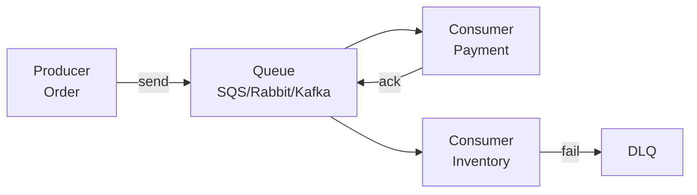

# Message Queue

> Kaam ko queue me daalo — producer bhage, consumer aaram se peeche aaye.

> Message queue ek dhaba ka token system — order lo token do, kitchen peeche banaye, bheed badhe to token line badhe, kitchen tez nahi to nahi. Producer aur consumer alag, spike buffer.

Har async design me aayega — notification, analytics, transcode.

## Queue vs Log vs Pub/Sub

- **Queue (SQS, RabbitMQ):** ek message ek consumer — `push` → `pop` + ack → delete. Order per queue nahi pakka.
- **Log (Kafka):** har message disk pe, har group pura padhe — `offset` yaad, replay. Order per partition pakka.
- **Pub/Sub:** topic pe publish, N subscribers — log ka hi roop.

## When to pick which

- **SQS (managed queue):** 10k TPS, at-least-once, 14 days, dead-letter queue. Simple jobs.
- **RabbitMQ:** routing `direct/topic/fanout`, priority, 20k TPS, in-memory.
- **Kafka:** 100k+ TPS, durable log, replay, 7 days, exactly-once via transaction. Heavy par powerful.

**Pick:** simple delayed job → SQS, complex routing → RabbitMQ, high throughput + replay → Kafka.

## How to answer in interview

- **Decouple:** `Order Service → queue order.created → Payment + Inventory` async.
- **DLQ:** fail 3 baar to `order.DLQ` me, manual retry.
- **Backpressure:** consumer slow to queue bade + alert + autoscale.
- **Idempotency:** same message 2 baar → `msgId SETNX` → dedup.

## Failure handling

- **Order:** Rabbit/Kafka partition pe order, SQS nahi.
- **Poison pill:** ek message har baar fail → DLQ, warna loop.
- **Visibility timeout (SQS):** 30 sec me ack nahi to wapas queue.

**🔴 Galti:** "Har cheez sync" — Spike pe DB marega.
**✅ Sahi:** "Write DB + queue async, consumer idempotent, DLQ."

**Phrase:** "Queue token jaisa — SQS simple, Rabbit routing, Kafka log replay, DLQ + idempotent."

**Yaad rakho:** Queue 1 consumer, log replay, SQS simple, Rabbit routing, Kafka high + replay, DLQ must.

**See also:** [kafka](/hld/kafka), [backpressure](/hld/backpressure), [idempotency](/hld/idempotency).
