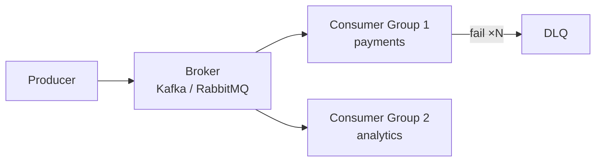

# Message Queues

> Decouple in time — producers move on while consumers catch up, with spikes absorbed in between.

> Queues sit between producers and consumers so neither waits for the other. Order placed → payment, inventory, and email each proceed independently. Spikes queue up instead of crashing services. Core trio: Kafka (durable log), RabbitMQ (smart routing), NATS JetStream (lightweight plus persistence).

## Message Queue Basics

Producers publish, the broker stores, consumers process at their pace. Point-to-point queues deliver each message to one consumer; competing consumers scale throughput. Persistence plus acknowledgments decide durability: acked messages leave, unacked ones redeliver.

## Producer and Consumer Roles

Producers fire and forget (with optional confirmations); consumers pull or receive pushes, process idempotently, then ack. Slow consumers exert backpressure — brokers buffer, shed, or throttle. Consumers must tolerate redelivery because at-least-once is the norm.

## Pub/Sub Model

One message fans to many subscribers via topics — each subscriber group gets its own copy. Perfect for event-driven systems (order created → five reactions). Ordering holds per partition or subject, not globally.

## Asynchronous Processing

Move slow work off the request path: uploads return 202 while transcoding queues; emails send after signup responds. Async raises availability (survives downstream outages) at the cost of eventual results and harder debugging.

## Delivery Guarantees

At-most-once (may lose, never duplicate — metrics), at-least-once (redelivers, may duplicate — the default; pair with idempotent consumers), exactly-once (effectively once via transactions plus idempotency — Kafka + idempotent sinks). State the guarantee per flow, never assume.

## Message Ordering

Order holds within a partition or key (same chat, same order ID), never across the whole topic. Need global order? Single partition — and accept the throughput ceiling. Design keys so related events share partitions.

## Retries

Retry transient failures with exponential backoff plus jitter (prevents retry storms). Cap attempts — infinite retries poison queues. Separate retryable (timeouts) from fatal (bad payload) errors early.

## Dead Letter Queue

Messages failing all retries park in a DLQ with error context for inspection and replay. Every queue needs one; without it, poison messages loop forever or vanish silently. Alert on DLQ depth.

## Backpressure

When producers outrun consumers: bounded queues plus 429s, load shedding (drop low-priority), autoscaling consumers, or pull-based consumption (consumers set the pace). Pick one deliberately — unbounded buffering just moves the crash to memory.

## Consumer Groups

Groups split partitions across consumers for parallel processing; each group gets the full stream independently. Rebalances on scaling pause consumption briefly. Size partitions for peak parallelism — you cannot scale consumers past partition count.

## Kafka, RabbitMQ, NATS, SQS/SNS

Kafka: durable partitioned log, replay, 100k+ msgs/s — heavy streaming backbone. RabbitMQ: exchanges with smart routing, per-message acks — flexible task queues. NATS JetStream: lightweight pub-sub plus persistence — simplest ops. SQS/SNS: managed AWS queue plus notifications — zero ops, moderate throughput.

## Keep in mind

- Decouple in time: producers never wait for consumers.
- At-least-once plus idempotent consumers is the default contract.
- Order per partition only — design keys accordingly.
- Retry with backoff and caps; park failures in a DLQ.
- Backpressure needs an explicit strategy, not hope.
- Kafka for logs, RabbitMQ for routing, NATS for light ops, SQS for managed.
