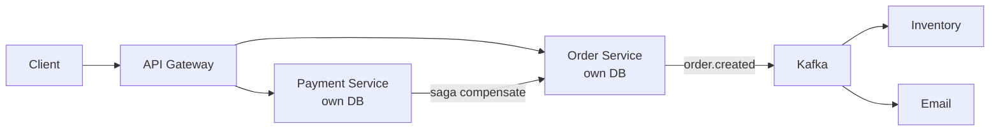

# Microservices

> Many small deployables instead of one big one — independent scaling and shipping at the price of distributed complexity.

> Start as a monolith; extract services when teams and scale demand it. Each microservice owns its code, data, and deployments — user, order, and payment evolve and scale independently. The costs are real: network latency, distributed transactions, and 10x operational overhead.

## Monolith and Modular Monolith

One repo, one database, one deploy — simple joins, ACID transactions, easy debugging. Outgrows via merge conflicts, single-language lock-in, and all-or-nothing deploys. The modular monolith (separated packages, shared DB) is the sane middle step — extract services later with the strangler pattern.

## Microservices and Service Boundaries

Split by domain (Domain-Driven Design bounded contexts: User, Order, Payment), never by layer. Each service owns its database — no shared tables, communication via APIs or events. Wrong boundaries hurt more than monoliths; get the domains right first.

## Service Discovery

Instances come and go, so hardcoding addresses fails. Registries (Consul, Eureka, etcd) track healthy instances via heartbeats; clients discover via registry lookup or DNS plus load balancer. Health checks keep the directory honest.

## API Gateway

Single front door per system: auth, rate limits, routing. In microservices it also aggregates responses for clients (Backend-for-Frontend). Keep business logic out — gateways route and guard, services decide.

## Sync vs Async Communication

Synchronous REST/gRPC is simple and fast to trace, but couples availability — downstream down means caller fails (mitigate with circuit breakers). Asynchronous events via Kafka decouple completely with retries and replay, at eventual-consistency cost. Hot paths go sync; side effects go async.

## Database per Service

Each service owns its tables; cross-service joins happen via APIs or replicated read models, never shared writes. Polyglot persistence follows naturally — SQL for orders, documents for catalogs.

## Event-Driven Architecture

Services emit domain events (order.created) that interested parties consume independently — inventory, email, analytics react without the order service knowing them. Producers and consumers evolve separately; ordering holds per key, consistency stays eventual.

## Saga Pattern

Distributed transactions as a chain of local steps with compensations: book flight, charge card, reserve hotel — card failure triggers flight cancellation events. Choreography (event-driven, no boss) suits simple flows; orchestration (central coordinator) suits complex ones. Prefer sagas over 2PC everywhere in microservices.

## Outbox Pattern

Publish events atomically with state changes: write business row plus outbox row in one transaction, then a relay publishes outbox rows to Kafka. No dual-write inconsistency — the database stays the single commit point.

## CQRS and Event Sourcing Basics

CQRS splits read and write models — denormalized read replicas serve queries, transactional models take writes, synced by events. Event sourcing stores the event log as truth and derives state by replay — full audit trail included. Both add complexity; earn them with read/write asymmetry or audit needs.

## Distributed Tracing

One request crosses many services — trace IDs propagate through headers, spans record per-service timing, tools (Jaeger, Zipkin, OpenTelemetry) assemble the waterfall. Without tracing, debugging distributed latency is guessing. Correlate logs with the same IDs.

## Keep in mind

- Start monolith or modular; extract with strangler when scale demands.
- Boundaries follow domains; each service owns its database.
- Sync for hot paths with circuit breakers; async for side effects.
- Sagas with compensations replace distributed transactions.
- Outbox makes event publishing atomic with state changes.
- Trace IDs across services or debugging is blind.
