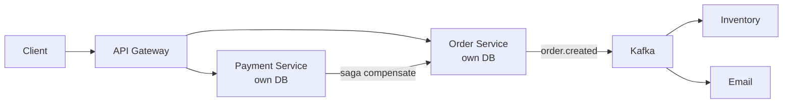

# Microservices

> Many small deployables instead of one big one — independent scaling and shipping at the price of distributed complexity.

> Start as a monolith; extract services when teams and scale demand it. Each microservice owns its code, data, and deployments — user, order, and payment evolve and scale independently. The costs are real: network latency, distributed transactions, and 10x operational overhead.

## Monolith and Modular Monolith

One repo, one database, and one deploy keep the happy path simple: in-process calls, ACID transactions across tables, and stack traces that point to a single codebase. That simplicity erodes when dozens of engineers collide on the same repo, when one hot feature forces scaling the entire app, or when a small change requires a full redeploy. A modular monolith preserves one deploy but enforces package boundaries (user, billing, catalog) inside the same process — you still share one database, but imports and schemas stay scoped. Use it as the deliberate stepping stone before extraction: when a module has clear ownership, stable APIs, and independent scaling needs, peel it off with the strangler pattern instead of big-bang rewrites.

- Single deploy and shared DB minimize ops until team size and traffic force separation.
- Merge conflicts and all-or-nothing scaling are the usual monolith breaking points.
- Modular monolith = bounded packages + shared DB; cheaper than microservices early on.
- Extract services when a domain has its own team, SLA, or scale curve — not because diagrams look cleaner.

## Microservices and Service Boundaries

Microservices split the system into independently deployable units, each aligned to a business capability rather than a technical layer. Domain-Driven Design bounded contexts (User, Order, Payment, Inventory) are the default guide: if two teams argue about the same noun, your boundary is probably wrong. Each service owns its persistence — no shared tables, no cross-service foreign keys — and talks outward only through versioned APIs or events. Bad boundaries create chatty networks, duplicated data, and distributed monoliths that are harder to operate than what you left; invest in domain modeling and event storming before carving services.

- Split by business capability (Order), not layer (Controller, Repository).
- One team per service is a useful ownership heuristic at scale.
- Shared databases between services reintroduce coupling — treat as a migration anti-pattern.
- Wrong boundaries cost more to fix than staying monolithic for another quarter.

## Service Discovery

Instances register and deregister constantly under autoscaling, rolling deploys, and spot interruptions — hardcoded host lists break within hours. A service registry (Consul, Eureka, etcd, Kubernetes Services) stores instance metadata, health, and optional weights; clients resolve names to current endpoints via sidecar, SDK, or DNS. Health checks (HTTP `/health`, TCP, gRPC) evict bad nodes before traffic hits them; stale entries cause retry storms, so TTLs and deregistration on shutdown matter. In Kubernetes, the control plane plus kube-proxy often replace a standalone registry, but the interview pattern is the same: dynamic membership, health-aware routing, and no static IPs in config.

- Registries track `(service name → healthy instances)` with heartbeats.
- Client-side discovery (pick instance + load balance) vs server-side (LB + registry lookup) — know both.
- Graceful shutdown must deregister before SIGTERM completes or in-flight requests get cut.
- DNS-based discovery (SRV, anycast) trades freshness for simplicity at very large scale.

## API Gateway

The gateway is the single north-south entry: TLS termination, authentication, rate limits, request routing, and sometimes response aggregation for mobile or web clients (Backend-for-Frontend). It maps external URLs to internal service names discovered at runtime, so clients never bind to individual pods. Keep domain rules out — pricing, inventory checks, and payment authorization belong in services; the gateway validates tokens, enforces quotas, and forwards. Multiple gateways (public vs partner vs admin) are common; each can apply different auth schemes and WAF rules without duplicating business logic.

- One front door simplifies CORS, OAuth, and global rate limits.
- BFF aggregation reduces chatty mobile clients but can become a fat gateway — cap aggregation depth.
- Idempotency keys and request IDs often originate at the gateway for traceability.
- Gateway failure is total outage — run it in HA across zones with health-checked backends.

## Sync vs Async Communication

Synchronous REST or gRPC gives strong request–response semantics, easy debugging, and natural error propagation to the caller — ideal for user-facing read paths and operations that must confirm success before responding. The downside is temporal coupling: if Payment is down, Checkout fails unless you add timeouts, retries, and circuit breakers. Asynchronous messaging (Kafka, SQS, RabbitMQ) decouples availability and absorbs spikes; consumers retry, dead-letter, and replay at the cost of eventual consistency and harder “did it happen?” debugging. Rule of thumb: sync on the critical path where the user waits; async for notifications, analytics, search indexing, and anything that can lag seconds without breaking UX.

- Sync: lower latency to answer, higher blast radius on dependency failure.
- Async: higher throughput and resilience, requires idempotent consumers and outbox/dedup.
- Combine both — HTTP command in, event out — for most real order flows.
- Always set client timeouts on sync calls; unbounded waits tie up thread pools.

## Database per Service

Each microservice owns its schema and migration lifecycle; no other service gets direct SQL access to its tables. Cross-service reads go through APIs, materialized views fed by events, or dedicated read models — never shared-write tables that silently couple deploys. This enables polyglot persistence: relational for transactional orders, document store for product catalogs, graph for recommendations. The trade-off is no foreign keys across services and no single-query reports — you design compensating queries, caches, and event-driven projections instead.

- Schema changes are local; one team's migration cannot lock another's tables.
- Duplicate data across services is normal; consistency is bounded by business rules, not ACID globally.
- Anti-pattern: “shared library” database module used by every service — that's a distributed monolith.
- Read replicas and CQRS often appear once query load diverges from write models.

## Event-Driven Architecture

Services publish facts about what happened (`OrderCreated`, `PaymentCaptured`) rather than imperative “call inventory now” coupling. Subscribers (inventory, email, fraud, data warehouse) react independently; the producer does not maintain a subscriber list in code. Message brokers provide durability, partitioning for parallelism, and at-least-once delivery — consumers must be idempotent. Ordering is usually per partition key (e.g., `order_id`) not global; cross-event timelines need versioning or sagas. Event-driven designs shine when many downstream reactions evolve at different speeds without redeploying the core write path.

- Domain events name past tense facts; commands name intent — don't mix semantics.
- At-least-once delivery implies duplicate handling — use idempotency keys or dedup stores.
- Schema evolution (Avro, Protobuf with compatibility rules) prevents silent consumer breaks.
- Dead-letter queues and replay tooling are mandatory for operability, not optional extras.

## Saga Pattern

A saga is a long-running business transaction split into local ACID steps across services, with compensating actions when a later step fails — book flight, charge card, reserve hotel; failed charge triggers `CancelFlight`. Choreography chains events with no central brain: simple flows, harder to see global state. Orchestration uses a coordinator (state machine service) that tells each participant what to do next — better visibility and timeout handling for complex flows. Two-phase commit (2PC) across microservices is fragile and slow; sagas accept temporary inconsistency visible to users (pending payment) in exchange for availability.

- Each step is a local transaction; compensations undo or logically reverse prior steps.
- Design compensations for every forward step — “sorry, we can't auto-undo” is a product bug.
- Timeouts and saga state (running, compensating, failed) must be persisted and observable.
- Prefer orchestration when steps have strict ordering or human approval gates.

## Outbox Pattern

Dual writes — “update DB, then publish to Kafka” — lose messages if the process crashes between steps or if the broker is down while the DB committed. The outbox writes the business row and an outbox row in one local transaction; a separate relay (polling or CDC) reads unpublished rows and publishes to the bus, marking them sent. Consumers see events slightly later, but never miss commits that actually happened. Debezium-style CDC from the outbox table scales better than high-frequency polling for large throughput.

- Single commit point = database; message broker is eventually consistent with DB truth.
- Relay must be idempotent — duplicate publishes happen; consumers dedupe on event ID.
- Outbox pairs naturally with transactional inbox on the consumer side for exactly-once-ish processing.
- Without outbox, “we updated order status but never sent email” bugs appear under partial failures.

## CQRS and Event Sourcing Basics

CQRS separates the model that handles commands (writes, validation, invariants) from the model optimized for queries (denormalized tables, Elasticsearch, Redis). Sync via events or async projections; reads may lag writes by milliseconds to seconds. Event sourcing stores the append-only event log as source of truth and rebuilds entity state by replay — excellent audit, time travel, and debugging “how did we get here?” Both patterns add operational surface: projection lag monitoring, snapshotting for long streams, and schema migrations on stored events. Adopt when read/write shapes diverge sharply (feeds, dashboards) or compliance demands immutable history — not for CRUD that fits one table.

- CQRS without event sourcing = two models + sync path; still valid for read-heavy UIs.
- Event sourcing replay cost grows — snapshot every N events for fast startup.
- Projections can fail independently; rebuild from event log is the recovery story.
- Don't event-source everything — use for aggregates with rich lifecycle (Account, Order), not static config.

## Distributed Tracing

A single user click may traverse gateway → order → payment → inventory; without correlation, each service logs in isolation and MTTR balloons. Propagate a trace ID (W3C `traceparent` or legacy headers) on every outbound call; each hop creates a span with start time, duration, tags, and errors. Backends (Jaeger, Zipkin, OpenTelemetry collectors) assemble waterfalls and service dependency graphs. Sample aggressively in production (1–10%) to control cost, but always trace errors and high-latency tails. Tie logs to `trace_id` so you jump from metric spike → trace → pod logs in one flow.

- One trace ID per user request; span per service hop and per major internal operation.
- Baggage carries small context (tenant ID) across services — don't abuse for large payloads.
- Tail-based sampling keeps interesting traces (errors, >p99) when head sampling would drop them.
- Tracing without metrics tells stories without alarms — use both.

## Keep in mind

- Start monolith or modular monolith; extract with strangler when team boundaries and scale justify the ops tax.
- Boundaries follow domains; each service owns its database — shared tables are coupling in disguise.
- Sync for hot paths with timeouts and circuit breakers; async for side effects with idempotent consumers.
- Sagas with compensations replace 2PC; design undo paths before shipping multi-step flows.
- Outbox makes event publishing atomic with state changes — skip it only if you enjoy mystery outages.
- Trace IDs (and log correlation) across services — without them, distributed debugging is guesswork.
