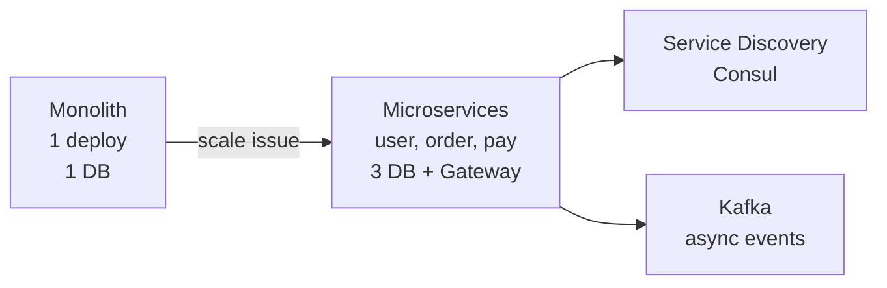

# Microservices vs Monolith

> Ek bada app vs bahut chhote apps — kaise todo aur kaise jodo.

> Monolith ek bada dabba — sab code ek jagah, deploy ek saath, simple. Microservices me dabba tod ke 10 chhote dabbe (user, order, pay) — har dabba alag team deploy kare, par network + failure badhega. Start monolith, badhe to todo.

Har "Design Netflix/ Uber" me puchenge architecture kya?

## Monolith

- Ek repo, ek DB, ek deploy.
- Pros: join easy, transaction ACID, debug simple, 1k QPS tak kaafi.
- Cons: ek line badla to pura deploy, ek bug se sab down, team merge conflict, scale pe ek hi language.

**Kahan:** early startup, 5 devs, MVP.

## Microservices

- Har domain alag service + alag DB (Database per service) + [API Gateway](/hld/api-gateway) + [Service Discovery](/hld/service-discovery).
- Pros: alag deploy, alag scale (pay 10 boxes, user 2), alag tech (Python ML, Go API), fault isolate (pay down to feed chalu).
- Cons: network latency (10ms per hop), distributed transaction mushkil (Saga), observability mushkil (trace), ops 10x.

**Boundaries kaise todo?** Domain-Driven Design — `User`, `Order`, `Payment` alag bounded context. Shared DB mat rakho — API se baat.

## Communication

- **Sync:** REST/gRPC — tez par downstream down to fail → Circuit Breaker.
- **Async:** Kafka/RabbitMQ — order → `order.created` → pay + inventory async, retry easy, eventual.

**Saga vs 2PC:** 2PC heavy, Saga me har service local TX + compensate (pay fail to order cancel event).

## How to answer in interview

- **Start monolith, modular monolith** banalo (modules alag package) — baad me extract easy.
- **Monolith to micro:** strangler pattern — pehle `payment` alag, baaki monolith.

**🔴 Galti:** "Day 1 microservices" — Ops me dub jaoge.
**✅ Sahi:** "Start modular monolith, scale pe payment/auth ko alag, async Kafka, Saga."

**Phrase:** "Monolith simple start, micro scale + team isolate — trade network + Saga."

**Yaad rakho:** 1 repo vs N services, DB per service, sync vs async, Saga for TX, strangler.

**See also:** [api-gateway](/hld/api-gateway), [service-discovery](/hld/service-discovery), [gossip-protocol](/hld/gossip-protocol).
