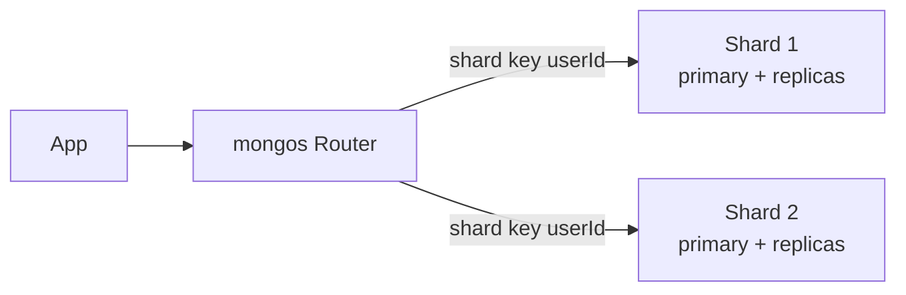

# MongoDB

> Document database — store JSON-like data directly, no upfront schema required.

> Collections hold BSON documents, each shaped differently if needed. Product catalogs, CMS content, and MERN apps fit naturally; schemas evolve without migrations. Where joins and strict transactions rule, [PostgreSQL](/hld/postgresql) wins instead.

## When to pick it

1. Evolving schemas (startup products, CMS, catalogs) — add fields without migrations
2. Self-contained documents (profile plus settings in one place) — no joins needed
3. MERN stacks or JSON-thinking teams — the mental model matches
4. Read-heavy product data with secondary indexes — queries stay fast

**Don't use for:** strict relations plus joins (orders with users and payments), financial ACID ([PostgreSQL](/hld/postgresql)), or massive known-key write volume ([Cassandra](/hld/cassandra)).

## How scaling works

**Replica sets:** one primary takes writes, secondaries copy — elections promote on failure. Secondaries serve stale-acceptable reads. **Sharding:** data splits by shard key, `mongos` routers direct queries. The shard key decides everything — wrong keys hotspot single shards.

## Failure modes to mention

1. **Bad shard key** — monotonic ObjectIds hammer one shard; prefer hashed or compound keys.
2. **Unbounded arrays** — 16MB document limit; ever-growing arrays (all comments in one doc) explode — separate collections.
3. **Schema sprawl** — flexibility abused means every document differs and queries rot; keep light `$jsonSchema` validation.
4. **Primary failover** — elections pause writes for seconds; enable retryable writes.
5. **Multi-doc transactions** — exist since 4.0 but weaker than Postgres; keep money elsewhere.

**Mistake:** "Schema-less means schema-free-for-all."
**Correct:** "Evolving product data in MongoDB — replica sets for HA, careful shard keys, unbounded arrays in separate collections, money in Postgres."

**Phrase:** "Documents suit flexible schemas — replica sets give HA, shard keys decide scaling, joins and money stay Postgres work."

**Remember (Revision):** BSON documents plus collections, schema-on-read, replica sets (primary/secondary plus election), sharding (mongos plus shard key), 16MB document limit, unbounded arrays separated, limited multi-doc transactions.

**See also:** [postgresql](/hld/postgresql), [cassandra](/hld/cassandra), [dynamodb](/hld/dynamodb), [sharding](/hld/sharding).
