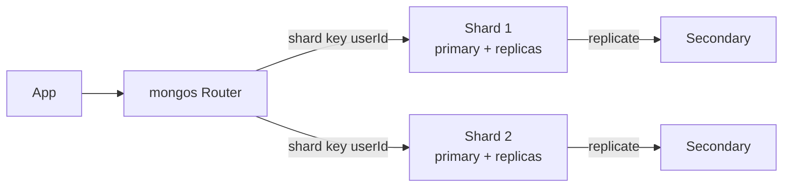

# MongoDB

> Document database — JSON jaisa data seedha store karo, schema pehle se fix karne ki zaroorat nahi.

> Collections me BSON documents rehte hain — har document alag shape ka ho sakta hai. Product catalogs, CMS, MERN apps aur evolving schemas iski jagah hai. Jahan joins aur sakht transactions hon, wahan [PostgreSQL](/system-design/postgresql) jeetta hai.

MongoDB ka model simple hai: database ke andar **collections**, collection ke andar **documents** (BSON — binary JSON). Schema-on-read hai — code evolve hote hi fields jud jaate hain, migration ka dard nahi. Query language me filters, projections, sorts aur aggregation pipeline (group/sort/join-ish `$lookup`) milta hai.

## When you pick it

1. Schema evolve hota ho (startup product, CMS, catalogs) — migration ke bina fields jodo
2. Document akela kaafi ho (user profile + settings ek jagah) — joins ki zaroorat na ho
3. MERN stack ho ya team JSON me sochti ho — mental model match karta hai
4. Read-heavy product data ho with secondary indexes — queries tez rehti hain

**Mat lo:** sakht relations + joins (orders↔users↔payments), financial ACID ([PostgreSQL](/system-design/postgresql) lo), ya massive write volume known keys pe ([Cassandra](/system-design/cassandra) dekho).

## How scaling works

**Replica sets:** ek primary writes leta hai, secondaries copy karte hain — failover pe election se naya primary. Reads secondary se (stale chalega to) baant do. **Sharding:** data shard key pe bat-ta hai, `mongos` router sahi shard pe bhejta hai. Shard key hi sab kuch hai — galat key matlab hot shard.

## Failure modes to mention

1. **Bad shard key** — Monotonic ObjectId sab writes ek shard pe bhejta hai (hot shard) — hashed ya compound key lo.
2. **Unbounded arrays** — Document me 16MB limit hai; growing arrays (saare comments ek doc me) document phula dengi — alag collection me rakho.
3. **Schema sprawl** — Flexibility ka misuse: har document alag shape to queries/indexes tootenge — light validation (`$jsonSchema`) rakho.
4. **Primary failover** — Election me seconds ka write pause — retryable writes on rakho.
5. **Multi-doc transactions** — 4.0+ me hain par Postgres jitni sakht nahi — paisa yahan mat rakho.

**🔴 Galti:** "Schema-less matlab schema-free-for-all" — Bina validation ke data kachra banega, queries slow hongi.
**✅ Sahi:** "Evolving product data ke liye MongoDB — replica sets for HA, shard key carefully, unbounded arrays alag collection, paisa Postgres me."

**Phrase:** "Documents flexible schema ke liye hain — replica sets HA dete hain, shard key scaling tay karti hai, joins aur paisa Postgres ka kaam hai."

**Yaad rakho (Revision):** BSON documents + collections, schema-on-read, replica sets (primary/secondary + election), sharding (mongos + shard key), 16MB document limit, unbounded arrays alag rakho, multi-doc TXN limited.

**See also:** [postgresql](/system-design/postgresql), [cassandra](/system-design/cassandra), [dynamodb](/system-design/dynamodb), [sharding](/system-design/sharding).
