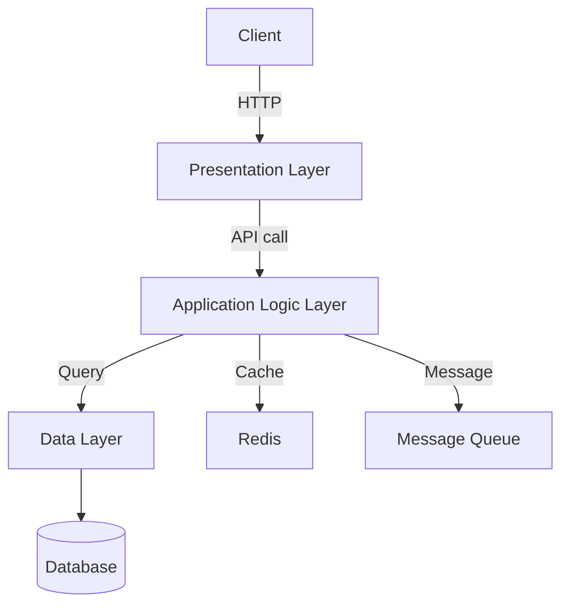

# N-tier architecture

> Application ko layers mein split karo — presentation, logic, data separately.

> N-tier architecture application ko 3 ya zyada layers mein divide karta hai — presentation (UI), application logic (business rules), data (database). Monolith sab ek layer mein, microservices alag alag services mein. 2-tier (client-server), 3-tier (client-app-db), N-tier (multiple logic layers). Scalability aur maintainability badhata hai layers alag hone se.

N-tier architecture application ko logical layers mein split karta hai:

**Layers:**
- **Presentation layer** — UI, frontend (React, Angular)
- **Application/Business logic layer** — API, business rules (Node, Java, Python)
- **Data layer** — Database, cache, storage (Postgres, Redis)

**Types:**
- **2-tier** — Client directly talks to server/database
- **3-tier** — Client → Application server → Database
- **N-tier** — Multiple logic layers, middleware, message queues

## Failure modes to mention

1. **Layer coupling** — Tight coupling between layers — hard to scale/update
2. **Network latency** — More layers = more network hops = latency
3. **Single tier failure** — Monolith fail = entire app down
4. **Complexity** — N-tier adds operational complexity — deployment, monitoring

**🔴 Galti:** "N-tier = microservices" — N-tier is layering pattern, microservices is deployment pattern. N-tier can still be monolith.
**✅ Sahi:** "N-tier = presentation, logic, data layers. 3-tier most common. Layers separate = scalable + maintainable. Different from microservices (deployment)."

**Phrase:** N-tier architecture application ko layers mein divide karta hai — presentation, business logic, data. 3-tier common, layers separate for scalability.

**Yaad rakho (Revision):** Presentation, application logic, data layers. 2-tier vs 3-tier vs N-tier, layers separate = scalable/maintainable, not same as microservices.

**See also:** [Microservices](/hld/microservices), [API Gateway](/hld/api-gateway), [Message Queue](/hld/message-queue).
