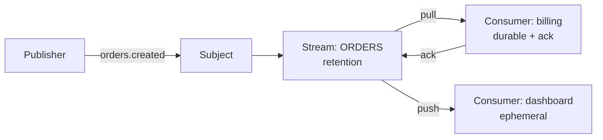

# NATS (JetStream)

> Featherweight messaging — NATS core is blazing pub-sub, JetStream adds the durable layer.

> Core NATS is at-most-once fire-and-forget — no persistence, offline subscribers miss out. JetStream adds durability on top: streams store messages, consumers read at their pace, ack, and replay history. Philosophy inverts Kafka's — simplicity and low ops cost over raw throughput.

## When to pick it

1. Lightweight microservice messaging wanted — clusters up in minutes, near-zero ops burden
2. Edge or IoT boxes with thin resources — single binary, tiny footprint
3. Request-reply plus some durability needed — core plus JetStream combined
4. Key-Value or Object Store wanted without another database — JetStream includes both

**Don't use for:** 100k+ msgs/s log analytics, long-retention event sourcing, or complex stream processing — look at [Kafka](/hld/kafka) or Flink.

## How JetStream works

**Publisher → Subject → Stream (store) → Consumer (push/pull) → Ack.** Streams capture matching subjects and retain by policy — limits (size/age), workqueue (delete on ack), or interest (delete when all consumers read). Consumers come push (server sends) or pull (client asks — natural backpressure). Durable consumers survive restarts; ephemeral ones don't. Subjects use dots (`orders.created.eu`) with wildcards (`*` one level, `>` all levels).

## JetStream vs Kafka

- **Ops:** single binary clustering in minutes vs ZooKeeper/KRaft plus tuning.
- **Throughput:** Kafka clears 100k+ msgs/s; JetStream serves tens of thousands for moderate loads.
- **Model:** both log plus replay; Kafka's ecosystem (Connect, Streams, Flink) runs deeper.
- **Footprint:** JetStream wins edges and small teams.

## Failure modes to mention

1. **Slow consumers** — lagging consumers fill streams; size retention plus pull consumers defend.
2. **Ack expiry** — unacked in time means redelivery; keep consumers idempotent.
3. **Interest policy surprises** — no consumers means instant deletion; choose policies deliberately.
4. **Memory streams** — restarts wipe them; file storage when durability matters.

**Mistake:** "Expect persistence from core NATS."
**Correct:** "Core is fire-and-forget; durability needs JetStream streams plus durable consumers."

**Phrase:** "NATS core is fast pub-sub, JetStream the durable layer — streams store, consumers ack. Light ops, moderate throughput."

**Remember (Revision):** Core fire-and-forget, JetStream streams plus consumers plus acks plus replay, dotted subjects with wildcards, retention policies, pull backpressure, file storage for durability.

**See also:** [message queues](/hld/message-queues), [microservices](/hld/microservices).
