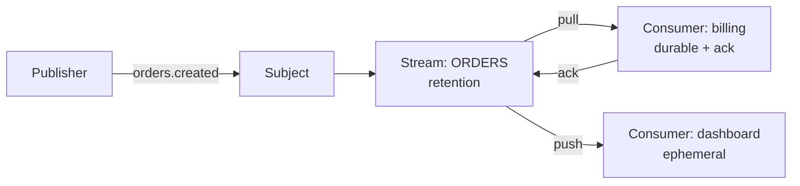

# NATS (JetStream)

> Halka-phulka messaging — NATS core aag ki tarah tez pub-sub hai, JetStream uspe tikau parat hai.

> NATS core me koi persistence nahi — subscriber live nahi to message gaya. JetStream persistence jodta hai: streams (message store), consumers (kaun kya padhega), acks aur replay. Philosophy Kafka se ulti hai — simplicity aur low ops cost, raw throughput nahi.

NATS ke do hisse samjho. **Core NATS** at-most-once fire-and-forget hai — microservices ke beech halki events, service discovery, request-reply ke liye perfect. **JetStream** uske upar durability hai — subject pe aaye messages stream me store hote hain, consumers apni raftaar se padhte hain, ack karte hain, aur purana replay kar sakte hain. Subjects dot-wale hote hain (`orders.created.eu`) aur wildcards (`*` ek level, `>` sab levels) se subscribe hota hai.

## When you pick it

1. Microservices ke beech halki messaging chahiye ho — setup minutes me, ops bojh na ke barabar
2. Edge/IoT ya resource-kam machines hon — single binary, chhota footprint
3. Request-reply plus thodi durability dono chahiye hon — core + JetStream combo
4. Key-Value ya Object Store chahiye ho bina alag DB ke — JetStream built-in deta hai

**Mat lo:** 100k+ msgs/s submitted historian... matlab bhaari log analytics, lambe retention wale event sourcing, ya complex stream processing — wahan [Kafka](/system-design/kafka) ya Flink dekho.

## How JetStream works

**Publisher → Subject → Stream (store) → Consumer (push/pull) → Ack.** Stream subject match karke messages pakadta hai aur retention policy se rakhta hai — limits (size/age), workqueue (ack pe delete), ya interest (sab consumers padh lein to delete). Consumer do tarah: push (server bhejta hai) aur pull (client maangta hai — backpressure natural hai). Durable consumers restart survive karte hain, ephemeral nahi.

## JetStream vs Kafka

- **Ops:** JetStream single binary, minutes me cluster; Kafka ZooKeeper/KRaft + tuning mangta hai.
- **Throughput:** Kafka 100k+ msgs/s; JetStream tens of thousands — moderate load ka raja hai.
- **Model:** Dono log + replay dete hain; Kafka ecosystem (Connect, Streams, Flink) bada hai.
- **Footprint:** Edge aur chhoti teams ke liye JetStream halka hai.
- **Super-cluster:** NATS ka geo-distributed leafnode/supercluster setup aasan hai.

## Failure modes to mention

1. **Slow consumer** — Consumer peeche reh jaye to stream bhar jayegi — max age/bytes retention + pull consumers se bachao.
2. **Ack expiry** — Time pe ack nahi aaya to redelivery — duplicate handle karne wale idempotent consumers rakho.
3. **No consumers (interest policy)** — Koi consumer nahi to message turant ud jayega — policy samajh ke chuno.
4. **Memory storage** — Stream memory me rakhi to restart pe gayi — file storage lo durability chahiye to.

**🔴 Galti:** "Core NATS me persistence expect karna" — Core fire-and-forget hai; durability chahiye to JetStream stream banao.
**✅ Sahi:** "Halki fast messaging NATS core se, durability JetStream streams + durable consumers se. Bhaari log ho to Kafka."

**Phrase:** "NATS core tez pub-sub hai, JetStream uspe tikau parat — streams store karte hain, consumers ack karte hain. Ops halka, throughput moderate."

**Yaad rakho (Revision):** Core = fire-and-forget, JetStream = streams + consumers + acks + replay, subjects dot-wale + wildcards, retention policies (limits/workqueue/interest), pull se backpressure, file storage for durability.

**See also:** [kafka](/system-design/kafka), [message brokers](/system-design/message-brokers), [microservices](/system-design/microservices).
