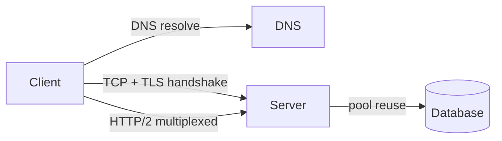

# Networking

> How bytes move — protocols, names, encryption, and the APIs that ride on top.

> Every request crosses the same stack: DNS resolves the name, TCP carries the bytes, TLS encrypts them, and HTTP defines the conversation. Interviews test whether you know which layer solves which problem.

## TCP vs UDP

TCP is connection-oriented and reliable — handshake, acknowledgments, retransmission, ordering. Use it for HTTP, email, file transfer. UDP is connectionless fire-and-forget — no handshake, no guarantees, minimal overhead. Use it for video streaming, gaming, DNS lookups, VoIP. Rule: correctness needs TCP, real-time speed tolerates UDP.

## DNS

The internet's phone book — domain names to IP addresses. Resolution walks a hierarchy: browser cache, OS cache, router, ISP resolver, then root → TLD (.com) → authoritative server. Every level caches with a TTL. Record types: A (IPv4), AAAA (IPv6), CNAME (alias), MX (mail), NS (nameserver). If DNS fails, the site is down — it is a hard dependency.

## TLS / SSL

TLS (1.2/1.3 — SSL is deprecated) encrypts client-server traffic; HTTPS is HTTP plus TLS. The handshake exchanges hellos, verifies the server certificate against a CA, negotiates keys, then encrypts symmetrically. mTLS adds client certificates so both sides authenticate — standard for service-to-service calls.

## HTTP/1.1, HTTP/2, HTTP/3

HTTP/1.1 opens a connection per request (keep-alive helps) and suffers head-of-line blocking. HTTP/2 multiplexes many streams over one TCP connection with header compression — one connection per origin. HTTP/3 moves to QUIC over UDP, removing TCP-level blocking entirely. New systems target HTTP/2 minimum.

## WebSockets and SSE

WebSockets upgrade HTTP to a persistent two-way pipe — chat, docs, games. Server-Sent Events stream one-way (server to client) over plain HTTP with auto-reconnect — feeds and notifications. Polling wastes requests; long polling holds them. Rule: two-way needs WebSocket, one-way pushes fit SSE.

## REST and gRPC

REST exposes resources over HTTP verbs (GET cacheable, PUT idempotent) — simple, browser-friendly, CDN-cacheable. gRPC uses binary protobuf over HTTP/2 with streaming — 5-10x faster payloads plus codegen, but not browser-native. Public APIs go REST; internal microservices go gRPC; mobile backends often add GraphQL.

## Connection Pooling and Keep-Alive

Opening TCP plus TLS per request costs milliseconds. Pools reuse connections; keep-alive holds them open. Size pools to concurrency (too small queues, too big exhausts the server) and always set timeouts — no timeout means one slow dependency freezes threads forever.

## Keep in mind

- TCP for correctness, UDP for real-time speed — state the trade-off first.
- DNS is hierarchical with caching everywhere; TTL controls staleness.
- TLS 1.2/1.3 only; mTLS for service-to-service authentication.
- HTTP/2 multiplexes; HTTP/3 removes TCP blocking via QUIC.
- WebSocket is two-way, SSE is one-way — match the direction to the use case.
- gRPC inside, REST outside; pools plus timeouts everywhere.
