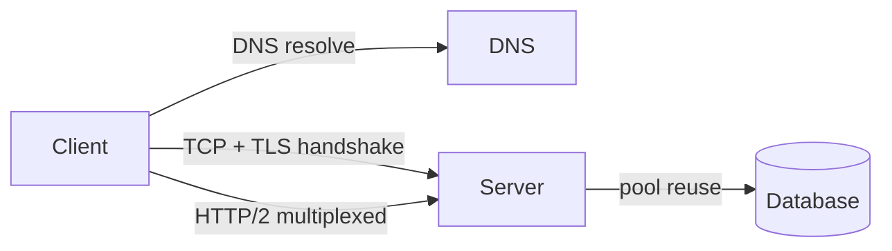

# Networking

> How bytes move — protocols, names, encryption, and the APIs that ride on top.

> Every request crosses the same stack: DNS resolves the name, TCP carries the bytes, TLS encrypts them, and HTTP defines the conversation. Interviews test whether you know which layer solves which problem.

## TCP vs UDP

TCP provides a reliable byte stream between two endpoints: three-way handshake, sequence numbers, acknowledgments, retransmission, and flow control. You pay latency and head-of-line blocking on that connection, but you get ordered delivery — ideal when every byte must arrive (HTTP APIs, SQL, file sync). UDP sends datagrams without guarantees: loss, duplication, and reordering are possible, but overhead stays minimal — ideal when timeliness beats perfection (live video, VoIP, gaming state). In design discussions, name the failure mode you accept: glitchy frame vs corrupted payment.

- **TCP** for request/response, transactions, and anything that must be **complete and ordered**.
- **UDP** for real-time media, DNS queries, and metrics where **app-layer** handles loss.
- TCP **head-of-line blocking** — one lost packet stalls the whole connection (HTTP/3 mitigates via QUIC).
- **Connection setup** cost: TCP + TLS adds RTTs — reuse with keep-alive and pooling.
- Hybrid pattern: **QUIC/UDP** transport with reliable streams where the stack provides them.

## DNS

DNS maps human-readable names to IPs and other records. Resolution is hierarchical and cached at every hop: browser → OS → recursive resolver (often ISP or 8.8.8.8) → root → TLD → authoritative nameserver. **TTL** controls how long caches serve stale answers — low TTL speeds failover, high TTL cuts load and latency. Record types matter in design: **A/AAAA** (IPs), **CNAME** (aliases), **MX** (mail), **NS** (delegation). If DNS fails, the site is unreachable — treat it as a hard dependency with redundant providers and health-checked records.

- **A/AAAA** for direct IPs; **CNAME** for aliases (often to load balancers or CDNs).
- **Geo DNS** or **latency-based routing** steers users to nearest region.
- **DNS propagation** delays matter during cutovers — plan TTL lowering before migrations.
- **Internal service discovery** (Consul, K8s DNS) replaces public DNS east-west.
- Mention **DNSSEC** only when tampering or compliance is in scope.

## TLS / SSL

TLS encrypts and authenticates traffic between client and server. Modern deployments use **TLS 1.2 or 1.3** (SSL is obsolete). The handshake negotiates cipher suites, verifies the server certificate chain to a trusted CA, and establishes symmetric keys for bulk encryption. **HTTPS** is HTTP over TLS; terminate at the load balancer or app depending on trust boundaries. **mTLS** requires client certificates — common for service-to-service meshes so only enrolled workloads call each other.

- **Terminate TLS** at LB for central cert management; **end-to-end** TLS for stricter compliance.
- **TLS 1.3** fewer round trips — prefer on public APIs.
- **Certificate rotation** and **SNI** — multiple hosts on one IP.
- **HSTS** reduces downgrade attacks on browsers.
- **mTLS** inside the VPC; still authorize at app layer (cert ≠ user).

## HTTP/1.1, HTTP/2, HTTP/3

HTTP defines semantics (methods, headers, status codes); the version defines how efficiently bytes multiplex on the wire. HTTP/1.1 defaults to one request at a time per connection unless pipelining/keep-alive — browsers open many parallel connections, which wastes sockets. HTTP/2 multiplexes many streams on one TCP connection with HPACK header compression — great for APIs with many small requests. HTTP/3 runs over **QUIC (UDP)**, so packet loss on one stream does not block others — wins on lossy mobile networks. New systems target **HTTP/2 minimum** at the edge; add HTTP/3 where UDP paths are reliable.

- **HTTP/2** server push is rarely used; **multiplexing + single connection** is the win.
- **HTTP/3** needs UDP path — some corporate firewalls block it; have HTTP/2 fallback.
- **gRPC** rides HTTP/2 — same multiplexing benefits internally.
- **Cache semantics** (ETag, Cache-Control) are version-agnostic — design REST with them.
- Edge/CDN should speak **HTTP/2 or HTTP/3** to clients; origin can differ.

## WebSockets and SSE

Real-time updates need a strategy beyond polling. **WebSockets** upgrade an HTTP connection to a full-duplex channel — client and server send frames anytime; use for chat, collaborative docs, and games. **SSE** keeps a long-lived HTTP response open and streams **server → client** events — simpler through proxies and auto-reconnects in browsers; use for live feeds and notifications. **Long polling** holds a request until data arrives — a fallback when WebSockets are blocked. Rule: two-way needs WebSocket; one-way pushes fit SSE; avoid naive polling on hot paths.

- **WebSocket** scaling → connection registries, sticky routing, or user-sharded gateways.
- **SSE** over standard HTTP/2 — easy through many L7 load balancers.
- **Heartbeat/ping** detects dead connections; set **idle timeouts** on LB and app.
- **Backpressure** — slow clients should not unbounded-buffer the server.
- Fallback ladder: WebSocket → SSE → long poll → short poll.
- **Fleet design:** stateless WS servers sharded by user hash; Redis maps `userId → server` with TTL heartbeats for presence; disconnects trigger jittered-backoff reconnects plus sequence-ID catch-up from the message log (Kafka fan-out behind the fleet).
- **Failure modes:** connection storms on deploy (stagger reconnects); sticky-routing loss on server death (Redis remap + client reconnect); idle timeouts from LB/NAT (heartbeat every ~15–30s); missed-message gaps (sequence IDs + log replay).
- **Phrase:** "WebSocket is the phone call — upgrade once, shard the fleet, heartbeat presence, replay history on reconnect."

## REST and gRPC

REST models resources with URLs and uses HTTP verbs for semantics — easy to debug, cache with CDNs, and consume from browsers. gRPC uses **Protocol Buffers** over HTTP/2: binary, compact, with strong typing and **streaming** (client, server, bidirectional) — often 5–10× smaller payloads plus codegen, but not browser-native. Public APIs go REST; internal microservices go gRPC; mobile backends often add GraphQL on a BFF when field selection matters.

- **REST**: idempotent PUT/DELETE, cacheable GET, **429/Retry-After** for limits.
- **gRPC**: deadlines, **status codes**, streaming for log tailing and bulk sync.
- **Versioning**: REST path/header; gRPC **package/service** versioning in proto.
- **Browser gap**: gRPC-Web or REST gateway in front of gRPC backends.
- Pick by **client type** and **latency/payload** — not fashion.

## Connection Pooling and Keep-Alive

Opening TCP and TLS for every request burns RTTs and CPU. **Keep-alive** reuses the same TCP connection for multiple HTTP requests; **connection pools** maintain a bounded set of warm connections to databases, Redis, and upstream HTTP services. Size pools to expected concurrency — too few threads block waiting; too many exhaust file descriptors or DB `max_connections`. Always set **connect, read, and idle timeouts** — no timeout means one slow dependency can freeze threads forever.

- Pool size ≈ **parallel in-flight requests** per instance, not total QPS.
- **DB pools** per app instance multiply — 100 pods × 20 connections = 2000 DB conns.
- **HTTP client** reuse across requests; disable per-call new clients in hot paths.
- **Circuit breakers** plus timeouts prevent pool starvation from cascading failures.
- Monitor **wait time for pool connection** — early signal of undersizing.

## Keep in mind

- TCP for correctness, UDP for real-time speed — state the trade-off and failure mode first.
- DNS is hierarchical with caching everywhere; TTL controls staleness and failover speed.
- TLS 1.2/1.3 only; mTLS for service-to-service authentication, not a substitute for authZ.
- HTTP/2 multiplexes; HTTP/3 removes TCP blocking via QUIC — know when UDP is blocked.
- WebSocket is two-way, SSE is one-way — match direction to use case and proxy compatibility.
- gRPC inside, REST outside; pools plus timeouts everywhere dependencies are shared.
