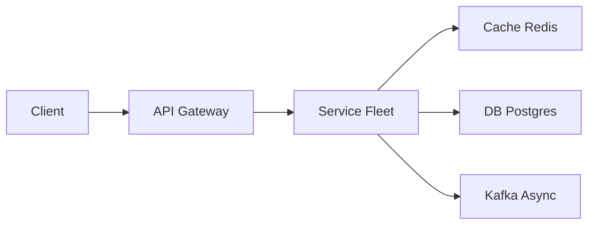

# News Aggregator

> Google News / Apple News lite. Ingest many publishers, **dedupe stories**, rank a feed. Crawling is a means, not the product.

> **TL;DR Hinglish:** Publishers poll/crawl → dedupe (SimHash) → ranking (fresh + personal) → feed per user cache.

## Kya poochte hain? (What they ask) — Hinglish me samjho

Design a news aggregator that pulls articles from ~1k–10k publishers, clusters near-duplicate stories ("same earthquake, 40 headlines"), and serves a ranked, optionally personalized feed. The interviewer will say "like Google News" and test whether you build a crawler or an aggregator.

**Scenario:** Users open the app and expect a fresh feed in <200ms. Behind the scenes, publishers publish at unpredictable rates; some offer RSS/sitemaps, others only HTML. The same wire story appears with different titles across 50 outlets. You must be polite (don't DDoS), deduplicate, rank, and serve a precomputed feed — not scatter-gather 1k publishers on every `GET /feed`.

**What interviewer tests:**
- Polite ingest ([web crawler](/system-design/web-crawler) etiquette, robots.txt, backoff)
- Canonicalization + near-duplicate clustering (hashing vs embeddings)
- Ranking and personalization without per-request fan-out
- Freshness vs. load trade-offs and legal/copyright handling

## Requirements — Kya chahiye? (Functional / Non-functional)

| Category | Requirement |
|---|---|
| **Functional** | Ingest articles (RSS, sitemaps, HTML crawl, webhooks). Canonicalize + dedupe. Cluster near-duplicates into a story. Rank feed per topic. Serve feed with pagination (`cursor`). Story detail with sources. Optional: topic pages, search, push for breaking news. |
| **Non-functional** | Freshness: important publishers reflected in <2 min, long tail <15 min. Don't overload publishers (per-host rate limit). Available feed even if crawler lags. Handle 10k publishers, millions of articles. |
| **Clarify** | Personalized vs global ranking? Link out vs host full text (copyright)? Languages? Paywalled sources? Push notifications? How is "source authority" defined? |
| **Out of scope v1** | Full NLP summarization, comments/social graph, publisher CMS, real-time collaborative filtering training. |

## Scale ka andaaza — Kitna load? (Math jo design badle)

| Metric | Math | Result |
|---|---|---|
| **Publishers** | 1k–10k domains | Manageable host queue count |
| **Articles/day** | 1k publishers × 50 articles/day avg | ~50k articles/day; viral days 200k |
| **Ingest QPS** | 50k fetches/day + sitemaps + politeness delays | ~1–5 fetches/sec avg, bursty; per-host ~1 req/sec max |
| **Storage — raw HTML** | 50k × 30 KB | ~1.5 GB/day → ~45 GB/month in S3; compress → ~15 GB |
| **Storage — parsed docs** | 50k × 2 KB metadata + text snippet | ~100 MB/day in Postgres/ES |
| **Storage — embeddings** | 50k × 768 dims × 4 bytes | ~150 MB/day if using vectors |
| **Serve QPS** | 5M DAU × 10 feed loads | ~580 rps avg, ~3k peak |
| **Bandwidth** | Feed response 20 stories × 500 bytes | ~10 KB/response → 30 MB/s peak (CDN cacheable) |

Ingest is I/O-bound and politeness-limited; serve is cache-friendly.

## API Design — Endpoints kya honge?

| Method | Endpoint | Description |
|---|---|---|
| `GET` | `/api/v1/feed?topic=&personalized=&cursor=&limit=` | Ranked story feed |
| `GET` | `/api/v1/stories/{clusterId}` | Cluster detail + sources |
| `GET` | `/api/v1/topics` | Available topics |
| `GET` | `/api/v1/articles/{id}` | Single article metadata (or redirect) |
| `POST` | `/internal/ingest/webhook` | Publisher push (if supported) |
| `GET` | `/api/v1/search?q=&cursor=` | Search stories (via [Elasticsearch](/system-design/elasticsearch)) |

**Feed — Response:**
```json
GET /api/v1/feed?topic=world&cursor=eyJ0...&limit=20
{
  "stories": [
    {
      "clusterId": "cl_9x2a",
      "title": "Major earthquake hits ...",
      "summary": "Cluster summary / top source snippet",
      "image": "https://cdn.example.com/cl_9x2a.jpg",
      "sourceCount": 42,
      "topSources": ["Reuters", "AP", "BBC"],
      "publishedAt": "2026-08-25T08:12:00Z",
      "score": 0.94
    }
  ],
  "nextCursor": "eyJ0..."
}
```

**Cluster detail:**
```json
GET /api/v1/stories/cl_9x2a
{
  "clusterId": "cl_9x2a",
  "articles": [
    { "id": "a_1", "url": "https://reuters.com/...", "publisher": "Reuters", "title": "...", "publishedAt": "..." },
    { "id": "a_2", "url": "https://apnews.com/...", "publisher": "AP", "title": "...", "publishedAt": "..." }
  ]
}
```

Pagination: opaque cursor = `score + clusterId` or `publishedAt`; `limit` default 20.

## High-Level Design (HLD) — Boxes kaise judenge? (Hinglish)

```
Publishers (RSS / Sitemap / HTML / Webhook)
   |
 Crawler Fleet (polite per-host queue, robots.txt, backoff) -> Raw HTML in S3
   |
 Parser Service (extract title, body, time, canonical URL, image) -> Normalized Doc
   |
 Canonicalizer + Deduper (URL normalize, content hash) -> Article Store (Postgres)
   |
 Clustering Service (blocking -> similarity -> cluster assignment) -> Clusters table
   |
 Ranking Service (recency × authority × engagement, personalization weights)
   |
 Materializer (every 60s rebuild topic lists: global + per-segment) -> Redis + CDN
   |
 API Service (serves precomputed feed) -> Client
   |
 Search Indexer -> [Elasticsearch](/system-design/elasticsearch)
 Notification Service -> [notification system](/system-design/notification-system) (breaking news push)
```



**Components:**
- **Crawler Fleet:** Per-host queue with token bucket (e.g., 1 rps/host, burst 2). Respects `robots.txt` and `sitemap.xml`. Priority queues: tier-1 publishers (Reuters, AP) polled every 60s; long tail every 15 min. Uses [web crawler](/system-design/web-crawler) pattern. Backoff on 429/403 with exponential + jitter.
- **Parser Service:** Site-specific parsers + generic fallback (JSON-LD, OpenGraph, readability). Extracts canonical URL, publish time, geo/topic hints. Stores raw HTML in S3 for reprocessing.
- **Canonicalizer:** URL normalization (strip UTM, lower host, sort query), content hash (SimHash/MinHash) to collapse same article with different URLs.
- **Clustering Service:** Near-duplicate grouping (see LLD). Assigns `clusterId`; first source in creates cluster, later attach if similarity > threshold within time window.
- **Ranking Service:** Batch job + streaming updates. Score = `w1*recency + w2*sourceAuthority + w3*engagement + w4*personalization`. Personalization: user topic weights in [Redis](/system-design/redis), blended at serve time.
- **Materializer:** Every 30–60s rebuilds `feed:topic:{world|tech|...}` sorted sets in Redis and warms [CDN](/system-design/cdn). `GET /feed` never crawls — it reads precomputed list.

**Write flow — Ingest article:**
1. Crawler fetches URL (polite queue) → store raw HTML to S3 → enqueue `ParseJob` to [Kafka](/system-design/kafka).
2. Parser extracts fields → canonicalize URL + hash body → check dedup table (exact hash hit → skip).
3. Clustering service computes blocking key (time bucket + topic/geo) → similarity check → assign `clusterId`.
4. Upsert article + cluster mapping → enqueue `RankUpdate`.

**Read flow — Serve feed:**
1. `GET /feed?topic=world` → API reads `ZRANGE feed:topic:world 0 19` from Redis (or CDN cache) → hydrate cluster metadata from Postgres/Redis hash → return. Personalized variant: merge global list with user-weighted rerank of top 100.

## Low-Level Design (LLD) — DB + Classes (Hinglish notes)

**DB Schema (Postgres + S3 + Redis + optional Vector DB):**
```sql
CREATE TABLE publishers (
  id              BIGSERIAL PRIMARY KEY,
  domain          VARCHAR(255) UNIQUE NOT NULL,
  name            VARCHAR(255) NOT NULL,
  authority_score FLOAT DEFAULT 0.5, -- editorial weight
  poll_interval_s INT NOT NULL DEFAULT 300,
  robots_txt      TEXT,
  created_at      TIMESTAMPTZ DEFAULT now()
);

CREATE TABLE articles (
  id              BIGSERIAL PRIMARY KEY,
  publisher_id    BIGINT REFERENCES publishers(id),
  url             TEXT NOT NULL,
  canonical_url   TEXT NOT NULL,
  title           TEXT NOT NULL,
  body_snippet    TEXT, -- truncated, not full copyrighted text
  published_at    TIMESTAMPTZ NOT NULL,
  fetched_at      TIMESTAMPTZ DEFAULT now(),
  content_hash    VARCHAR(64) NOT NULL, -- SHA256 / SimHash
  simhash         BIGINT, -- for near-dup
  topic           VARCHAR(50),
  geo             VARCHAR(50),
  image_url       TEXT,
  cluster_id      BIGINT REFERENCES clusters(id),
  UNIQUE(canonical_url),
  UNIQUE(content_hash)
);
CREATE INDEX idx_articles_cluster ON articles(cluster_id);
CREATE INDEX idx_articles_published ON articles(published_at DESC);
CREATE INDEX idx_articles_topic_time ON articles(topic, published_at DESC);

CREATE TABLE clusters (
  id              BIGSERIAL PRIMARY KEY,
  representative_title TEXT NOT NULL,
  topic           VARCHAR(50),
  geo             VARCHAR(50),
  created_at      TIMESTAMPTZ DEFAULT now(),
  updated_at      TIMESTAMPTZ DEFAULT now(),
  article_count   INT DEFAULT 1,
  score           FLOAT DEFAULT 0
);
CREATE INDEX idx_clusters_score ON clusters(score DESC, updated_at DESC);
CREATE INDEX idx_clusters_topic_score ON clusters(topic, score DESC);

CREATE TABLE cluster_articles (
  cluster_id      BIGINT REFERENCES clusters(id),
  article_id      BIGINT REFERENCES articles(id),
  similarity      FLOAT,
  PRIMARY KEY (cluster_id, article_id)
);

-- Redis structures:
-- ZSET feed:topic:{topic} -> {clusterId: score}
-- HASH cluster:{id} -> {title, image, sourceCount, topSources}
-- ZSET user:{id}:topic_weights -> {topic: weight}
```

**Key classes / responsibilities:**
```python
class Crawler:
  def fetch(url): # respects per-host rate limiter, robots.txt, ETag/If-Modified-Since
  def poll_sitemap(publisher): ...

class Parser:
  def parse(html, url): -> {title, body, published_at, canonical_url, image, topic}

class Canonicalizer:
  def normalize_url(url): -> canonical
  def content_hash(body): -> sha256/simhash

class ClusteringService:
  def blocking_key(article): # e.g., (hour_bucket, topic, geo)
  def similarity(a, b): # MinHash Jaccard or embedding cosine
  def assign_cluster(article): # find candidate clusters in block, threshold >0.82

class RankingService:
  def score(cluster): return w1*recency_decay(cluster) + w2*authority + w3*clicks
  def personalize(user_id, ranked_list): # blend with user topic_weights

class FeedMaterializer:
  def rebuild(topic): # SELECT ... ORDER BY score DESC LIMIT 500 -> ZADD to Redis
```

**Concurrency & algorithms:**
- **SimHash / MinHash:** Shingle title + first 500 chars into 3-grams, compute MinHash signature (e.g., 128 perms). Jaccard similarity ≈ fraction of matching minhashes. Faster than full embedding for v1; upgrade to embeddings (e.g., sentence-transformers) for semantic near-dup when scale allows.
- **Blocking:** Don't compare every article to every cluster (O(n²)). Block by 2-hour window + topic/geo; only compare within block — reduces candidates 1000x.
- **Per-host politeness:** Token bucket per domain in [Redis](/system-design/redis) or local limiter: `allow = tokens >0 ? consume : delay`. Shared across crawler replicas via Redis cell.
- **Idempotent ingest:** `canonical_url` UNIQUE + `content_hash` UNIQUE ensures re-crawls don't duplicate.

**Patterns used:** Producer-Consumer ([Kafka](/system-design/kafka) between fetch→parse→cluster→rank), Cache-aside + Materialized view (precomputed feed), CQRS (write path ingest vs read path serve), Content hashing, Leaderless per-host queues.

## Deep Dive — Gehrai se (Interview yahi puchega) — clustering

Exact hash misses rewrites ("Quake hits city" vs "Major quake strikes city"). Too-loose threshold merges unrelated stories. Practical v1: normalize title (lowercase, strip punctuation, sort tokens), block by time window (2h) + geo/topic, then MinHash similarity threshold 0.80–0.85. "First source in, others attach" — the earliest article creates the cluster; later arrivals attach if similarity passes. Human review queue for borderline (0.75–0.80). Embeddings (cosine >0.88) improve recall for paraphrases but cost more; run as async re-clustering job. Store `simhash` for fast Hamming distance pre-filter before full MinHash.

## Deep Dive — Gehrai se (Interview yahi puchega) — freshness vs load and politeness

Poll important publishers every 60s, long tail every 15 min. Use conditional fetch: `If-Modified-Since` / `ETag` — most polls return 304 with no body. Respect `robots.txt` crawl-delay and `sitemap.xml` `changefreq`. On 429, exponential backoff per host (1s → 2s → 4s) and deprioritize host. Webhooks (WebSub / RSS Cloud) are ideal — mention you'll take push over poll if offered. Freshness SLA: tier-1 p95 <2 min from publish to feed visibility; measure via `published_at → materialized_at` lag histogram.

## Deep Dive — Gehrai se (Interview yahi puchega) — ranking, personalization, and legal

**Ranking:** `score = 0.4*recency_decay + 0.3*authority + 0.2*engagement + 0.1*diversity`. Recency: `exp(-hours_since_publish / 6)`. Authority: editorial score per publisher (Reuters > blog). Engagement: clicks/impressions from your pixels (with anti-gaming). Personalization: user topic weights in Redis (`user:{id}:topic_weights` updated on clicks) blended as `final = 0.7*global + 0.3*personalized` for top 100 rerank — don't fully personalize breaking news.

**Legal:** Often link out; store snippet only (fair use). For paywalled sources, respect `robots.txt` and never bypass. Mention copyright and ToS in interview — signals maturity. Images: hotlink or proxy with cache; respect publisher CDN.

## Hinglish Tip — Galti vs Sahi

**🔴 Galti:** Hot path pe DB direct without cache/queue.
**✅ Sahi:** Cache/queue beech me, DB source of truth.

## Failures & Scale — Kya tootega aur kaise bachenge? (Hinglish)

| Failure | Handling |
|---|---|
| **Crawler banned (403/429)** | Backoff, rotate UA, reduce rate; alert; fallback to RSS only for host. Never hammer. |
| **Parser fails (site redesign)** | Mark fetch as `PARSE_FAILED`, keep raw HTML in S3 for reparse; generic parser fallback; alert on error rate spike. |
| **Clustering service down** | Articles queue in Kafka; serve stale feed from Redis/CDN; no user impact. Replay on recovery. |
| **Redis/CDN stale** | Materializer rebuilds every 60s; versioned keys (`feed:topic:world:v123`); cut over atomically. |
| **Publisher spike (breaking news)** | Per-host queue absorbs burst; priority lane for tier-1; shed low-priority hosts. |
| **Scale — more publishers** | Shard crawler fleet by consistent hash on domain; add parser consumers (Kafka partitions). |
| **Scale — more users** | Feed is precomputed and CDN-cacheable (60s TTL); personalization reranks only top 100 in memory, not DB. |

## Aur kya puch sakte hain? (Extra probes — Hinglish)

1. Breaking news: push via [notification system](/system-design/notification-system) when cluster `sourceCount` spikes in 5 min.
2. Spam / SEO farms — denylist + authority threshold; downrank low-authority clusters.
3. Search — [Elasticsearch](/system-design/elasticsearch) on cluster titles + snippets, with dedup (one result per cluster).
4. De-duplication across languages — multilingual embeddings + translation layer (v2).
5. Trending topics — `SELECT topic, count(*) FROM clusters WHERE created_at > now()-1h GROUP BY topic`.

**Yaad rakho (Revision):** Write durable, read cache, async Kafka/Flink, failure me degrade gracefully.

**Phrase:** "Polite ingest, canonicalize URLs, cluster near-duplicates, and serve a precomputed topic feed. The user request never crawls the web."
