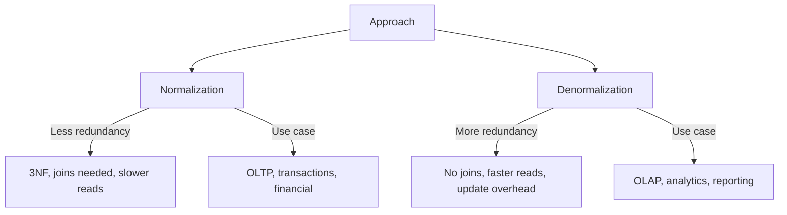

# Normalization and Denormalization

> Data organize karne ka method — redundancy kam karne vs read fast karne.

> **TL;DR Hinglish:** Normalization data redundancy kam karta hai — tables mein split karo, relationships se connect karo (1NF, 2NF, 3NF). Denormalization data duplicate karke reads fast karta hai — redundant data ek jagah store karo. Interview mein samjho — normal form mein writes tez hain, reads slow (joins). Denormalized mein reads fast hain, writes slow (update multiple places).

Normalization aur denormalization data organize karne ke opposite approaches:

**Normalization (redundancy kam):**
- 1NF: Atomic values only (no arrays in cells)
- 2NF: No partial dependency (all non-key columns depend on full primary key)
- 3NF: No transitive dependency (non-key columns depend only on primary key)
- Less data duplication, easier updates
- But: joins needed for reads, slower reads

**Denormalization (reads fast):**
- Data duplicate karo, one place mein store karo
- No joins needed, reads faster
- Updates slower (multiple places update)
- Data inconsistency risk

## Failure modes to mention

1. **Over-normalization** — Too many joins, query very slow — read performance suffers
2. **Over-denormalization** — Too much duplication, update anomalies, data inconsistency
3. **Update anomaly** — Denormalized data, update one place but not other → inconsistency
4. **Write amplification** — Normalized, many tables update for one operation

**🔴 Galti:** "Normalization always better" — Over-normalization = slow reads with too many joins. Denormalization needed for read-heavy apps.
**✅ Sahi:** "Normalization = less redundancy (faster writes, slower reads via joins). Denormalization = duplicate data (faster reads, slower writes). OLTP = normalized, OLAP = denormalized."

**Phrase:** Normalization redundancy kam karta hai (3NF, joins, slower reads), denormalization reads fast karta hai (duplicate data, faster reads, update overhead). OLTP normalized, OLAP denormalized.

**Yaad rakho (Revision):** 1NF (atomic), 2NF (no partial dep), 3NF (no transitive dep), denormalization (duplicate for speed), OLTP = normalized, OLAP = denormalized, update anomaly risk.

**See also:** [Databases and DBMS](/system-design/databases-and-dbms), [SQL Databases](/system-design/sql-databases), [Database Indexing](/system-design/database-indexing).
