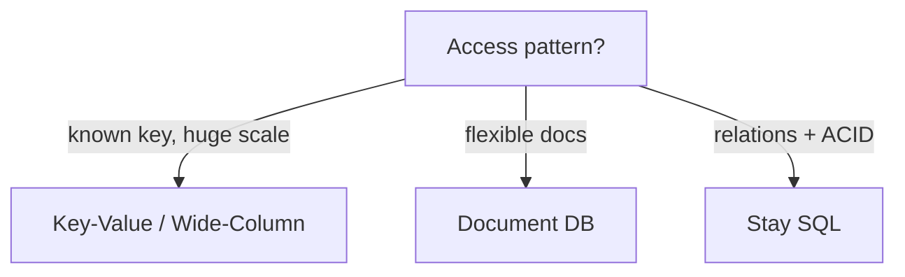

# NoSQL Databases

> Flexible schema with horizontal scale — pick the shape that matches the access pattern.

> NoSQL trades joins and rigid schemas for flexible models and built-in sharding. The right choice depends entirely on how data gets read: known keys favor key-value and wide-column stores; search and relations favor other tools.

## NoSQL vs SQL

SQL delivers normalized schemas, multi-row ACID transactions, and ad hoc joins with strong consistency on a single primary — scale vertically first, then read replicas, then sharding with pain. NoSQL optimizes for partition tolerance, elastic horizontal scale, and schema flexibility, often defaulting to eventual consistency tunable via quorums. Keep money, inventory, and anything requiring multi-table invariants in SQL; use NoSQL for high-volume keyed access, flexible documents, and write-heavy logs. Production systems routinely run both — polyglot persistence with clear ownership per store.

- **When SQL stays:** Joins across entities, serializable transactions, complex reporting without ETL duplication.
- **When NoSQL wins:** Predictable access paths at huge scale, TTL-heavy ephemeral data, multi-region active-active with tunable R/W.
- **Migration trigger:** Single-node write ceiling, hot partition on one key, or schema change velocity blocking releases — measure before switching.
- **Interview framing:** "Access pattern first, consistency model second, SQL vs NoSQL third."

## Key-Value Stores

The model is minimal: `GET key`, `SET key`, optional TTL — no secondary query language beyond what the engine adds (Redis SCAN, DynamoDB GSIs). Latency targets single-digit milliseconds in-memory (Redis) or low tens ms durable (DynamoDB on SSD). Model every read path as a key design exercise: `user:{id}:session`, `cart:{id}`, `rate:{ip}:{minute}`. Values are opaque blobs (JSON, protobuf); structure lives in application code, not the database.

- **Redis:** Ephemeral cache, sessions, rate limits, leaderboards (sorted sets), pub/sub — plan persistence (AOF/RDB) if restart data loss hurts.
- **DynamoDB:** Partition key required; sort key optional for range queries within partition; GSIs duplicate projection for alternate access paths.
- **No ad hoc joins:** If you need "all users who bought X," precompute keys, use a stream to a warehouse, or keep that query in SQL.
- **Hot keys:** Celebrity counters hit one partition — split key (`likes:post:123:shard:7`) or cache in front.

## Document Databases

Documents (BSON/JSON) nest arrays and objects — one document often equals one aggregate root (product with variants, user profile with preferences). MongoDB indexes fields inside documents, supports aggregation pipelines, and evolves schema without blocking migrations — new fields appear on write. Favor self-contained documents: embed one-to-few relationships, reference or duplicate one-to-many when read patterns need both sides without `$lookup` storms.

- **Embedding vs referencing:** Embed when read together always and array bounded; reference when unbounded growth (comments → separate collection with `post_id` index).
- **Schema validation:** Optional JSON Schema on collections catches bad writes without rigid upfront DDL.
- **Indexes:** Compound indexes on `{tenant_id, created_at}` match typical multi-tenant feeds; explain plans like SQL.
- **Transactions:** Multi-document ACID exists (Mongo 4+) but keep transactions short — default design stays single-document atomicity.

## Wide-Column Databases

Tables are sparse wide rows grouped into **column families** — Cassandra, ScyllaDB, HBase excel at append-heavy writes and time-range reads by partition key. Design is **query-first:** each query pattern gets a table (or materialized view) with partition key matching the mandatory equality filter; clustering columns define sort order within partition. Billions of rows per day (metrics, IoT, activity logs) fit naturally; cross-partition queries are anti-patterns — push them to Spark/Batch jobs.

- **Partition key cardinality:** Too few keys → hot partitions; too many tiny partitions → overhead — aim for 100MB–1GB per partition guideline.
- **TTL:** Native row TTL for logs and events — automatic compaction without delete storms.
- **Consistency:** Tunable per query (`LOCAL_QUORUM`, `ONE`) — name consistency per use case in the same cluster.
- **HBase vs Cassandra:** HBase on HDFS for Hadoop ecosystems; Cassandra for always-on geo-distributed apps without HDFS ops.

## Data Modeling, Replication, Sharding

Start from access patterns: list the top 5 reads/writes, draw keys and duplication, then pick store type. Duplicate data across tables or items to avoid runtime joins — **write amplification** buys read simplicity. Replication uses leader-follower (Mongo replica sets), leaderless quorum (Dynamo/Cassandra), or multi-leader with conflict resolution (CRDTs, last-write-wins with care). Sharding splits partitions across nodes; the partition key must spread load evenly and align with queries — resharding later is painful, so load-test synthetic hot keys early.

- **GSI cost:** Every DynamoDB GSI duplicates write throughput billing — only index paths you actually serve.
- **Celebrity problem:** Detect via metrics (single partition > X% traffic) — cache, split keys, or async aggregation.
- **Multi-region:** Active-active needs version vectors or conflict policies; active-passive simplifies consistency story.
- **Streams:** Change data capture (Dynamo Streams, Mongo change streams) feeds search indexes and warehouses without polling.

## Eventual Consistency

Replicas apply updates asynchronously; without quorum reads, a client may read a stale value for milliseconds to seconds depending on load and geography. That is acceptable for social counts, recommendation features, and configuration flags with TTL; it is unacceptable for balances and inventory unless you force linearizable reads/writes on that path. Tune with **quorum**: for N replicas, require W writes and R reads with `R + W > N` to overlap on the latest version; `W=ALL` for critical writes, `R=1` for best-effort dashboards.

- **Read repair / anti-entropy:** Background processes fix drift — know your store's repair story for long-tail staleness.
- **Session consistency:** Sticky routing to a replica improves "feels consistent" UX without full linearizability.
- **Monotonic reads:** User never sees time go backward — often enough for feeds with version or timestamp checks.
- **Strong on demand:** Same cluster can mix `{W:3,R:1}` for likes and `{W:3,R:3}` for wallet — state per API.

## Keep in mind

- Model around queries, not ER diagrams — duplicate to avoid joins; pay write cost consciously.
- Partition key choice decides scaling success or hot-partition failure — load-test before launch.
- Eventual consistency is the default; tune quorum (`R + W > N`) where freshness matters.
- MongoDB for evolving documents, DynamoDB for managed keyed scale, Cassandra/Scylla for write firehoses and TTL logs.
- Polyglot persistence: SQL for money and invariants, NoSQL for scale and access-pattern fit — boundaries documented per service.
