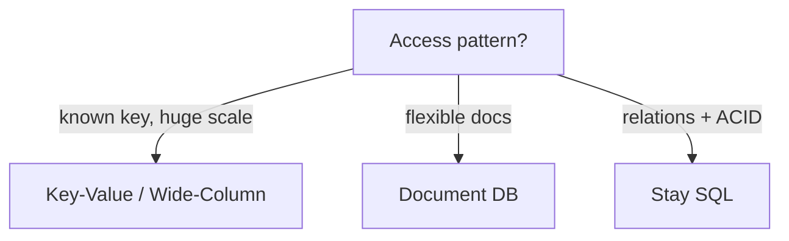

# NoSQL Databases

> Flexible schema with horizontal scale — pick the shape that matches the access pattern.

> NoSQL trades joins and rigid schemas for flexible models and built-in sharding. The right choice depends entirely on how data gets read: known keys favor key-value and wide-column stores; search and relations favor other tools.

## NoSQL vs SQL

SQL delivers normalized schemas, multi-row ACID transactions, and ad hoc joins with strong consistency on a single primary — scale vertically first, then read replicas, then sharding with pain. NoSQL optimizes for partition tolerance, elastic horizontal scale, and schema flexibility, often defaulting to eventual consistency tunable via quorums. Keep money, inventory, and anything requiring multi-table invariants in SQL; use NoSQL for high-volume keyed access, flexible documents, and write-heavy logs. Production systems routinely run both — polyglot persistence with clear ownership per store.

- **When SQL stays:** Joins across entities, serializable transactions, complex reporting without ETL duplication.
- **When NoSQL wins:** Predictable access paths at huge scale, TTL-heavy ephemeral data, multi-region active-active with tunable R/W.
- **Migration trigger:** Single-node write ceiling, hot partition on one key, or schema change velocity blocking releases — measure before switching.
- **Interview framing:** "Access pattern first, consistency model second, SQL vs NoSQL third."

## Key-Value Stores

The model is minimal: `GET key`, `SET key`, optional TTL — no secondary query language beyond what the engine adds (Redis SCAN, DynamoDB GSIs). Latency targets single-digit milliseconds in-memory (Redis) or low tens ms durable (DynamoDB on SSD). Model every read path as a key design exercise: `user:{id}:session`, `cart:{id}`, `rate:{ip}:{minute}`. Values are opaque blobs (JSON, protobuf); structure lives in application code, not the database.

- **Redis:** Ephemeral cache, sessions, rate limits, leaderboards (sorted sets), pub/sub — plan persistence (AOF/RDB) if restart data loss hurts.
- **DynamoDB:** Partition key required; sort key optional for range queries within partition; GSIs duplicate projection for alternate access paths.
- **No ad hoc joins:** If you need "all users who bought X," precompute keys, use a stream to a warehouse, or keep that query in SQL.
- **Hot keys:** Celebrity counters hit one partition — split key (`likes:post:123:shard:7`) or cache in front.

## Document Databases

Documents (BSON/JSON) nest arrays and objects — one document often equals one aggregate root (product with variants, user profile with preferences). MongoDB indexes fields inside documents, supports aggregation pipelines, and evolves schema without blocking migrations — new fields appear on write. Favor self-contained documents: embed one-to-few relationships, reference or duplicate one-to-many when read patterns need both sides without `$lookup` storms.

- **Embedding vs referencing:** Embed when read together always and array bounded; reference when unbounded growth (comments → separate collection with `post_id` index).
- **Schema validation:** Optional JSON Schema on collections catches bad writes without rigid upfront DDL.
- **Indexes:** Compound indexes on `{tenant_id, created_at}` match typical multi-tenant feeds; explain plans like SQL.
- **Transactions:** Multi-document ACID exists (Mongo 4+) but keep transactions short — default design stays single-document atomicity.

## Wide-Column Databases

Tables are sparse wide rows grouped into **column families** — Cassandra, ScyllaDB, HBase excel at append-heavy writes and time-range reads by partition key. Design is **query-first:** each query pattern gets a table (or materialized view) with partition key matching the mandatory equality filter; clustering columns define sort order within partition. Billions of rows per day (metrics, IoT, activity logs) fit naturally; cross-partition queries are anti-patterns — push them to Spark/Batch jobs.

- **Partition key cardinality:** Too few keys → hot partitions; too many tiny partitions → overhead. Keep partitions bounded (often tens to low hundreds of MB); validate the limit against row size, traffic, and your Cassandra version.
- **TTL:** Native row TTL for logs and events — automatic compaction without delete storms.
- **Consistency:** Tunable per query (`LOCAL_QUORUM`, `ONE`) — name consistency per use case in the same cluster.
- **HBase vs Cassandra:** HBase on HDFS for Hadoop ecosystems; Cassandra for always-on geo-distributed apps without HDFS ops.

## Data Modeling, Replication, Sharding

Start from access patterns: list the top 5 reads/writes, draw keys and duplication, then pick store type. Duplicate data across tables or items to avoid runtime joins — **write amplification** buys read simplicity. Replication uses leader-follower (Mongo replica sets), leaderless quorum (Dynamo/Cassandra), or multi-leader with conflict resolution (CRDTs, last-write-wins with care). Sharding splits partitions across nodes; the partition key must spread load evenly and align with queries — resharding later is painful, so load-test synthetic hot keys early.

- **GSI cost:** Every DynamoDB GSI duplicates write throughput billing — only index paths you actually serve.
- **Celebrity problem:** Detect via metrics (single partition > X% traffic) — cache, split keys, or async aggregation.
- **Multi-region:** Active-active needs version vectors or conflict policies; active-passive simplifies consistency story.
- **Streams:** Change data capture (Dynamo Streams, Mongo change streams) feeds search indexes and warehouses without polling.

## Eventual Consistency

Replicas apply updates asynchronously; without quorum reads, a client may read a stale value for milliseconds to seconds depending on load and geography. That is acceptable for social counts, recommendation features, and configuration flags with TTL; it is unacceptable for balances and inventory unless you use a store and operation that provide the required consistency. With N replicas, `R + W > N` makes read and write quorums overlap, which improves freshness—but overlap alone is not a universal linearizability guarantee under concurrent writes, sloppy quorums, or clock-based conflict resolution.

- **Read repair / anti-entropy:** Background processes fix drift — know your store's repair story for long-tail staleness.
- **Session consistency:** Sticky routing to a replica improves "feels consistent" UX without full linearizability.
- **Monotonic reads:** User never sees time go backward — often enough for feeds with version or timestamp checks.
- **Strict correctness:** For compare-and-set, uniqueness, balances, or inventory, use conditional writes / lightweight transactions or a transactional database; do not infer safety from quorum arithmetic alone.

## DynamoDB Deep-Dive

Managed key-value: the partition key hashes to a storage partition; an optional sort key orders items within it (`PK=userId`, `SK=order#ts`). Query patterns must match keys — no SQL planner saves a bad model. GSIs are alternate access paths, each billed roughly like another table (project only needed fields). On-demand for spiky traffic, provisioned + autoscaling for steady load, DAX for microsecond hot reads.

- **Keys:** high cardinality (`userId` spreads, `status=ACTIVE` throttles one partition); 400KB item cap — large blobs belong in S3 with pointers here; Query paths by design, never Scan at scale.
- **Consistency per request:** eventually consistent default (cheaper, feeds and catalogs); strongly consistent when UX needs read-after-write; TransactWrite/ConditionExpression for small multi-item atomicity; Global Tables for active-active with last-writer-wins conflicts.
- **Failure modes:** hot partitions (split keys `userId#shard` or cache in front); GSI lag and separate billing; throttling under burst (backoff with jitter).
- **Phrase:** "DynamoDB is the managed locker — partition key in, milliseconds out; spread keys, mind GSI costs."

## MongoDB Deep-Dive

BSON documents in collections — product catalogs, CMS content, evolving startup schemas; new fields appear on write without migrations. **Replica sets** (one primary, secondaries copy, elections promote on failure) give HA with stale-acceptable secondary reads. **Sharding** splits by shard key with `mongos` routers directing queries — the shard key decides everything.

- **Model:** embed one-to-few (read together, bounded); reference unbounded growth (comments → separate collection with `post_id` index) — 16MB document limit. Light `$jsonSchema` validation stops schema sprawl.
- **Transactions:** multi-document ACID exists but weaker than Postgres — keep money elsewhere; default design stays single-document atomic.
- **Failure modes:** monotonic ObjectId shard keys hammer one shard (prefer hashed/compound); primary failover pauses writes for seconds (retryable writes on).
- **Phrase:** "Documents suit flexible schemas — replica sets for HA, shard keys decide scaling, joins and money stay Postgres work."

## Cassandra Deep-Dive

Wide-column store for write firehoses (chat messages, time-series, activity logs): the partition key picks the node on the hash ring; clustering columns sort rows inside the partition. Design **query-first** — one table per query, denormalize freely (chat: `PRIMARY KEY ((chatId), ts, messageId)` makes "latest messages" a sequential read). Consistency tunes per operation (`ONE`, `LOCAL_QUORUM`, `ALL`); `R + W > N` overlaps read and write sets. Hinted handoff + read repair + anti-entropy converge replicas.

- **TTL expiry** beats mass deletes (tombstone storms slow reads); bucket unbounded partitions by time (`chatId + yyyyMM`); lightweight transactions cost ~4 RTTs — off hot paths; schedule repairs or replicas drift.
- **Multi-region active-active** with `LOCAL_*` levels keeps latency low; conflicts resolve last-write-wins — prefer immutable appends over mutable counters.
- **Phrase:** "Cassandra is the big diary — think query first, table second; writes cheap, reads fast by known key."

## Elasticsearch for Search

Book index over your data: CDC or queue feeds documents → analyzers tokenize (lowercase, stem, stopwords) → inverted index maps terms → documents. Writes refresh segments on a schedule — **near-real-time (~1s lag accepted)**, not instant. The database stays source of truth; Elasticsearch is its async search copy (read-your-write for authors via primary; deletes must flow through the same pipeline). Product search, facets/aggregations, log analytics, autocomplete.

- **Queries to name:** match/multi-match (relevance), term filters (cheap faceting), aggregations (counts, histograms), completion suggesters, `search_after` for deep pages.
- **Failure modes:** mapping explosions (explicit mappings, no unbounded dynamic fields); hot tenants (route deliberately, ~20–50GB shards); refresh lag (say it upfront); yellow cluster (replica missing — searchable but not HA).
- **Phrase:** "Elasticsearch is the book index — async from the database, slight lag accepted, relevance plus facets out of the box."

## Keep in mind

- Model around queries, not ER diagrams — duplicate to avoid joins; pay write cost consciously.
- Partition key choice decides scaling success or hot-partition failure — load-test before launch.
- Eventual consistency is the default; tune quorum (`R + W > N`) where freshness matters.
- MongoDB for evolving documents, DynamoDB for managed keyed scale, Cassandra/Scylla for write firehoses and TTL logs.
- Polyglot persistence: SQL for money and invariants, NoSQL for scale and access-pattern fit — boundaries documented per service.
