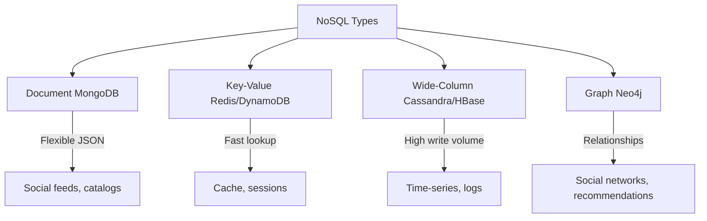

# NoSQL Databases

> Flexible schema, horizontal scaling — documents, key-value, wide-column, graphs.

> **TL;DR Hinglish:** NoSQL databases flexible schema rakhte hain — predefined table structure nahi. Document (MongoDB), key-value (Redis), wide-column (Cassandra), graph (Neo4j) types hain. Horizontal scaling naturally hoti hai — sharding built-in. High throughput, low latency. Best for real-time apps, social media, IoT — unstructured/flexible data.

NoSQL databases flexible, scalable data store karte hain:

**Types:**
- **Document** — JSON/BSON documents, flexible schema (MongoDB)
- **Key-Value** — simple lookup, ultra-fast (Redis, DynamoDB)
- **Wide-Column** — column-family, high write volume (Cassandra, HBase)
- **Graph** — nodes + edges, relationships (Neo4j)

**Key advantages:**
- Schema flexibility — no migrations needed
- Horizontal scaling — sharding built-in
- High throughput, low latency
- Polyglot persistence — use different DBs for different needs

## Failure modes to mention

1. **Eventual consistency** — Data may be stale temporarily — read repairs, quorum
2. **Limited queries** — No joins, complex queries hard — denormalize data
3. **Data duplication** — Schema flexibility leads to duplication — consistency harder

**🔴 Galti:** "NoSQL no consistency" — NoSQL can be strongly consistent (Cassandra quorum), but eventual is default.
**✅ Sahi:** "NoSQL = flexible schema, horizontal scale. Types: document, key-value, wide-column, graph. Eventual consistency default, but tunable."

**Phrase:** NoSQL flexible schema, horizontal scaling — document (MongoDB), key-value (Redis/DynamoDB), wide-column (Cassandra), graph (Neo4j). Polyglot persistence, high throughput.

**Yaad rakho (Revision):** Document/key-value/wide-column/graph types, flexible schema, horizontal scaling built-in, eventual consistency (tunable), polyglot persistence, MongoDB/Redis/Cassandra/DynamoDB.

**See also:** [Cassandra](/system-design/cassandra), [DynamoDB](/system-design/dynamodb), [Redis](/system-design/redis), [Databases and DBMS](/system-design/databases-and-dbms).
