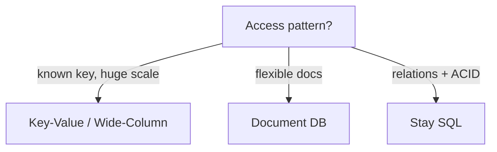

# NoSQL Databases

> Flexible schema with horizontal scale — pick the shape that matches the access pattern.

> NoSQL trades joins and rigid schemas for flexible models and built-in sharding. The right choice depends entirely on how data gets read: known keys favor key-value and wide-column stores; search and relations favor other tools.

## NoSQL vs SQL

SQL gives structured tables, ACID, and joins with vertical scaling. NoSQL gives flexible schemas, horizontal scaling, and eventual consistency (tunable). Financial data and inventory stay SQL; social feeds, catalogs, and real-time streams go NoSQL. Most real systems use both — polyglot persistence, each store for its strength.

## Key-Value Stores

Simplest model: key in, blob out, single-digit millisecond latency. Redis for ephemeral speed (cache, sessions, counters), DynamoDB for durable managed scale (partition keys, GSIs, on-demand throughput). No queries beyond key lookup — model access paths as keys.

## Document Databases

JSON-like documents with flexible fields, indexed and queryable — MongoDB is the standard. Product catalogs, CMS content, and user profiles fit naturally; schema evolves without migrations. Keep documents self-contained; cross-document joins are weak, so embed or duplicate deliberately.

## Wide-Column Databases

Column families with massive write throughput and known-key reads — Cassandra and HBase. Time-series data, message logs, and activity feeds at billions of rows. Model tables around queries (query-first design), not relations; each query pattern may own its table.

## Data Modeling, Replication, Sharding

Model for reads: duplicate data to avoid joins, choose partition keys from access patterns. Replicate for availability (leader-follower or quorum-based, like DynamoDB). Shard by key across nodes; hot partitions (celebrity keys) need splitting or caching in front.

## Eventual Consistency

Replicas converge without instant agreement — reads may return stale data for milliseconds to seconds. Acceptable for likes, feeds, and counters; unacceptable for money. Tune with quorum reads and writes (`R + W > N` for strong reads) where it matters.

## Keep in mind

- Model around queries, not relations — duplicate to avoid joins.
- Partition key choice decides scaling success or hot-partition failure.
- Eventual consistency is the default; tune quorum where freshness matters.
- MongoDB for evolving documents, DynamoDB for managed key-value, Cassandra for write firehoses.
- Polyglot persistence: SQL for money, NoSQL for scale — use both deliberately.
