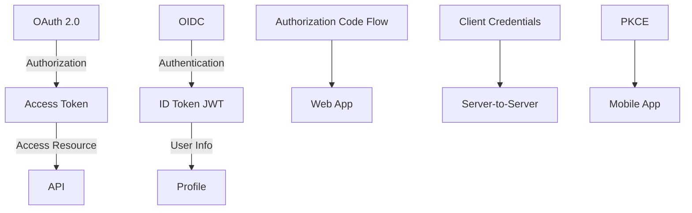

# OAuth 2.0 and OpenID Connect

> Authorization + Authentication protocols — secure API access, user identity.

> **TL;DR Hinglish:** OAuth 2.0 authorization protocol hai — app ko user ke behalf access dena bina password diye. OIDC (OpenID Connect) authentication layer hai OAuth 2.0 ke upar — user identity verify karta hai. OAuth 2.0 = "kya access hai", OIDC = "kyun hai ye". Flows: Authorization Code (web apps), Client Credentials (server-to-server), PKCE (mobile). Access tokens + Refresh tokens use hote hain.

OAuth 2.0 aur OIDC secure access aur identity ke liye:

**OAuth 2.0 (Authorization):**
- User app ko limited access delegate karta hai
- "This app can read your Gmail, but not delete emails"
- Access token (short-lived) + Refresh token (long-lived)
- Flows: Authorization Code, Client Credentials, PKCE

**OIDC (Authentication) — OAuth 2.0 + layer:**
- User identity verify karta (who is this user?)
- ID Token (JWT) mein user info hota hai
- "This is user Rakshit"
- Built on top of OAuth 2.0

## Failure modes to mention

1. **Token leakage** — Access token stolen → unauthorized access — short-lived tokens, HTTPS
2. **Token replay** — Same token used twice — nonce, one-time use
3. **Over-scoping** — Too much access granted — least privilege principle
4. **Refresh token theft** — Refresh token stolen → long-lived access — rotation, binding

**🔴 Galti:** "OAuth 2.0 authentication hai" — OAuth 2.0 authorization hai (access), OIDC authentication hai (identity).
**✅ Sahi:** "OAuth 2.0 = authorization (what access), OIDC = authentication (who is user). Access token + refresh token. Authorization Code for web, PKCE for mobile."

**Phrase:** OAuth 2.0 authorization protocol hai — app ko limited access delegate karta, OIDC authentication layer hai identity ke liye. Access tokens + refresh tokens.

**Yaad rakho (Revision):** OAuth 2.0 = authorization (access), OIDC = authentication (identity), access token (short-lived) + refresh token, flows (Auth Code, Client Credentials, PKCE), least privilege.

**See also:** [Single Sign-On](/system-design/single-sign-on), [SSL, TLS, mTLS](/system-design/ssl-tls-mtls), [Microservices](/system-design/microservices).
