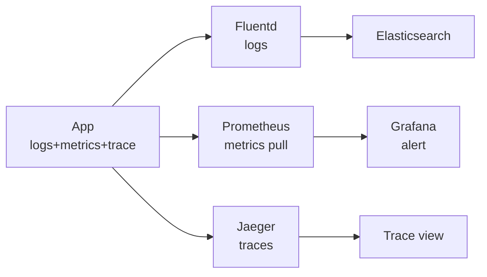

# Observability

> Logs, Metrics, Traces — andar kya ho raha hai dekho, warna blind.

> **TL;DR Hinglish:** Observability ek hospital monitor jaisa — Logs = doctor ki notes (kya hua), Metrics = pulse graph (kitna), Traces = X-ray (kahan atka). Teeno bina scale pe debug impossible.

Har "Metrics Monitoring" question ka base.

## How it works

**1. Logs:** line by line — `2026-08-25 10:01:23 user=123 pay failed`. ELK (Elasticsearch+Kibana) me. High volume → sampling.

**2. Metrics:** numbers over time — `http_requests_total{status=500} 12`, `cpu 80%`. Prometheus scrape + Grafana graph + alert `p99 > 500ms`.

**3. Traces:** ek request ka safar — `API → Auth (20ms) → DB (80ms) → Cache` — OpenTelemetry traceId `abc` se jodo. Jaeger/Tempo.

**Fourth:** Events/profiling — par 3 hi yaad rakho.

## How it works

- **Metrics:** app `/metrics` expose → Prometheus har 15 sec pull → Grafana dashboard + Alertmanager `SLO burn`.
- **Logs:** Fluentd → Elasticsearch/Loki → Kibana `traceId` se filter.
- **Traces:** OpenTelemetry SDK → `traceId` har service me header `X-Trace-Id` → Jaeger.

**Golden signals (Google):** latency, traffic, errors, saturation.

## Alerting

- **SLO:** `99.9% requests < 300ms` — 0.1% budget. Burn 2x to page, 1x to ticket.
- **Runbook:** alert ke saath link `https://runbook/pay-fail` — kya karna.

## How to answer in interview

- **Rate limiter:** metrics `allowed vs blocked`, trace `check() 2ms`.
- **Payment:** logs me `orderId` + `traceId`, metrics `success 99.9%`, trace DB 80ms.

**🔴 Galti:** "Logs hi kaafi" — 10k RPS pe logs dhoondhna mushkil, metrics/traces chahiye.
**✅ Sahi:** "Logs for details, metrics for graphs/alerts, traces for latency — traceId se jodo."

**Phrase:** "Observability monitor jaisa — logs notes, metrics pulse, traces X-ray, traceId se link."

**Yaad rakho:** Logs line, metrics number, traces safar, Prometheus pull, SLO burn.

**See also:** [metrics-monitoring](/system-design/metrics-monitoring), [api-gateway](/system-design/api-gateway), [kafka](/system-design/kafka).
