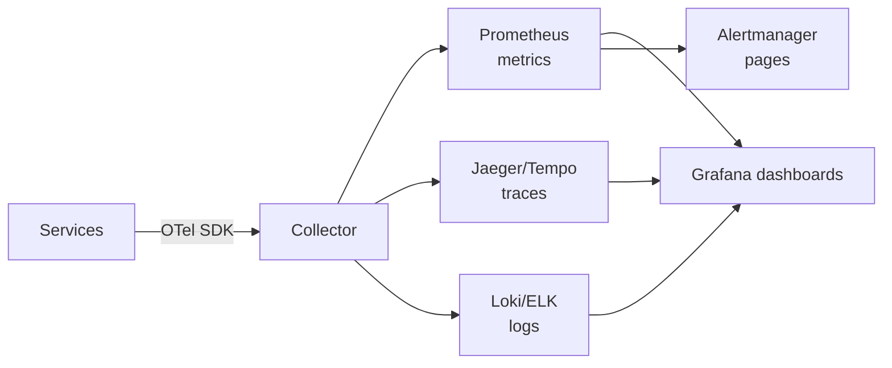

# Observability

> You cannot fix what you cannot see — instrument first, alert on symptoms, debug with traces.

> Observability answers three questions: what happened (logs), how much (metrics), and where time went (traces). Add health monitoring on top and systems become operable: detectable incidents, fast diagnosis, honest SLOs.

## Logging

Logs are timestamped records of discrete events — request handled, payment failed, cache miss — and they answer "what happened" when someone pages you at 3 a.m. Prefer **structured JSON** with stable field names (`timestamp`, `level`, `service`, `trace_id`, `user_id` hashed) over unparsed prose; free-text-only logs don't aggregate or filter at scale. Use levels deliberately: `debug` for development, `info` for lifecycle events, `warn` for recoverable anomalies, `error` for failures needing attention — and sample or gate verbose debug in production to control cost. Ship logs off the host to centralized, searchable storage (ELK, Loki, CloudWatch Logs) with retention tiers: hot for days, warm for compliance, cold for archive — container-local files disappear with the pod.

- **One line per event** with context — avoid multi-megabyte stack dumps on every 404.
- **PII redaction** at ingest: emails, tokens, and card numbers never hit long-term storage.
- **Request ID / trace ID** on every log line ties a user click to downstream failures.
- **Log volume budget:** INFO per successful request is often enough; DEBUG only when sampling.
- **Interview:** "Structured logs + correlation ID + central store + retention policy."

## Metrics

Metrics are numeric time series — counters, gauges, histograms — optimized for aggregation, dashboards, and alerting. **Counters** only go up (requests total, errors total); **gauges** go up and down (queue depth, open connections); **histograms** capture distributions (latency buckets for p50/p99). Derive rates (`requests/sec`), error ratios, and SLO burn from metrics, not from scanning logs. High **cardinality** kills backends — never use unbounded labels like `user_id` or `order_id` on every request; stick to `service`, `route`, `status`, `region`.

- **RED** for services: Rate, Errors, Duration — three charts cover most APIs.
- **USE** for resources: Utilization, Saturation, Errors — CPU, disk, memory nodes.
- **SLO metrics:** availability and latency SLIs as first-class recorded series.
- **Business metrics:** signups, payments — same pipeline as infra, different dashboards.
- **Alert on symptoms** (error rate ↑, p99 ↑) before raw CPU alerts when possible.

## Tracing and Distributed Tracing

A **span** is one unit of work (HTTP server handler, DB query, cache get); a **trace** is the tree of spans for one logical request across services. Distributed tracing shows which hop consumed 800 ms of a 900 ms request — indispensable for microservices where logs alone fragment the story. Propagate **trace context** in headers (W3C `traceparent`) from edge through async boundaries where your broker supports it. At scale, **sample** traces (1–10% head-based, or tail-based on errors/latency) — 100% tracing on high-QPS paths explodes storage and collector cost.

- **Instrument outbound calls** — missing client spans create "mystery gaps" in waterfalls.
- **Span attributes:** `db.statement` sanitized, `http.route` templated (`/users/{id}` not raw URLs).
- **Critical path:** focus optimization on spans on the longest chain, not every leaf.
- **Compare canary vs prod** traces when rolling out risky changes.
- **Interview:** "Metrics tell me it's slow; traces tell me which service and which query."

## Correlation IDs

A **correlation ID** (request ID) is one identifier assigned at the edge for a single user-facing action and copied into every downstream HTTP header, message attribute, and log field. When support says "payment ID 8821 failed," one grep across services beats guessing which pod logged what. Generate at the **API gateway** or first service; reject or replace missing IDs on internal boundaries so everything shares the same thread. Async jobs should carry the same ID from the enqueueing request so workers stay joinable to the original click.

- **Header convention:** `X-Request-ID` or `X-Correlation-ID` — document and enforce in middleware.
- **Pass through queues:** SQS/Kafka message attributes mirror HTTP headers.
- **Don't reuse** across unrelated user actions — new ID per inbound HTTP request.
- **Support tooling:** expose correlation ID in error JSON so users paste it into tickets.
- **Tracing overlap:** correlation ID complements trace ID — both may appear; tracing adds span hierarchy.

## Health Monitoring and Alerting

Monitor what users feel first: **latency**, **error rate**, and **availability** (success ratio or synthetic probes), then drill into causes — CPU, memory, disk, DB connections, queue depth, dependency timeouts. Define **SLOs** with error budgets; alert on **burn rate** (budget consumed too fast) rather than every blip above threshold. Every alert needs a **runbook** link: what to check, who owns it, when to escalate — alerts without action become noise and get silenced. Page humans for imminent or active user impact; create tickets for capacity planning and non-urgent debt.

- **Symptom-based paging:** "checkout error rate > 1% for 5m" beats "CPU > 80%."
- **Multi-window burn:** fast burn pages quickly; slow burn warns before budget gone for the month.
- **Heartbeats** for batch and cron — absence-of-success alerts catch silent failures.
- **Dependency health:** circuit breaker open counts and upstream 5xx as first-class signals.
- **Interview:** "Alert on SLO violation with runbook; tune until on-call trusts every page."

## OpenTelemetry, Prometheus, Grafana

**OpenTelemetry (OTel)** is the vendor-neutral standard: one SDK emits traces, metrics, and logs with consistent context, export to Jaeger, Tempo, Datadog, or others without rewriting instrumentation. **Prometheus** pulls (scrapes) metrics from `/metrics` endpoints, stores time series locally or remotely, and evaluates **PromQL** alert rules — the de facto metrics backend in Kubernetes land. **Grafana** dashboards unify Prometheus metrics, trace backends, and log sources for one pane during incidents. Practical starter path: instrument services with OTel, scrape metrics into Prometheus, visualize and alert in Grafana, export traces to Jaeger or Tempo.

- **OTel Collector** as a single agent: receive, batch, sample, export — keeps app code thin.
- **Prometheus labels:** match your cardinality discipline — same rules as custom metrics.
- **Recording rules** pre-aggregate expensive queries dashboards hammer every refresh.
- **Unified dashboards:** RED per service row + trace drill-down from spike timestamps.
- **Interview stack sentence:** "OTel instrument, Prometheus store metrics, Grafana view, Alertmanager page."

## Keep in mind

- Logs say what happened, metrics say how much, traces say where time went — use all three.
- Structure logs with request/trace IDs; propagate correlation from edge through queues.
- Alert on user-facing symptoms and SLO burn with runbooks — unactionable alerts get ignored.
- Bound metric label cardinality; sample traces aggressively at high QPS.
- OpenTelemetry to instrument, Prometheus to store metrics, Grafana to view and drill down.

**Practice next:** [Design Metrics Monitoring](/hld/metrics-monitoring) applies cardinality control, downsampling, TSDB sharding, SLO burn-rate alerts, and Alertmanager grouping end to end.
