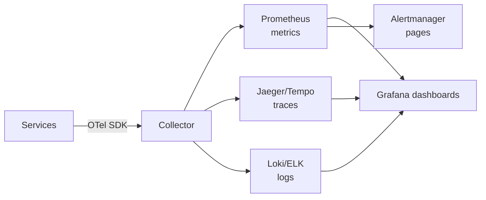

# Observability

> You cannot fix what you cannot see — instrument first, alert on symptoms, debug with traces.

> Observability answers three questions: what happened (logs), how much (metrics), and where time went (traces). Add health monitoring on top and systems become operable: detectable incidents, fast diagnosis, honest SLOs.

## Logging

Timestamped event records per request and error — structured JSON with request IDs, never free text alone. Log levels (debug, info, warn, error) control volume; sample debug logs in production. Centralize into searchable storage with retention tiers — local files die with containers.

## Metrics

Numbers over time: counters (requests), gauges (connections), histograms (latencies). Aggregate into rates, percentiles, and SLO burn. Metrics drive dashboards and alerts; keep cardinality bounded (user IDs as label values explode storage).

## Tracing and Distributed Tracing

Spans follow one request across services; assembled traces reveal which hop is slow. Propagate trace and span IDs in headers (W3C Trace Context). Sample aggressively (1-10%) — full tracing at scale bankrupts storage.

## Correlation IDs

One ID per user action, passed through every service, queue, and log line. Turns "something failed somewhere" into one searchable thread. Generate at the edge (gateway), require downstream.

## Health Monitoring and Alerting

Monitor symptoms users feel (latency, error rate, availability) plus causes (CPU, disk, queue depth). Alert on SLO burn with runbooks attached — every alert must be actionable, or it becomes ignored noise. Page humans for user impact; ticket the rest for mornings.

## OpenTelemetry, Prometheus, Grafana

OpenTelemetry standardizes instrumentation (one SDK for traces, metrics, logs) with vendor-neutral export. Prometheus scrapes and stores time-series metrics with PromQL alerting. Grafana visualizes it all in shared dashboards. The standard beginner stack: instrument with OpenTelemetry, store in Prometheus, view in Grafana.

## Keep in mind

- Logs say what happened, metrics say how much, traces say where time went.
- Structure logs with request IDs; correlate across services always.
- Alert on user-facing symptoms with runbooks — unactionable alerts get ignored.
- Bound metric cardinality; sample traces aggressively.
- OpenTelemetry to instrument, Prometheus to store, Grafana to view.
