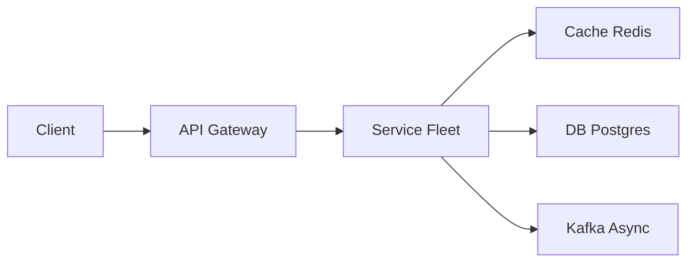

# Online Auction

> eBay-style bids. The last seconds of a popular lot are a **consistency + burst** problem. Whoever wins must match the ledger.

> **TL;DR Hinglish:** Last-sec bids me DB `SERIALIZABLE`, WebSocket se live price, anti-sniping + TTL, throughput vs consistency trade-off.

## Kya poochte hain? (What they ask) — Hinglish me samjho

Design an online auction platform like eBay where sellers list items with a start price, reserve price, and end time. Buyers place bids; the highest bid when the clock hits zero wins. The interviewer will describe sniping, proxy bidding, and "no two winners" — then watch how you handle concurrency.

**Scenario:** Millions of listings are mostly quiet (few bids), but a viral lot (sneakers, concert tickets, art) gets 10k concurrent bidders hammering the bid button in the final 10 seconds. Your system must accept bids, broadcast the live price, and declare one deterministic winner that matches the durable bid ledger — even if Redis or a WebSocket node crashes.

**What interviewer tests:**
- Strong consistency vs. eventual consistency trade-offs (who decides the winner?)
- Serializing contended writes without killing throughput for uncontended auctions
- Real-time fan-out ([WebSockets](/system-design/websocket) / SSE) decoupled from the transaction
- Idempotency, clock correctness, and idempotent close/settlement

## Requirements — Kya chahiye? (Functional / Non-functional)

| Category | Requirement |
|---|---|
| **Functional** | Create auction (title, images, description, start/end time, starting price, reserve price, bid increment). Place bid. Watch auction (live price + time left + bid history). Close auction and declare winner. Notify winner/loser and trigger payment. Search/browse listings. |
| **Non-functional** | **Serializable** winning bid — no split-brain winner. Handle burst: 10k rps on a single `auctionId` for last seconds. Durable bid history (auditable). Low latency live updates (<500ms). Highly available reads. |
| **Clarify** | English auction (ascending, highest wins)? Reserve price hidden or visible? Anti-snipe extension (e.g., +30s if bid in last 30s)? Proxy/auto-bidding supported? Soft vs hard close? Cancellation rules? |
| **Out of scope v1** | Full-text search relevance tuning (delegate to [Elasticsearch](/system-design/elasticsearch)), recommendation feed, dispute/return flow, seller reputation graph, multi-currency settlement. |

## Scale ka andaaza — Kitna load? (Math jo design badle)

Assume 10M active listings, 100M registered users, 5M DAU. Average bids per auction: 8. Peak factor: viral auctions dominate.

| Metric | Math | Result |
|---|---|---|
| **QPS — reads** | 5M DAU × 20 page views / 86400 × peak 5x | ~6k rps average, ~30k peak |
| **QPS — writes (bids)** | Normal: 500 rps. Burst: one hot auction 10k rps for 30s; 100 concurrent hot auctions | 50k–100k peak bid rps cluster-wide, but per-auction serialization is the bottleneck |
| **Storage — auctions** | 10M rows × ~2 KB (metadata + indexes) | ~20 GB |
| **Storage — bids** | 80M bids/year (10M auctions × 8) × 200 bytes | ~16 GB/year + indexes ~40 GB with replication |
| **Bandwidth — WS fan-out** | 10k watchers × 1 bid/sec × 200 bytes × 8 bits | ~16 Mbps per hot auction; 100 hot = 1.6 Gbps (needs pub/sub sharding) |
| **Cache** | Current price + end_at per auction in [Redis](/system-design/redis) | ~10M keys × 200 bytes ≈ 2 GB |

Conclusion: DB size is modest; the challenge is **per-key contention and fan-out**, not total volume.

## API Design — Endpoints kya honge?

| Method | Endpoint | Description |
|---|---|---|
| `POST` | `/api/v1/auctions` | Create auction |
| `GET` | `/api/v1/auctions?id=&status=&cursor=` | List/search (cursor pagination) |
| `GET` | `/api/v1/auctions/{id}` | Get current price, end time, winner (if closed) |
| `POST` | `/api/v1/auctions/{id}/bids` | Place bid |
| `GET` | `/api/v1/auctions/{id}/bids?cursor=` | Bid history |
| `POST` | `/api/v1/auctions/{id}/watch` | Subscribe to watchlist |
| `WS` | `/ws/auctions/{id}` | Live price + time-left stream |

**Create auction — Request:**
```json
POST /api/v1/auctions
{
  "title": "1962 Fender Stratocaster",
  "description": "...",
  "images": ["s3://..."],
  "startingPrice": 10000,
  "reservePrice": 50000,
  "bidIncrement": 500,
  "startAt": "2026-08-25T10:00:00Z",
  "endAt": "2026-08-30T10:00:00Z"
}
```

**Place bid — Request/Response:**
```json
POST /api/v1/auctions/{id}/bids
{ "amount": 52500, "clientBidId": "uuid-v4" }

// 201 Created — accepted, now high bid
{ "bidId": "b_9x...", "status": "ACCEPTED", "currentPrice": 52500, "isHighBidder": true }
// 409 Conflict — too low / auction closed / outbid in same instant
{ "error": "BID_TOO_LOW", "currentPrice": 53000, "minNextBid": 53500 }
```

Headers: `Idempotency-Key: <clientBidId>` — retry safe.

## High-Level Design (HLD) — Boxes kaise judenge? (Hinglish)

```
Client (Web/Mobile)
   |  HTTPS/WSS
   v
 CDN (images)  +  WebSocket Gateway (fan-out)
   |
Load Balancer (L7) -> API Gateway (auth, rate-limit, validation)
   |
   +--> Auction Service (CRUD, close scheduler)
   +--> Bid Service (write path — serialized per auction)
   +--> Search Service -> [Elasticsearch](/system-design/elasticsearch)
   +--> Notification Service -> [Kafka](/system-design/kafka) -> Email/Push
   +--> Payment Service -> [payment system](/system-design/payment-system)
   |
  [Kafka](/system-design/kafka) (bid events, close events)
   |
 Postgres (source of truth)  <->  Redis (price cache + pub/sub)  <->  S3 (images)
```



**Components:**
- **API Gateway:** JWT auth, per-user [rate limiter](/system-design/rate-limiter) (e.g., 10 bids/sec), request validation, routes to services.
- **Auction Service:** Owns `auctions` table; authoritative clock (server `now()`); idempotent close job.
- **Bid Service:** Stateless API fronting a **per-auction serialized worker**. For hot auctions, bids are partitioned by `auctionId` to a single [Kafka](/system-design/kafka) partition / single-threaded consumer so DB isn't hit with 10k concurrent `SELECT FOR UPDATE`.
- **Redis:** Cache `current_price`, `end_at`, `high_bidder_id` for reads + pub/sub channel `auction:{id}:bids` for WS gateway.
- **Scheduler:** Cron/DB poll that triggers close at `end_at` (with anti-snipe extensions).

**Write flow — Place bid:**
1. Client sends `POST /bids` with `clientBidId`.
2. Gateway validates, checks rate limit.
3. Bid Service deduplicates by `clientBidId` (unique index), then enqueues to Kafka partition = `hash(auctionId)`.
4. Partition consumer: `BEGIN; SELECT * FROM auctions WHERE id=? FOR UPDATE;` check `status=OPEN AND now < end_at AND amount >= current_price + increment`; insert into `bids`; update `auctions.current_price/winner_id/version`; handle anti-snipe extension; `COMMIT`.
5. On commit, publish `BidAccepted` to Kafka + Redis pub/sub; WS gateway pushes to watchers.

**Read flow — Watch auction:**
1. `GET /auctions/{id}` served from Redis cache (fallback to Postgres + repopulate).
2. WS connection subscribes to Redis channel; receives new high-bid events with <300ms lag.

## Low-Level Design (LLD) — DB + Classes (Hinglish notes)

**DB Schema (Postgres):**
```sql
CREATE TABLE users (
  id              BIGSERIAL PRIMARY KEY,
  email           VARCHAR(255) UNIQUE NOT NULL,
  created_at      TIMESTAMPTZ DEFAULT now()
);

CREATE TABLE auctions (
  id              BIGSERIAL PRIMARY KEY,
  seller_id       BIGINT NOT NULL REFERENCES users(id),
  title           VARCHAR(300) NOT NULL,
  description     TEXT,
  starting_price  BIGINT NOT NULL, -- cents
  reserve_price   BIGINT,
  bid_increment   BIGINT NOT NULL DEFAULT 100,
  current_price   BIGINT NOT NULL,
  winner_id       BIGINT REFERENCES users(id),
  status          VARCHAR(20) NOT NULL DEFAULT 'OPEN', -- OPEN, CLOSED, CANCELLED
  start_at        TIMESTAMPTZ NOT NULL,
  end_at          TIMESTAMPTZ NOT NULL,
  version         BIGINT NOT NULL DEFAULT 0, -- optimistic lock
  created_at      TIMESTAMPTZ DEFAULT now(),
  updated_at      TIMESTAMPTZ DEFAULT now()
);
CREATE INDEX idx_auctions_status_end ON auctions(status, end_at);
CREATE INDEX idx_auctions_seller ON auctions(seller_id);

CREATE TABLE bids (
  id              BIGSERIAL PRIMARY KEY,
  auction_id      BIGINT NOT NULL REFERENCES auctions(id),
  bidder_id       BIGINT NOT NULL REFERENCES users(id),
  amount          BIGINT NOT NULL,
  client_bid_id   VARCHAR(64) UNIQUE NOT NULL, -- idempotency
  created_at      TIMESTAMPTZ DEFAULT now()
);
CREATE INDEX idx_bids_auction_time ON bids(auction_id, created_at DESC);
CREATE UNIQUE INDEX uq_bids_client ON bids(client_bid_id);

CREATE TABLE watchlist (
  user_id         BIGINT REFERENCES users(id),
  auction_id      BIGINT REFERENCES auctions(id),
  created_at      TIMESTAMPTZ DEFAULT now(),
  PRIMARY KEY (user_id, auction_id)
);
```

**Key classes / responsibilities:**
```python
class AuctionService:
  def create_auction(seller_id, payload): ...
  def get_auction(id): # cache-aside via Redis
  def close_auction(id): # idempotent, runs in transaction

class BidService:
  def place_bid(auction_id, bidder_id, amount, client_bid_id):
    # dedup check -> enqueue to Kafka
  def process_bid_event(event):
    # transactional: SELECT FOR UPDATE -> validate -> insert -> update auction

class AuctionCache:
  def get_current_price(id): ...
  def publish_bid_update(auction_id, price): ...

class CloseScheduler:
  def tick(): # SELECT id FROM auctions WHERE status='OPEN' AND end_at <= now() LIMIT 100 FOR UPDATE SKIP LOCKED
```

**Concurrency & algorithms:**
- **Pessimistic per-auction serialization:** `SELECT ... FOR UPDATE` inside a short transaction. For hot keys, Kafka partition ordering guarantees single-threaded processing per `auctionId`, avoiding lock storms. Alternative: Redis distributed lock `SET NX auction:lock:{id}` with fencing token — DB transaction remains the commit point.
- **Optimistic fallback:** `UPDATE auctions SET current_price=?, version=version+1 WHERE id=? AND version=?` — retry on 0 rows affected.
- **Idempotency:** `client_bid_id` UNIQUE ensures retries don't double-bid; return prior result.
- **Anti-snipe:** if `end_at - now() < 30s`, set `end_at = now() + 30s` in same transaction — prevents last-millisecond races.

**Patterns used:** Transactional outbox (bid insert + event publish atomically), Cache-aside, Pub/Sub fan-out, Partitioned serialization (Kafka key = auctionId), Idempotency key, Scheduler with `SKIP LOCKED`.

## Deep Dive — Gehrai se (Interview yahi puchega) — last-second bids

If you trust `Redis INCR` to decide the winner, a failover can elect two winners (split-brain) because Redis replication is async. **The DB (or a consensus log) is the tiebreaker.** Redis may show a stale price for 100ms — that's acceptable. The winner is whoever holds the row after `close` commits. Cache is display-only. Writes that fail the `FOR UPDATE` check return `409` with the fresh `current_price` so the client can re-bid without polling.

**Clock:** Never trust `Date.now()` from the browser. Server `now()` (Postgres `now()` or NTP-synced app clock) is authoritative. WS pushes `server_time` + `end_at` so clients render countdown from server delta.

## Deep Dive — Gehrai se (Interview yahi puchega) — hot-path optimization & proxy bidding

A naive design lets 10k connections all `SELECT FOR UPDATE` the same row — Postgres lock queue explodes, p95 spikes to seconds. The partitioned worker collapses contention to a single consumer per auction, turning 10k concurrent DB hits into a sequential queue with ~5ms per bid. Throughput per hot auction ~200 bids/sec (DB bound) which is enough — you don't need 10k winners, just the highest.

**Proxy bidding:** Store `max_bid` per bidder. When a new bid arrives, the system auto-bids up to the proxy max in `minIncrement` steps inside the same transaction. State machine: `proxy_bids(auction_id, user_id, max_amount)` — the engine iterates until only one proxy remains on top. Mention this as v2.

## Deep Dive — Gehrai se (Interview yahi puchega) — closing, settlement, and notifications

Closing must be **idempotent and exactly-once per auction**: `UPDATE auctions SET status='CLOSED' WHERE id=? AND status='OPEN'` — only one closer succeeds. On success, enqueue `AuctionClosed` event to [Kafka](/system-design/kafka). Consumers: charge winner via [payment system](/system-design/payment-system) (with idempotency key `auctionId`), notify watchers via [notification system](/system-design/notification-system), update search index. If payment fails, mark `PAYMENT_FAILED` and retry with backoff — don't revert the winner; surface to ops. Scheduler runs every second with `FOR UPDATE SKIP LOCKED` so multiple schedulers don't double-close.

## Hinglish Tip — Galti vs Sahi

**🔴 Galti:** Hot path pe DB direct without cache/queue.
**✅ Sahi:** Cache/queue beech me, DB source of truth.

## Failures & Scale — Kya tootega aur kaise bachenge? (Hinglish)

| Failure | Handling |
|---|---|
| **DB down** | Reads served stale from Redis; writes queue in Kafka (bounded, backpressure 503 to clients). Failover to replica; close job retries. |
| **Redis down** | Reads fall back to Postgres; WS degrades to polling `GET /auctions/{id}` every 2s. No winner correctness impact. |
| **Kafka lag / consumer crash** | Bid events replay from last offset; idempotency key prevents double-insert. Monitor consumer lag; autoscale consumers (max = partition count). |
| **Scheduler double-fire** | `SKIP LOCKED` + `status` guard ensures one close wins; others no-op. |
| **Bid flood / DDoS** | Per-IP and per-user rate limit at gateway; CAPTCHA on burst; shed load by returning 429 with `Retry-After`. |
| **Scale** | Shard `auctions`/`bids` by `auctionId` hash when single Postgres saturates; move hot auctions to dedicated partition/worker pool; WS gateway horizontally scaled via consistent hash on `auctionId` + Redis pub/sub cluster. |

## Aur kya puch sakte hain? (Extra probes — Hinglish)

1. Proxy / auto-bidding with hidden max — extra state machine and incremental bid loop.
2. Fraud / shill bidding detection — velocity checks, seller-bidder graph, manual review queue.
3. Images on [CDN](/system-design/cdn) + listing search via [Elasticsearch](/system-design/elasticsearch) with filters (category, price, ending soon).
4. Reserve price not met → `UNSOLD` status, notify seller.
5. Legal / audit: immutable bid ledger, append-only table, point-in-time recovery.

**Yaad rakho (Revision):** Write durable, read cache, async Kafka/Flink, failure me degrade gracefully.

**Phrase:** "Bids are serialized per item and committed in Postgres. Redis and WebSockets only show the price. The winner is whoever is on the row when we close — once, idempotently."
