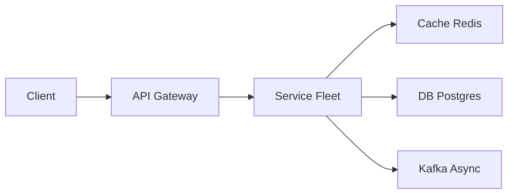

# Online Chess

> Realtime game. **Authoritative server**, clocks, matchmaking. Cheating and disconnects matter more than drawing a board in React.

> **TL;DR Hinglish:** Matchmaking queue, game room per match (state in Redis), clock sync WebSocket, move validation server pe, anti-cheat.

## Kya poochte hain? (What they ask) — Hinglish me samjho

Interviewer: *"Design online chess — pair two players, validate moves, run clocks, handle disconnects and spectators. Think Lichess/Chess.com at scale."*

What they really test:
- **Authoritative server:** Server owns rules and clocks — clients are dumb renderers. Do you reject illegal moves and never trust `Date.now()` from client?
- **Fair clocks:** Server timestamps, lag compensation, handling of network jitter without punishing the player.
- **Matchmaking:** How to pair by rating quickly without matching a 400 vs 2200 unless they waited long enough.
- **Reconnect & persistence:** Refresh mid-game must restore exact position + clock, no "you lost because your websocket died."

Example scale: 1M DAU, 100k concurrent games, 20k seeking at peak, 2 moves/sec per game avg → 200k moves/sec cluster. Game history kept forever (PGN), spectators 10× players on featured games.

## Requirements — Kya chahiye? (Functional / Non-functional)

**Functional:**
- **Matchmaking:** `seek` with `timeControl` (bullet 1+0, blitz 5+0, rapid 10+0), rating range, color preference; queue, pair, create game.
- **Play:** `move` (UCI `e2e4` or SAN), `resign`, `offerDraw`/`acceptDraw`, `claim` (threefold, 50-move), promotion choice.
- **Clocks:** per-player countdown with increment (Fischer) — `timeControl: 5+3` means 5 min + 3s per move.
- **Game lifecycle:** `seeking → matched → playing → finished (checkmate, resign, draw, flag, abort)`; `GET` snapshot for reconnect.
- **History:** move list (PGN), result, rating delta, archive.
- **Spectators & presence:** live board + clocks for watchers, chat (filtered), cap fan-out.
- **Rating:** Glicko-2/Elo update on finish (async).

**Non-functional:**
- Move validation latency < 50ms server-side, clock drift < 100ms.
- No illegal position ever accepted — server is source of truth.
- Reconnect grace — rated games continue with clock running or short pause (product choice, state the tradeoff).
- Fair clocks under 200ms network jitter — subtract server-measured elapsed, not client-reported.
- Anti-cheat light: suspicious move timing, engine correlation flagged for review.

**Clarify:**
- Clocks: Fischer increment only or also delay/bonus variants? (Start with Fischer)
- Rated vs casual — different disconnect policy?
- Time controls in v1 — one fixed or multiple pools?
- Tournaments / puzzles / analysis engine — out of scope unless asked.
- Spectator cap — 1k or 10k per game?

**Out of scope (v1):**
- Running Stockfish as a service for every game — analysis is async post-game.
- Voice/chat moderation ML — simple profanity filter.
- Variants (960, bughouse) — defer.
- Full anti-cheat engine clustering — flagging only.

## Scale ka andaaza — Kitna load? (Math jo design badle)

| Parameter | Assumption | Math | Result |
|---|---|---|---|
| DAU | 1M, 20% play daily | 200k games/day | ~14 games/min avg, 200 concurrent seeks peak 20k |
| Concurrent games | 100k at peak evening | 100k × 2 players | **200k active player sockets + 1M spectators (10×)** |
| Moves/sec | avg game 40 moves, 5 min, 200k games/day | 8M moves/day | **~93 moves/sec avg, 2k/sec peak** (tiny, but latency-sensitive) |
| Move payload | UCI 5B + clocks 20B + metadata | 50B/move | **~5KB/s per game** with clocks — negligible bandwidth |
| Storage (games) | 200k/day × 2KB PGN + metadata | — | **~400MB/day**, 146GB/year — small, keep in Postgres |
| Matchmaking queue | 20k seekers × 100B | — | **2MB** in [Redis](/system-design/redis) sorted set — in-memory |
| WS fan-out | featured game 10k spectators × 2 moves/sec × 100B | — | **2MB/s** per hot game — need per-game fan-out service, not per-move DB write |

Throughput is low, latency and correctness are king — keep game state in memory, persist moves asynchronously but durably.

## API Design — Endpoints kya honge?

```http
POST /v1/seeks
{
  "timeControl": { "initialSec": 300, "incrementSec": 3 }, // 5+3
  "ratingRange": { "min": 1400, "max": 1600 }, // optional
  "color": "random", // white | black | random
  "rated": true
}
→ 201 { "seekId":"seek_123", "status":"seeking", "estimatedWaitSec": 12 }

DELETE /v1/seeks/{seekId}  // cancel seeking
→ 200 { "cancelled": true }

GET /v1/seeks  // list my seeking

// Match found → server pushes via WS or long-poll:
→ { "type":"matched", "gameId":"game_abc", "color":"white", "opponent":{"userId":"u_456","rating":1520} }

POST /v1/games  // alternative: direct challenge to user
{ "opponentId":"u_456", "timeControl":{...} } → 201 { "gameId":"game_abc" }

// Game play — WebSocket (authenticated)
WS /v1/games/{gameId}/ws?token=...
Client → Server: { "type":"move", "uci":"e2e4", "clientSeq": 12 }
Server → Both:   { "type":"moveAccepted", "uci":"e2e4", "fen":"rnbqkbnr/pppppppp/8/4P3/8/8/PPPP1PPP/RNBQKBNR b KQkq e3 0 1",
                   "clocks":{"white":298.2,"black":300.0}, "serverTime":"2026-05-13T10:00:01.123Z" }
Server → Sender: { "type":"illegal", "reason":"king in check" } // only to sender
Client → Server: { "type":"resign" }
Client → Server: { "type":"offerDraw" }  Server → Opponent: { "type":"drawOffered" }
Client → Server: { "type":"acceptDraw" } Server → Both: { "type":"gameEnd", "result":"1/2-1/2", "reason":"agreement" }
Client → Server: { "type":"claimDraw", "reason":"threefold" }

// Snapshot for reconnect / spectator join
GET /v1/games/{gameId}
→ 200 { "gameId":"game_abc","status":"playing","fen":"...","pgn":"1. e4 e5 2. Nf3 ...",
        "clocks":{"white":142.5,"black":198.1},"toMove":"white","lastMove":"e2e4",
        "players":{"white":{"userId":"u_123","rating":1500},"black":{"userId":"u_456","rating":1520}},
        "result": null, "timeControl":{"initialSec":300,"incrementSec":3} }

GET /v1/games?userId=me&status=finished&limit=20&cursor=
GET /v1/games/{gameId}/moves  // full move list with clock remaining per ply

POST /v1/games/{gameId}/abort // before 2 moves, no rating change
```

**Clock sync:** Client shows countdown based on `serverTime + clocks` and its own elapsed; server periodically sends `clockSync` to correct drift. Client `lagMs` reported is informational only — server subtracts its own `now - lastMoveAt`.

## High-Level Design (HLD) — Boxes kaise judenge? (Hinglish)

```
[Browser/Mobile] ──HTTPS/WS──▶ [CDN / Edge] ──▶ [API Gateway + Auth + Rate Limiter] ──▶ [Seek Service → Redis]
        │                              │                         │                              │
        │  WS /games/{id}              │                         │  match when |r1-r2| ok       │ sorted set by rating
        │                              │                         │                              ▼
        │                              │              ┌──────────▼──────────┐
        │                              │              │   Game Router       │  consistent hash gameId → host
        │                              │              │ (Redis: game→host)  │
        │                              │              └──────────┬──────────┘
        │                              │                         │
        │                              │              ┌──────────▼──────────┐
        │                              └──────────────▶   Game Server Fleet  │  sticky gameId in memory
        │                                             │  ┌───────────────┐  │  authoritative rules + clocks
        │                                             │  │ game_abc      │◀─┼─ WS to 2 players + spectators fan-out
        │                                             │  │ FEN + clocks  │  │  validate via chess lib (chess.js)
        │                                             │  └──────┬────────┘  │
        │                                             └─────────┼───────────┘
        │                                                       │ append move
        │                                             ┌─────────▼─────────┐
        │                                             │  [Kafka] or       │  topic: game.moves (partition by gameId)
        │                                             │  Postgres (moves) │  durable move log + snapshot
        │                                             └─────────┬─────────┘
        │                                                       │
        │                                             ┌─────────▼─────────┐
        │                                             │   Persistence:    │  games + moves tables, S3 PGN archive
        │                                             │   [Postgres]      │  rating updates async
        │                                             └───────────────────┘
        │
        └── Presence: Redis TTL for "seeking" + "playing" + spectator counts
```



**Component roles:**
- **Seek Service (matchmaking):** holds seekers in [Redis](/system-design/redis) — e.g., `ZSET seeks:{timeControl}` scored by `rating` or `waitTime`. Ticker every 100ms scans for pairable neighbors within `|r1-r2| ≤ 100 + waitSec*10` (widens with wait). On pair, `MULTI` remove both, create `games` row `playing`, publish `matched` to both users via push/WS. Challenges bypass queue.
- **Game Router:** consistent hash `gameId → host`; gateway looks up `game_host:{gameId}` in [Redis](/system-design/redis) and proxies WS. If host dies, router reassigns to warm replica that replays move log.
- **Game Server (authoritative):** in-memory `Game` object: `fen`, `clocks{white,black}`, `lastMoveAt`, `subscribers`. On `move(uci)`: validate `isLegal(fen, uci)` via chess library, check `toMove == moverColor`, compute `elapsed = now - lastMoveAt`, deduct from mover's clock (add increment after), check flag (`remaining <=0 → flag loss`), apply move → new FEN, append to durable log, broadcast `moveAccepted` with new FEN+clocks to players + spectators. Illegal → reply only to sender, no state change.
- **Persistence:** move log is source of truth — `moves(gameId, ply, uci, fen, clocks, at)`; `games` row holds `snapshotFEN` every N ply for fast reconnect. Rating service consumes `gameEnd` event from [Kafka](/system-design/kafka) and updates `ratings` async (Glicko-2).
- **[Kafka](/system-design/kafka):** decouples move persistence from broadcast latency — broadcast is immediate from memory, persistence is async but WAL-level durable within 100ms; if server crashes before Kafka ack, client will retry move (idempotent on `clientSeq`).

**Data flow — write (move):** Player sends `e2e4` → Gateway → Game Server (owner of `game_abc`) → `if legal && toMove==white && whiteClock>0` → `whiteClock -= elapsed; whiteClock += increment` → `fen = apply(fen, e2e4)` → `moves.append` → broadcast to both + spectators → persist to Postgres.

**Data flow — clock tick:** No per-ms ticks over WS — client animates locally from last `clocks + serverTime`; server checks flag only on move arrival and via 1-sec ticker `if now - lastMoveAt > remaining → flag`. This avoids 1k games × 2 clocks × 10Hz fan-out.

**Data flow — matchmaking:** P1 `POST /seeks 1500 5+0` → Redis `ZADD seeks:5+0 1500 seek_p1`; P2 `1520` → ticker sees neighbors `|1500-1520|=20 ≤ threshold` → pair → `game_abc` row + Redis `SET game_host:game_abc host3` → push `matched` to both via WS/long-poll.

## Low-Level Design (LLD) — DB + Classes (Hinglish notes)

**Database schema:**

```sql
CREATE TABLE users (
  id          UUID PRIMARY KEY,
  username    TEXT UNIQUE NOT NULL,
  rating      INT NOT NULL DEFAULT 1500,
  rd          DOUBLE PRECISION DEFAULT 350, -- Glicko
  created_at  TIMESTAMPTZ NOT NULL DEFAULT now()
);

CREATE TABLE seeks (
  id              UUID PRIMARY KEY,
  user_id         UUID REFERENCES users(id),
  time_control    JSONB NOT NULL, -- {initialSec, incrementSec}
  rating_min      INT,
  rating_max      INT,
  color_pref      TEXT CHECK (color_pref IN ('white','black','random')),
  rated           BOOLEAN DEFAULT true,
  created_at      TIMESTAMPTZ NOT NULL DEFAULT now(),
  expires_at      TIMESTAMPTZ NOT NULL -- auto-cancel after 2m
);
-- hot path in Redis, not Postgres; this table is audit

CREATE TABLE games (
  id              UUID PRIMARY KEY,
  white_id        UUID REFERENCES users(id),
  black_id        UUID REFERENCES users(id),
  time_control    JSONB NOT NULL,
  status          TEXT NOT NULL CHECK (status IN ('playing','finished','aborted')),
  result          TEXT CHECK (result IN ('1-0','0-1','1/2-1/2','*')),
  reason          TEXT, -- checkmate | resign | flag | draw_agreement | threefold | fifty_move | abort
  fen             TEXT NOT NULL, -- current snapshot fen
  pgn             TEXT, -- full PGN, updated on finish or periodically
  white_clock     DOUBLE PRECISION NOT NULL, -- seconds remaining
  black_clock     DOUBLE PRECISION NOT NULL,
  to_move         TEXT NOT NULL CHECK (to_move IN ('white','black')),
  last_move_at    TIMESTAMPTZ,
  created_at      TIMESTAMPTZ NOT NULL DEFAULT now(),
  finished_at     TIMESTAMPTZ
);
CREATE INDEX ON games (white_id, created_at DESC);
CREATE INDEX ON games (black_id, created_at DESC);
CREATE INDEX ON games (status) WHERE status='playing';

CREATE TABLE moves (
  game_id       UUID REFERENCES games(id) ON DELETE CASCADE,
  ply           INT NOT NULL, -- half-move number
  uci           TEXT NOT NULL, -- e2e4, e7e8q
  fen_before    TEXT NOT NULL,
  fen_after     TEXT NOT NULL,
  clocks_json   JSONB NOT NULL, -- {white:142.5, black:198.1} after move
  by_user_id    UUID NOT NULL,
  created_at    TIMESTAMPTZ NOT NULL DEFAULT now(),
  PRIMARY KEY (game_id, ply)
);

CREATE TABLE ratings_history (
  user_id     UUID REFERENCES users(id),
  game_id     UUID REFERENCES games(id),
  rating_before INT NOT NULL,
  rating_after  INT NOT NULL,
  at            TIMESTAMPTZ NOT NULL DEFAULT now(),
  PRIMARY KEY (user_id, game_id)
);
```

**Key classes:**

```text
SeekService         — addSeek(), removeSeek(), tick(): scan ZSET, pair(), createGame()
GameServer          — Map<gameId, Game>; onWSConnect(gameId, user): auth, subscribe; onMove(uci): validate, tickClock, broadcast
Game                — fen: String, clocks: {white,black}, lastMoveAt: Instant, subscribers: Set<WS>, moveList: List
ChessRules          — isLegal(fen, uci): bool, apply(fen, uci): fen, isCheckmate(fen): bool, isDraw(fen): bool (threefold/fifty)
ClockService        — deduct(player, elapsed): remaining -= elapsed; addIncrement(player); checkFlag(): if remaining<=0 → flagLoss
RatingService       — onGameEnd(game): glicko2(white, black, result) → update users.rating + ratings_history
SpectatorService    — subscribe(gameId, ws): add to fan-out list (cap 10k, else overflow to polling CDN)
AntiCheatFlagger    — flagIf: move time < 100ms for many moves + engine correlation (defer deep)
```

**Important algorithms / concurrency:**
- **Clock fairness:** `elapsed = serverNow - lastMoveAt` (server clock), not client. Client lag compensation: measure `rtt/2`, but never add time to player — only server deducts. On move, `remaining[mover] = max(0, remaining[mover] - elapsed + increment)`. Flag check runs on 1s ticker per game: if `now - lastMoveAt > remaining[toMove]` → `gameEnd flag`.
- **Move idempotency:** client sends `clientSeq` per move; server tracks `lastProcessedSeq per user` — duplicate WS resend is no-op (prevents double-move on retry).
- **Legality:** delegate to battle-tested library (chess.js / Stockfish movegen) — don't hand-code. Validate `uci` parses, `from` piece belongs to mover, destination legal, doesn't leave king in check, promotion piece valid.
- **Threefold:** server maintains position hash history (Zobrist) — if same hash occurs 3× with same toMove → `claimDraw` succeeds. Fifty-move: 100 ply without pawn move or capture.
- **Matchmaking widening:** `threshold = 50 + waitSec*15` capped at 400 — ensures quick pairs without terrible mismatches. Separate pools per `timeControl` so bullet seekers don't match rapid.
- **Per-game serialization:** single thread / actor per `gameId` (in-memory lock or partition by gameId) — no concurrent move interleaving; second move arriving while first validating is queued.

**Design patterns:** Actor per game (single writer), Event Sourcing (move log → replay), Pub/Sub (spectator fan-out), Strategy (time controls), State Machine (game status).

## Deep Dive — Gehrai se (Interview yahi puchega) — Authority, cheat, and why client is dumb

If client could say "I captured your king," the game is meaningless. Server runs the rules. Attack vectors: (1) send illegal `uci` — server rejects with `illegal`; (2) send `move` for opponent's turn — reject; (3) spoof clock — server ignores client timestamp; (4) spam moves — [rate limiter](/system-design/rate-limiter) per socket (10/sec). Engine abuse: stockfish-level accuracy in bullet is suspicious — flag for human review (don't build real-time engine detection; mention you would compare move match % vs engine top-3 over last 20 moves and flag if >95% at <2s/move). Packet replay: `clientSeq` dedup. Spectator cheat (helping player): not solvable technically — mention but defer.

## Deep Dive — Gehrai se (Interview yahi puchega) — Disconnects, persistence, and fair pairing

**Disconnect policy (say it explicitly):** Rated: clock keeps running, 30s grace to reconnect (WebSocket reconnect with same `gameId` + token) — if not back, flag loss when clock hits zero; no auto-draw. Casual: pause 60s or offer abort if <2 moves. Persistence: move list is the log; snapshot every 10 ply updates `games.fen` so reconnect `GET /games/{id}` is instant without replaying full game. Refresh = `GET snapshot` + `WS resubscribe` — server sends current FEN+clocks, client renders. On severed WS, game state stays in memory + durable log — no loss.

**Fair pairing:** Don't match 400 vs 2200 unless the 400 waited 2 minutes and threshold widened. Implementation: Redis `ZRANGE` neighbors within threshold sorted by rating distance × wait weight `score = |r - seekRating| - waitSec*10` minimize. Timeout: if no pair in 60s, offer bot or widen further (product choice). Separate pools per `timeControl` avoids 1+0 bullet player waiting behind 30+0 rapid queue.

## Hinglish Tip — Galti vs Sahi

**🔴 Galti:** Hot path pe DB direct without cache/queue.
**✅ Sahi:** Cache/queue beech me, DB source of truth.

## Failures & Scale — Kya tootega aur kaise bachenge? (Hinglish)

- **Sharding:** Game servers sharded by `gameId` hash (e.g., 50 hosts × 2k games each). Matchmaking shards by `timeControl` (each pool independent). [Kafka](/system-design/kafka) `game.moves` partitioned by `gameId` to preserve order per game.
- **Caching:** Game state in memory is primary; [Redis](/system-design/redis) holds `game_host:{id}` routing + seek queues. No DB read per move — only validation + memory op + async persist. Snapshot in Postgres is for reconnect and history, not hot path.
- **Replication:** Game server has warm standby (replica subscribes to same Kafka partition) — on primary crash, standby replays tail moves and takes over with `SETNX game_host`. Postgres primary-replica, S3 archive of PGN for cold history. Kafka RF=3.
- **Failure modes:**
  - *Game server crash mid-game:* moves already in Kafka/Postgres replayed on new host, clients reconnect, clocks corrected by `now - lastMoveAt` (small drift). No Illegal position.
  - *Seek service down:* seekers remain in Redis, ticker resumes — no matches missed, just delayed.
  - *Hot featured game 10k spectators:* fan-out via per-game pub/sub (Redis pub/sub or Kafka fan-out service) not per-player DB poll; cap spectators or degrade to 2s polling + CDN for overflow.
  - *Clock drift / NTP skew:* server clock is single source; use monotonic `elapsed` not wall time difference across hosts.
  - *Illegal spam:* rate limit per socket, drop after 10 illegal in 10s → disconnect.
- **Probes:** alert on game server memory per game, match wait P99, move validation latency, flag false-positive (clock negative), WS disconnect rate, rating update lag.

## Aur kya puch sakte hain? (Extra probes) / Interview follow-ups

1. **Tournaments:** Need [job scheduler](/system-design/job-scheduler) for round start times, Swiss pairing algorithm, broadcast of standings — separate service that creates games via same Game Server.
2. **Puzzles:** Server-generated from game positions where one move is winning — async puzzle service, not in game path.
3. **Analysis engine:** After `gameEnd`, enqueue `analysisJob` → Stockfish evaluates each position → store `analysis` with blunders — defer from real-time.
4. **Chat:** Per-game chat channel separate from moves, filtered, rate-limited, not persisted as moves — analogous to [WhatsApp](/system-design/whatsapp) presence tricks.
5. **Variants 960:** Only change is initial FEN generation — same clock + validation path.
6. **Mobile background:** App may suspend WS — server keeps clock running, push notifies "your move" via [notification system](/system-design/notification-system).

**Yaad rakho (Revision):** Write durable, read cache, async Kafka/Flink, failure me degrade gracefully.

**Phrase:** "Matchmaking is a rating queue. The game process validates moves and owns the clock. Clients are dumb renderers. Disconnects reload from the server snapshot."
