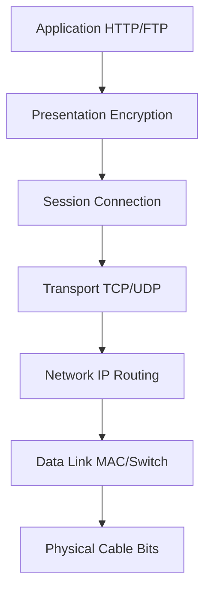

# OSI Model

> 7 layers ka framework — networking ke concept ko samajhne ke liye ek standard structure.

> OSI model 7 layers ka hai — Physical se Application tak. Har layer ka kaam alag hai. Jab interview mein network protocol samjhna ho, to is layers ko samjho — Physical hardware, Data Link cables, Network routing, Transport reliability, Session connections, Presentation encryption, Application HTTP/FTP.

OSI model ek conceptual framework hai jo networking ko 7 layers mein divide karta hai:
1. **Physical** — cables, signals, bits (0/1)
2. **Data Link** — frames, MAC addresses, switches, error detection
3. **Network** — packets, IP addresses, routing
4. **Transport** — segments, ports, TCP/UDP, reliability
5. **Session** — connections, sessions between applications
6. **Presentation** — encryption, compression, data formatting
7. **Application** — HTTP, FTP, SMTP — user-facing protocols

## How it works

- Jab hum URL type karte hain (HTTP), **Application layer** pe start hota hai
- Data neeche gayi **Presentation** (encrypt) → **Session** (connection) → **Transport** (TCP segment) → **Network** (IP packet) → **Data Link** (frame) → **Physical** (bits over cable)
- Receiver pe ulta — Physical se upar aata, Application pe jaata

## Key concepts

- **Encapsulation** — Har layer apna header add karta hai (data becomes segment → packet → frame → bits)
- **PDU (Protocol Data Unit)** — Har layer ka data ka naam alag hai (segment, packet, frame, bits)
- **TCP/IP vs OSI** — Real world TCP/IP 4-layer use hota hai (Application, Transport, Internet, Network Access)

## Failure modes to mention

1. **Layer mismatch** — Wrong protocol at wrong layer (e.g., TCP at Network layer)
2. **Encapsulation error** — Header missing, data corruption at any layer
3. **Encryption mismatch** — Presentation layer cipher mismatch = unreadable data

**🔴 Galti:** "OSI model actual networking hai" — Ye sirf conceptual hai. Real world TCP/IP 4-layer use hota hai.
**✅ Sahi:** "OSI is a teaching model. TCP/IP is the real protocol stack. But OSI helps interviewers test layering concepts."

**Phrase:** OSI model 7 layers ka conceptual framework hai — Physical se Application tak, har layer ka alag kaam, encapsulation se data neeche aata hai.

**Yaad rakho (Revision):** 7 layers — Physical (bits), Data Link (frames/MAC), Network (packets/IP), Transport (segments/TCP), Session (connections), Presentation (encryption), Application (HTTP). TCP/IP 4-layer real model.

**See also:** [TCP and UDP](/hld/tcp-and-udp), [IP](/hld/ip), [DNS](/hld/domain-name-system).
