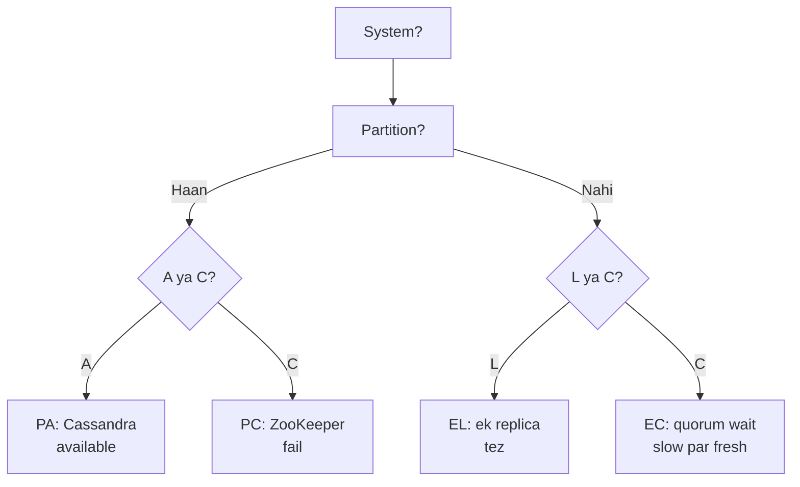

# PACELC

> CAP ka extension — **P**artition me **A vs C**, **E**lse me **L vs C**.

> **TL;DR Hinglish:** CAP sirf partition ki baat karta hai. PACELC bolta hai normal me bhi tradeoff hai — tez chahiye (Latency) ya pakka consistent chahiye. Har system dono ka jawab deta hai.

CAP ne bola partition me C ya A. PACELC ne joda: jab partition **nahi** hai tab bhi **L**atency vs **C**onsistency me chunna padta hai.

## PACELC cases

- **P → A/C:** partition aaya to Availability loge ya Consistency?
- **E → L/C:** normal me latency loge ya consistency?

**4 combos:**
- **PA/EL:** Cassandra/Dynamo — partition me Available, normal me Latency (eventual, 1 replica)
- **PC/EC:** HBase, ZooKeeper — partition me Consistent (fail), normal me bhi Consistent (quorum wait)
- **PA/EC:** CosmosDB tunable? — partition me Available, normal me Consistent
- **PC/EL:** naya system jo partition me Consistent par normal me fast? Rare.

## Example

**Cassandra PA/EL:** write `W=1` → ek node pe likh ke ok, baki async. Normal me tez (10ms), par thoda purana padh sakte ho.

**Postgres PC/EC:** write quorum pe (master + replica wait) → 30ms lagenge par har read fresh.

## How to answer in interview

- **Instagram likes:** PA/EL chalega — count thoda purana ok, tez chahiye.
- **Bank transfer:** PC/EC — paise me stale nahi, thoda slow ok.

**🔴 Galti:** "Sirf CAP kaafi" — Interviewer PACELC sunke impress, normal tradeoff bhool gaye.
**✅ Sahi:** "PA/EL vs PC/EC dono bolo — is feature PA/EL, us feature PC/EC."

**Phrase:** "PACELC — partition me A vs C, else me L vs C. Likes PA/EL, payment PC/EC."

**Yaad rakho:** CAP=partition, PACELC=else bhi, EL=tez 1 replica, EC=slow quorum.

**See also:** [cap-theorem](/system-design/cap-theorem), [cassandra](/system-design/cassandra), [postgresql](/system-design/postgresql).
