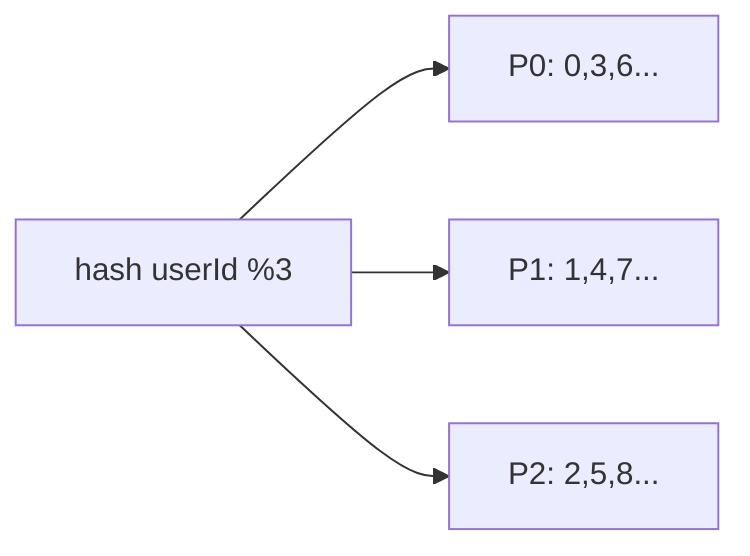

# Partitioning

> Data ko key se tukdon me baanto — har partition alag node pe, scale horizontal.

> **TL;DR Hinglish:** Partition ek kitaab ke chapters jaisa — har chapter alag almari. Hash se decide karo kaunsa chapter kahan, warna ek almari bhar jayegi, baaki khali.

Sharding ka hi dusra naam, par partitioned table me bhi same.

## How it works

**1. Hash partitioning:** `partition = hash(userId) % N` — barabar distribution, par range query (`WHERE age BETWEEN 20 AND 30`) ko saare partitions puchna padega.

**2. Range partitioning:** `userId 1-1M → P0, 1M-2M → P1` — range easy, par append-only me last partition garam (naye users sirf wahan).

**3. Geo/List partitioning:** `country=IN → P0, US → P1` — locality achhi, par IN zyada to skew.

**Partition key chuno:**
- High cardinality (`userId`, `orderId`) — low (`country` 4 values) nahi.
- Query ka `WHERE` — `WHERE userId=?` to `userId` pe partition.

## Hot partition handling

Celebrity `userId=123` pe 100k QPS → uska partition garam. Fix: `key#shard` (`123#1`, `123#2`) ya cache + split.

**Rebalancing:** `hash%N` pe N badla to 90% move — consistent hashing ya **logical partitions** (1000 shards → 4 nodes).

## Partition vs Sharding vs Replica

- **Partition/Sharding:** alag data, scale write
- **Replica:** same data copy, scale read + failover

**🔴 Galti:** `created_at` pe partition — saare naye writes ek partition pe.
**✅ Sahi:** `hash(userId)` + consistent ring + hot key split.

**Phrase:** "Partition key = query ka WHERE + high cardinality, hash barabar, hot pe split, rebalance consistent."

**Yaad rakho:** Hash barabar, range me skew, geo locality, hot → split, rebalance ring.

**See also:** [sharding](/system-design/sharding), [consistent-hashing](/system-design/consistent-hashing), [replication](/system-design/replication).
