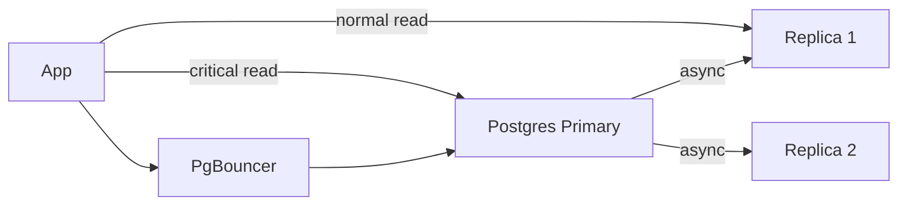

# PostgreSQL

> Default relational database. Transactions, joins, indexes — shuru yahan se karo, scale ne majboor kiya to hi niklo.

> **TL;DR Hinglish:** Postgres ek full-featured diary hai — table, relation, transaction sab pakka. 90% apps yahi se start karo. Index sahi to 10k QPS bhi handle, galat to 100 pe marega. Shard tabhi jab single node ka CPU/disk full ho.

Jab tak 10k QPS aur 1TB se neeche ho, Postgres hi best. Managed RDS/Aurora le lo, khud ka cluster mat banao.

## Kab Postgres hi rakho?

- Joins, transactions, constraints chahiye
- Strong consistency — payment, tickets
- JSONB, full-text, GIS bhi chal jayega (ES/Cassandra tabhi jab scale alag ho)

## Indexes — Hinglish me samjho

- **B-tree** — default, `=` aur `range` dono. `WHERE userId = ? AND ts > ?` → composite index `(userId, ts)` banao, order important.
- **Compound:** left se match hota hai — `(a,b)` → `WHERE a=?` use karega, `WHERE b=?` nahi.
- **Partial:** `WHERE is_active=true` pe hi index — chhota tez.
- **GIN:** JSONB / `@@` full-text.
- **Explain:** `EXPLAIN ANALYZE` bina index guess mat karo.

**Replication lag:** Master → replica async, 10-100ms lag — critical read ko master pe bhejo (`read-your-writes`).

**Connection pooling:** 1000 app servers × 10 connections = 10k → DB marega. PgBouncer beech me — 100 pool.

**Sharding:** `hash(userId) % N` ya `userId range`. Shard ke baad cross-shard join nahi — app me jodo. Interview me bolo "shard citus/nahi, pehle vertical split."

**SERIALIZABLE:** Ticketmaster me `SELECT ... FOR UPDATE` ya `SERIALIZABLE` — double-book rokna hai.

**🔴 Galti:** "Har query pe naya index" — Write slow, vacuum heavy.
**✅ Sahi:** "Composite index query pattern pe, replica lag ka dhyan, PgBouncer."

**Phrase:** "Postgres default choice — B-tree composite query pe, replica lag yaad, PgBouncer, shard tabhi jab majboori."

**Yaad rakho:** B-tree default, `(a,b)` left match, replica lag → master read, PgBouncer must, `FOR UPDATE` for booking.

**See also:** [ticketmaster](/system-design/ticketmaster), [payment-system](/system-design/payment-system), [dynamodb](/system-design/dynamodb).
