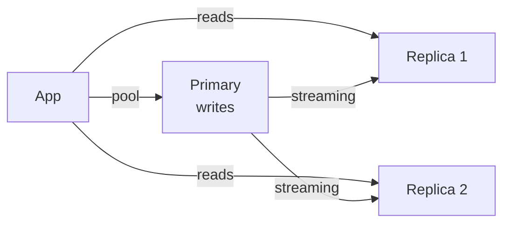

# PostgreSQL

> Full-featured relational database — tables, relations, transactions, all solid. Start 90% of apps here.

> Postgres handles structured data with ACID guarantees, rich indexing (B-tree, GIN, GiST), and JSON support for flexible corners. Correct indexes serve 10k QPS from one node; wrong ones die at 100. Shard only when a single node's CPU or disk fills — not before.

## When to pick it

1. Structured data with relationships (users, orders, payments)
2. Transactions that must not break (money movements)
3. Complex queries with joins and aggregations
4. Everything, until measured scale pain says otherwise

**Don't leave for:** massive write firehoses (Cassandra), flexible documents at scale (MongoDB), or full-text search (Elasticsearch) — pair, don't replace.

## How scaling works

Vertical first (bigger box), then read replicas for read-heavy loads, then partitioning (by time or range), then sharding (Citus, logical shards) for write scale. Connection pooling (PgBouncer) is mandatory — connections are expensive, requests are many.

## Failure modes to mention

1. **Missing indexes** — sequential scans on big tables; EXPLAIN every slow query.
2. **Connection exhaustion** — pool everything; one connection per request kills.
3. **Long transactions** — bloat and lock contention; keep transactions short.
4. **Replica lag** — stale reads after writes; read-your-writes from primary when needed.

**Mistake:** "Shard from day one."
**Correct:** "Vertical, then replicas, then partitioning, then sharding — each step on measured pain."

**Phrase:** "Postgres is the default diary — tables, relations, transactions solid. Index right, pool always, shard only on proof."

**Remember (Revision):** ACID default, B-tree plus GIN indexes, EXPLAIN slow queries, PgBouncer pooling, replicas for reads, shard by query key last.

**See also:** [sql databases](/hld/databases-sql), [ticketmaster](/hld/ticketmaster), [robinhood](/hld/robinhood).
