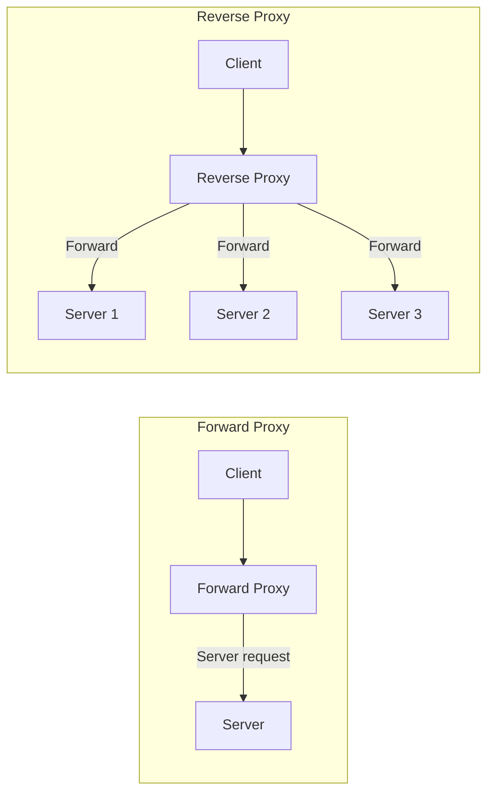

# Proxy

> Proxy client ka wakil hai — requests forward karta hai, cache karta hai, security add karta hai.

> Proxy client aur server ke beech ka middleman hai. Types: Forward proxy (client ke liye — ban request karta hai), Reverse proxy (server ke liye — traffic distribute karta hai). Reverse proxy = load balancer jaisa kaam karta hai + caching, SSL termination, rate limiting. CDN reverse proxy ka ek type hai.

Proxy ek intermediary hai — client aur server ke beech:

**Forward proxy:**
- Client ke liye kaam karta
- Client ka request proxy jaata hai, proxy server ke naam se request karta hai
- Privacy (IP hide), access control (firewall bypass), caching
- Example: VPN, corporate proxy

**Reverse proxy:**
- Server ke liye kaam karta
- Client request proxy pe aata, proxy server pe forward karta hai
- Load balancing, SSL termination, caching, rate limiting, DDoS protection
- Example: Nginx, HAProxy, Cloudflare

## Failure modes to mention

1. **Reverse proxy SPOF** — Proxy fail = all servers inaccessible — HA pairs se bachna
2. **Caching stale** — Proxy cache outdated content — TTL properly set karo
3. **Overhead** — Proxy add latency — connection pooling, keep-alive se reduce
4. **SSL termination cost** — Reverse proxy decrypt/encrypt — CPU overhead

**🔴 Galti:** "Forward proxy aur reverse proxy same cheez hain" — Forward proxy client ke liye, reverse proxy server ke liye.
**✅ Sahi:** "Forward proxy hides client IP (VPN/corporate), reverse proxy distributes server traffic (Nginx/HAProxy). Reverse proxy = load balancer + SSL + cache."

**Phrase:** Proxy client-server ke beech ka middleman hai — forward proxy client ke liye (privacy), reverse proxy server ke liye (load balancing, SSL, caching, DDoS protection).

**Yaad rakho (Revision):** Forward proxy (client, privacy), reverse proxy (server, LB+SSL+cache), Nginx/HAProxy examples, HA pairs for reverse proxy, caching + rate limiting features.

**See also:** [Load Balancing](/hld/load-balancing), [CDN](/hld/cdn), [API Gateway](/hld/api-gateway).
