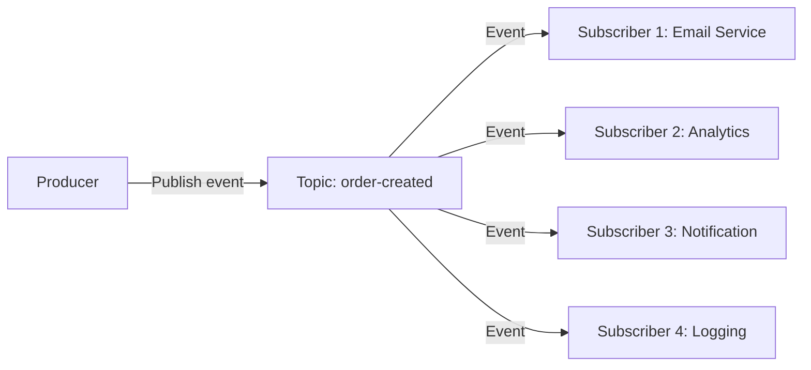

# Publish-Subscribe

> Event-driven communication — sab subscribers ko message jaati hai.

> Publish-Subscribe ek messaging pattern hai — producer event publish karta hai topic pe, sab subscribers ko jaati hai. Event-driven architecture mein use hota hai. Producer aur consumers decoupled hain. Fan-out hota hai — ek event sab recipients ko. Kafka topics, Redis PubSub, Google Pub/Sub examples. Fan-out scaling challenge — async consumers, backpressure handle karna zaroori.

Publish-Subscribe pattern mein events sab subscribers ko propagate hote hain:

**How it works:**
1. Producer event publish karta hai topic pe
2. Topic sab subscribers ko event jaata hai
3. Har subscriber independently process karta hai
4. **Fan-out** — ek event, multiple consumers
5. **Asynchronous** — Producer wait nahi karta

**Key concepts:**
- **Topic** — Event category (order-created, payment-completed)
- **Subscriber** — Consumer of events from topic
- **Message** — Event payload (data)
- **Fan-out** — One message to multiple subscribers

## Failure modes to mention

1. **Subscriber crash** — Subscriber miss events — replay, offset tracking
2. **Event ordering** — Multiple events, wrong order processed — partition by key
3. **Duplicate processing** — Consumer restart, duplicate events — idempotent processing
4. **Fan-out bottleneck** — Too many subscribers, slow processing — async, parallel

**🔴 Galti:** "Pub-sub = queue" — Queue one-to-one, pub-sub one-to-many. Queue message ek consumer, pub-sub message sab subscribers ko.
**✅ Sahi:** "Pub-sub = one-to-many (topic + subscribers). Queue = one-to-one. Fan-out, asynchronous, event-driven. Idempotent consumers + offset tracking."

**Phrase:** Publish-Subscribe ek-to-bahar communication — producer event topic pe publish, sab subscribers receive. Fan-out, asynchronous, event-driven, idempotent consumers.

**Yaad rakho (Revision):** Producer publish topic pe, sab subscribers receive, fan-out, asynchronous, decoupled, offset tracking for replay, idempotent consumers, Kafka topics.

**See also:** [Message Brokers](/hld/message-brokers), [Event-Driven Architecture](/hld/event-driven-architecture), [Kafka](/hld/kafka).
