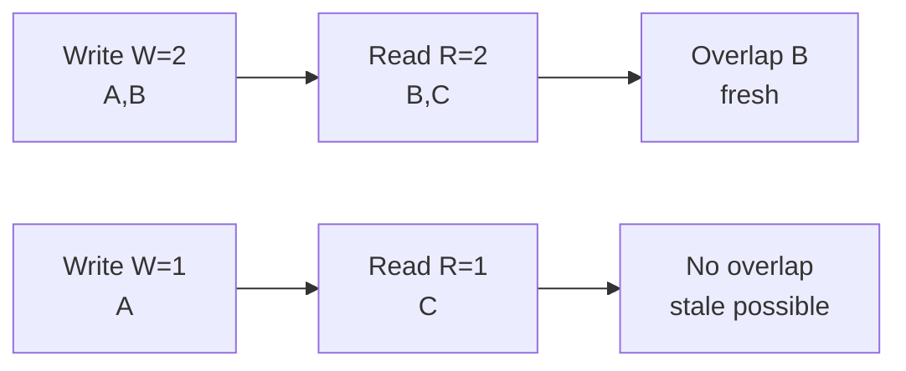

# Quorum

> `R + W > N` to strong read — kitne nodes pe likho aur kitne se padho, tune karo.

> **TL;DR Hinglish:** Quorum ek voting jaisa — `N=3` dabbe, `W=2` pe likho, `R=2` se padho to ek dabba common zaroor — latest data mil hi jayega. `W=1,R=1` tez par purana.

Tunable consistency ka dil. Cassandra/Dynamo me har query pe `W`, `R` bhejo.

## Formula

- `N` = kitne replicas (3)
- `W` = write kitne pe ok bolo (2)
- `R` = read kitne se pucho (2)
- `R + W > N` → **strong** (overlap pakka), warna **eventual**.

**Examples `N=3`:**
- `W=3,R=3` → strong, par slow + ek node down to fail
- `W=2,R=2` → strong, barabar (quorum)
- `W=1,R=1` → tez, par stale (eventual) — Instagram likes ok
- `W=3,R=1` → write slow, read tez

## How quorum works

Write `W=2` → nodes A,B pe `x=5`. Read `R=2` → B,C se pucho → B me 5 mil gaya (common). Agar `R=1` C se pucha to 5 nahi milta — stale.

## Sloppy quorum + hinted handoff

`W=2` par 2 nodes down? `W=3` fail. Sloppy: kisi bhi healthy node pe likh do, baad me asli owner aaya to handoff. Availability badhe, par thoda aur eventual.

## How to answer in interview

- **Bank:** `W=QUORUM, R=QUORUM` — paise me stale nahi.
- **Likes:** `W=ONE, R=ONE` — count 10 kam zyada chalega.
- **CAS:** `IF NOT EXISTS` → `W=QUORUM` chahiye.

**🔴 Galti:** "Quorum hamesha strong" — Sirf `R+W>N` pe.
**✅ Sahi:** "N,W,R tune — likes ONE, payment QUORUM."

**Phrase:** "R+W>N to strong, warna eventual — likes ONE, bank QUORUM."

**Yaad rakho:** `R+W>N` overlap, `W=1` tez, `QUORUM=2/3`, sloppy for AP.

**See also:** [replication](/system-design/replication), [cassandra](/system-design/cassandra), [cap-theorem](/system-design/cap-theorem).
