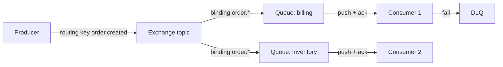

# RabbitMQ

> Smart broker — message khud decide karta hai kahan jana hai, exchange aur routing key dekh ke.

> Producer exchange me daalta hai, exchange rules se queue me bhejta hai, consumer ko message dhakka deke (push) milta hai. Flexible routing, per-message ack aur task queues iski pehchan hain. Kafka se ulta philosophy hai — wahan dumb log hai, yahan smart broker hai.

RabbitMQ AMQP protocol pe chalta hai aur iska core triangle hai: **exchange** (message leta hai), **binding** (rule: kaunsi key kahan jayegi), **queue** (jahan message rukta hai). Exchange chaar types ke hote hain — direct (exact key match), topic (pattern match jaise `order.*`), fanout (sabko copy), headers (header attributes pe). Consumer prefetch count se control karta hai ek saath kitne unacked messages rakhega.

## When you pick it

1. Complex routing chahiye ho (topic patterns, ek message kai queues me) — yahan RabbitMQ Kafka se aage hai
2. Task queues aur background jobs (email bhejo, image resize karo) — ack pe delete, fail pe requeue ya DLQ
3. Request-reply / RPC style kaam — correlation-id se jawab wapas
4. Throughput moderate ho (10-50k msgs/s) — isse zyada pe Kafka dekho

**Mat lo:** 100k+ msgs/s durable log, event replay/history, ya stream processing — wahan [Kafka](/system-design/kafka) hai.

## How routing works

**Producer → Exchange → (binding rules) → Queue → Consumer.** Producer ko queue ka naam nahi pata hota, sirf exchange aur routing key deta hai. Queue se consumer ko message push hota hai (poll nahi), aur har message pe ack aata hai — ack nahi aaya to message wapas queue me (requeue) ya dead-letter queue me.

**Durability:** queue + message dono durable mark karo tabhi restart survive hoga, nahi to RAM me ud jayega. **Publisher confirms** lagao taaki producer ko pata chale broker ne likh liya.

## RabbitMQ vs Kafka

- **Model:** RabbitMQ smart broker + queue (consume pe delete), Kafka dumb log (offset se replay).
- **Routing:** RabbitMQ exchanges me jeetta hai; Kafka me topic + consumer groups, routing app kare.
- **Throughput:** Kafka 100k+ msgs/s, RabbitMQ 10-50k — heavy streaming Kafka ka hai.
- **Replay:** Kafka me purana data dobara padho; RabbitMQ me ack ke baad gaya to gaya.
- **Ops:** RabbitMQ management UI ke saath aasan shuru hota hai; Kafka cluster bhaari hai.

## Failure modes to mention

1. **Unacked pile-up** — Consumer slow ya mara, queue badhti jaayegi — prefetch limit + alerts + autoscale.
2. **Poison message** — Ek message har baar fail, redeliver loop — DLQ policy must hai.
3. **Split-brain / netsplit** — Cluster nodes alag hon to quorum queues use karo, classic mirrored queues purani kahani hai.
4. **Memory alarm** — Broker RAM full hone pe publishers block karta hai — lazy queues + TTL + max-length policy rakho.

**🔴 Galti:** "Kafka jaisa log samajh ke replay maangna" — Ack ke baad message gaya, replay Kafka me hota hai.
**✅ Sahi:** "Routing aur task queues ke liye RabbitMQ — exchange + binding + per-message ack + DLQ. Heavy log/replay ho to Kafka."

**Phrase:** "Smart broker hai — exchange routing karta hai, queue push karti hai, ack pe delete. Routing chahiye to RabbitMQ, log chahiye to Kafka."

**Yaad rakho (Revision):** Exchange (direct/topic/fanout) + binding + queue, push model, per-message ack, DLQ must, durable queue+message, prefetch se backpressure, quorum queues.

**See also:** [kafka](/system-design/kafka), [message queue](/system-design/message-queue), [message brokers](/system-design/message-brokers).
