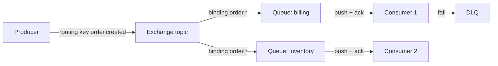

# RabbitMQ

> Smart broker — messages decide where to go via exchanges and routing keys.

> Producers drop messages into exchanges, exchanges route by rules into queues, consumers get pushed deliveries with per-message acks. Flexible routing, task queues, and request-reply patterns are its home ground. Opposite philosophy from Kafka's dumb log: intelligence lives in the broker here.

## When to pick it

1. Complex routing needs (topic patterns, one message to many queues)
2. Task queues and background jobs (email, resize) — ack on success, requeue or DLQ on failure
3. Request-reply flows with correlation IDs
4. Moderate throughput (10-50k msgs/s) with rich routing

**Don't use for:** 100k+ msgs/s durable logs, event replay and history, or stream processing — that's [Kafka](/hld/kafka).

## How routing works

**Producer → Exchange → (binding rules) → Queue → Consumer.** Producers know only the exchange plus routing key, never queues. Queues push to consumers (no polling); each message needs an ack — unacked ones requeue or dead-letter. Exchange types: direct (exact key), topic (pattern like `order.*`), fanout (copy to all), headers (attribute match).

**Durability:** mark queues plus messages durable or restarts wipe RAM state. **Publisher confirms** tell producers the broker persisted.

## RabbitMQ vs Kafka

- **Model:** smart broker plus queue (consumed messages leave) vs dumb log (offsets, replayable).
- **Routing:** exchanges decide here; topics plus consumer groups there, app routes.
- **Throughput:** Kafka handles 100k+ msgs/s; RabbitMQ serves 10-50k with richer routing.
- **Replay:** Kafka replays history; RabbitMQ deletes on ack.

## Failure modes to mention

1. **Unacked pile-up** — slow or dead consumers grow queues; prefetch limits plus alerts plus autoscale.
2. **Poison messages** — one message failing forever redelivers in loops; DLQ policy mandatory.
3. **Split brain** — network splits need quorum queues; classic mirrored queues are legacy.
4. **Memory alarms** — full RAM blocks publishers; lazy queues, TTLs, and max-length policies help.

**Mistake:** "Expect Kafka-style replay."
**Correct:** "Routing plus task queues via RabbitMQ — exchanges, bindings, per-message acks, DLQ. Logs and replay mean Kafka."

**Phrase:** "Smart broker — exchanges route, queues push, acks delete. Routing needs RabbitMQ, log needs Kafka."

**Remember (Revision):** Exchange types (direct/topic/fanout), bindings, push model, per-message ack, DLQ mandatory, durable queues plus messages, prefetch backpressure, quorum queues.

**See also:** [message queues](/hld/message-queues), [notification system](/hld/notification-system).
